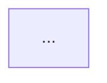
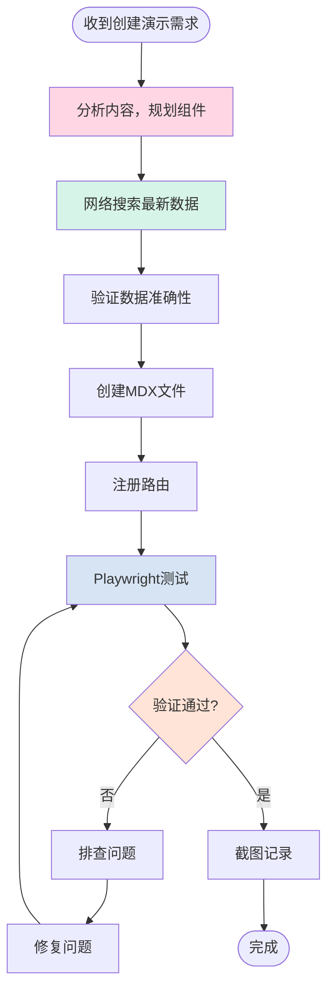

# MDX 演示文稿创建工作流程

本文档为 Claude 提供创建高质量 MDX 演示文稿的完整工作流程指南。

## 📋 工作流程

### 第一步：需求分析与组件规划

在开始创建演示文稿之前，**必须先思考和规划**：

#### 1.1 分析内容主题

- 主题是什么？
- 需要对比多个选项吗？
- 是否涉及技术架构？
- 有没有时间线或流程？
- 需要展示指标数据吗？

#### 1.2 选择合适的组件

根据内容需求，从以下组件中选择：

| 场景                  | 推荐组件        | 用途                            |
| --------------------- | --------------- | ------------------------------- |
| **对比多个产品/服务** | ComparisonCard  | 并排展示特性卡片                |
| **详细数据对比**      | ComparisonTable | 交互式可排序表格                |
| **功能支持矩阵**      | FeatureGrid     | 网格展示支持状态                |
| **按场景分类**        | TabComparison   | 标签切换不同内容                |
| **关键指标**          | MetricCard      | 柱状图/数字/徽章展示            |
| **价格方案**          | PricingCard     | 定价和功能对比                  |
| **流程/架构**         | Mermaid 图表    | flowchart, sequence, timeline等 |

如果 mdx 需要新的组件来做更好地展示，那么先构建好组件，再构建 mdx 文件。

#### 1.3 规划数据结构

在开始写 MDX 之前，规划：

- 需要哪些数据变量？
- 如何组织数据以便复用？
- 是否需要 export const 定义？

**示例规划：**

```javascript
// 对比产品A vs B vs C
export const providers = [...]  // ComparisonCard
export const features = [...]   // FeatureGrid
export const tableData = [...]  // ComparisonTable
export const metrics = [...]    // MetricCard
```

---

### 第二步：网络搜索确保数据最新

**重要**: 永远不要依赖训练数据！必须进行网络搜索获取最新信息。

#### 2.1 搜索策略

为每个主题执行**多轮搜索**：

```markdown
主题: [产品名称]
必须搜索:
1. "[产品] specifications 2025" - 获取最新规格
2. "[产品] pricing API cost 2025" - 获取价格信息
3. "[产品] vs competitors benchmark 2025" - 获取对比数据
4. "[产品] latest features updates 2025" - 获取最新功能
```

#### 2.2 验证数据准确性

- ✅ 检查发布日期
- ✅ 验证版本号
- ✅ 确认价格信息
- ✅ 核对 benchmark 数据
- ✅ 查找官方来源

#### 2.3 记录数据来源

在演示文稿底部标注：

```markdown
*最后更新: 2025年XX月*
*数据来源: 官方文档、[Benchmark名称]*
```

---

### 第三步：创建 MDX 文件

#### 3.1 文件结构

```mdx
// 1. 导入所需组件
import ComparisonCard from '../components/ComparisonCard'
import MetricCard from '../components/MetricCard'
// ... 其他组件

// 2. 标题和概述
# 演示文稿标题

**副标题** - 简短描述

> **最后更新**: 2025年XX月 | **数据来源**: ...

## 概览

简要介绍...

---

// 3. 定义数据变量（使用 export const）
export const myData = [
  { ... }
]

// 4. 使用组件展示内容
<ComparisonCard ... />

// 5. 使用 Mermaid 图表


// 6. 参考资源

## 参考资源

- **官方文档**: [链接]

```

#### 3.2 Mermaid 图表最佳实践

**避免使用 `<br/>` 标签！** 改用括号内单行：

```mermaid
// ❌ 错误 - 会导致文字被截断
flowchart TD
    A[文本1<br/>文本2]

// ✅ 正确 - 使用括号和单行
flowchart TD
    A["文本1 (文本2)"]
```

**常用图表类型：**

```mermaid
// 流程图
flowchart TD
    Start(["开始"]) --> Process["处理"]
    Process --> End(["结束"])

// 序列图
sequenceDiagram
    participant A as 用户
    participant B as 系统
    A->>B: 请求
    B-->>A: 响应

// 时间线
timeline
    title 发展历程
    2024 Q1 : 事件1
    2024 Q2 : 事件2
```

---

### 第四步：注册路由

在 `src/App.jsx` 中添加新演示文稿：

```javascript
// 1. 导入 MDX 文件
import MyPresentation from './presentations/MyPresentation.mdx'

// 2. 添加到 presentations 数组（放在最前面）
const presentations = [
  { path: '/my-presentation', name: '我的演示', component: MyPresentation },
  // ... 其他演示
]
```

---

### 第五步：使用 Playwright 测试验证

#### 5.1 启动开发服务器

确保服务器正在运行：

```bash
cd presentations && npm run dev
```

#### 5.2 测试清单

使用 Playwright 逐项验证：

```markdown
□ 页面能正常加载
□ 所有组件正确渲染
□ Mermaid 图表正常显示
□ 没有文字被截断
□ 交互功能正常
□ 响应式布局正常
```

#### 5.3 测试步骤

**A. 基础加载测试**

```javascript
// 1. 导航到页面
mcp__playwright__browser_navigate(url: "http://localhost:3003/my-presentation")

// 2. 等待加载
sleep 3

// 3. 截图验证
mcp__playwright__browser_take_screenshot(fullPage: true)
```

**B. 交互功能测试**

对于每个交互组件：

```javascript
// ComparisonCard 展开测试
mcp__playwright__browser_click(element: "查看全部按钮", ref: "...")
sleep 1
mcp__playwright__browser_take_screenshot()

// ComparisonTable 排序测试
mcp__playwright__browser_click(element: "表头", ref: "...")
sleep 1
mcp__playwright__browser_take_screenshot()

// TabComparison 切换测试
mcp__playwright__browser_click(element: "标签2", ref: "...")
sleep 1
mcp__playwright__browser_take_screenshot()
```

**C. Mermaid 图表测试**

```javascript
// 滚动到图表位置
mcp__playwright__browser_evaluate(() => {
  const heading = document.querySelector('h2/h3包含关键字');
  if (heading) heading.scrollIntoView({ behavior: 'smooth', block: 'center' });
})

sleep 3
mcp__playwright__browser_take_screenshot()
```

**检查项：**

- ✅ 图表渲染成功（没有"正在加载"或错误）
- ✅ 所有文字完整显示（没有被截断）
- ✅ 节点间距合理
- ✅ 连接线清晰

---

### 第六步：问题排查

#### 常见问题及解决方案

| 问题             | 原因              | 解决方案                               |
| ---------------- | ----------------- | -------------------------------------- |
| **MDX 编译错误** | 未闭合的 JSX 标签 | 检查所有 `<div>` 是否有对应的 `</div>` |
| **图表渲染失败** | Mermaid 语法错误  | 检查语法，避免使用 `<br/>`，使用引号   |
| **组件不显示**   | 未导入或路径错误  | 检查 import 语句和路径                 |
| **数据不显示**   | 变量未定义        | 确保使用 `export const`                |
| **文字被截断**   | 使用了 `<br/>`    | 改用单行形式 `["文本 (说明)"]`         |
| **样式不生效**   | CSS 变量未设置    | 确保传入 `color` prop                  |

---

## 🎯 完整示例工作流

### 场景：创建"AI 模型对比"演示

**1. 需求分析（5分钟）**

```markdown
主题: Claude vs GPT vs Gemini 对比
需要:
- ComparisonCard (3个卡片并排)
- MetricCard (性能指标柱状图)
- ComparisonTable (详细对比表)
- FeatureGrid (功能支持矩阵)
- PricingCard (价格对比)
- Mermaid 图表 (架构流程)
```

**2. 网络搜索（10分钟）**

```bash
# 搜索1: Claude Sonnet 4.5
WebSearch("Claude Sonnet 4.5 specifications pricing 2025")

# 搜索2: GPT-5
WebSearch("GPT-5 specifications features pricing 2025")

# 搜索3: Gemini 2.5 Pro
WebSearch("Gemini 2.5 Pro specifications context window 2025")

# 搜索4: Benchmark
WebSearch("AI models comparison benchmark 2025")
```

**3. 创建 MDX（20分钟）**

```mdx
import ComparisonCard from '../components/ComparisonCard'
...

# AI 模型对比

## 快速对比

<div style={{ display: 'grid', ... }}>
  <ComparisonCard provider="Claude" ... />
  <ComparisonCard provider="GPT-5" ... />
  <ComparisonCard provider="Gemini" ... />
</div>

## 性能对比

export const performanceData = [...]

<MetricCard title="性能评分" items={performanceData} type="bar" />

...
```

**4. 注册路由（1分钟）**

```javascript
// App.jsx
import AIComparison from './presentations/AI-Comparison.mdx'

const presentations = [
  { path: '/ai-comparison', name: 'AI 模型对比', component: AIComparison },
  ...
]
```

**5. Playwright 测试（5分钟）**

```javascript
// 导航
browser_navigate("http://localhost:3003/ai-comparison")
sleep 3

// 全页截图
browser_take_screenshot(fullPage: true, filename: "ai-comparison-full.png")

// 测试卡片展开
browser_click(element: "查看全部特性", ref: "e59")
sleep 1
browser_take_screenshot(filename: "card-expanded.png")

// 测试表格排序
browser_click(element: "表头", ref: "e451")
sleep 1
browser_take_screenshot(filename: "table-sorted.png")

// 测试标签切换
browser_click(element: "标签2", ref: "e527")
sleep 1
browser_take_screenshot(filename: "tab-switched.png")

// 验证图表
browser_evaluate(() => {
  document.querySelector('h2').scrollIntoView({ block: 'center' })
})
sleep 3
browser_take_screenshot(filename: "charts.png")
```

**6. 验证检查（2分钟）**

- ✅ 所有组件正常显示
- ✅ 图表完整渲染
- ✅ 文字无截断
- ✅ 交互功能正常
- ✅ 响应式布局正常

---

## 🎨 组件使用指南

### ComparisonCard - 对比卡片

**何时使用：** 需要并排展示2-4个选项的特性对比

**Props：**

```javascript
<ComparisonCard
  provider="产品名称"           // 必填
  logo="🤖"                    // 必填：emoji或图标
  color="#D97757"             // 必填：主题色
  tagline="一句话描述"         // 必填：副标题
  metrics={{                   // 可选：关键指标
    '指标1': '值1',
    '指标2': '值2'
  }}
  features={[                  // 必填：特性列表
    '特性1',
    '特性2'
  ]}
  highlight={false}           // 可选：是否高亮
/>
```

**推荐配色：**

- Claude: `#D97757` (橙)
- GPT/OpenAI: `#10A37F` (绿)
- Google/Gemini: `#4285F4` (蓝)

---

### ComparisonTable - 交互式表格

**何时使用：** 需要展示详细的结构化对比数据

**示例：**

```javascript
export const tableData = [
  { feature: '特性1', providerA: 'value1', providerB: 'value2' }
]

export const columns = [
  { key: 'feature', label: '特性', sortable: false },
  { key: 'providerA', label: '提供商A', sortable: true, type: 'number' }
]

<ComparisonTable
  data={tableData}
  columns={columns}
  interactive={true}
  highlightBest={false}
/>
```

---

### FeatureGrid - 功能矩阵

**何时使用：** 需要清晰展示多个产品对多个功能的支持情况

**支持状态：**

- `true` - 完全支持 (✓ 绿色)
- `'partial'` - 部分支持 (◐ 橙色)
- `false` - 不支持 (✗ 红色)

---

### MetricCard - 指标展示

**三种展示模式：**

1. **柱状图** (`type="bar"`) - 直观对比数值
2. **数字卡片** (`type="number"`) - 突出显示关键数字
3. **徽章** (`type="badge"`) - 状态或标签展示

---

### TabComparison - 标签切换

**何时使用：** 按场景/用途/类别组织内容

**示例：**

```javascript
export const content = {
  tab1: <div>内容1...</div>,
  tab2: <div>内容2...</div>
}

<TabComparison
  tabs={[
    { id: 'tab1', label: '标签1', icon: '💻', color: '#D97757', content: content.tab1 },
    { id: 'tab2', label: '标签2', icon: '✍️', color: '#10A37F', content: content.tab2 }
  ]}
  defaultTab="tab1"
/>
```

---

### Mermaid 图表

**重要规则：**

1. **不要使用 `<br/>` 换行！** 使用括号单行：

   ```mermaid
   // ❌ 错误
   A[文本1<br/>文本2]

   // ✅ 正确
   A["文本1 (文本2)"]
   ```

2. **使用引号包裹所有节点文本：**

   ```mermaid
   flowchart TD
       Start(["开始"]) --> Process["处理"]
       Process --> End(["结束"])
   ```

3. **常用图表类型：**
   - `flowchart TD/LR` - 流程图（上下/左右）
   - `sequenceDiagram` - 序列图
   - `timeline` - 时间线
   - `graph TD` - 通用图

---

## ✅ 测试验证清单

### 基础验证

- [ ] 页面能正常访问
- [ ] 侧边栏显示新演示文稿
- [ ] 标题和概述正确显示
- [ ] 所有组件正常渲染

### 组件验证

- [ ] **ComparisonCard**:
  - [ ] 卡片显示正常
  - [ ] "查看全部"按钮工作
  - [ ] 展开/收起动画流畅

- [ ] **ComparisonTable**:
  - [ ] 表格数据正确
  - [ ] 点击表头能排序
  - [ ] 排序图标（⇅ ↑ ↓）正确
  - [ ] 悬停高亮正常

- [ ] **FeatureGrid**:
  - [ ] 矩阵布局正确
  - [ ] 支持状态图标（✓ ◐ ✗）正确
  - [ ] 悬停高亮整行

- [ ] **TabComparison**:
  - [ ] 所有标签显示
  - [ ] 点击切换正常
  - [ ] 内容切换动画流畅

- [ ] **MetricCard**:
  - [ ] 柱状图百分比正确
  - [ ] 数字卡片显示清晰
  - [ ] 图标和颜色正确

- [ ] **PricingCard**:
  - [ ] 价格显示正确
  - [ ] "查看更多"按钮工作
  - [ ] "最受欢迎"标记（如有）显示

### Mermaid 图表验证

- [ ] 所有图表成功渲染（没有"正在加载"或错误）
- [ ] 节点文字完整显示（无截断）
- [ ] 多行文字使用括号形式
- [ ] 连接线清晰可见
- [ ] 颜色和样式正确
- [ ] 点击放大功能正常

### 交互测试

**必须测试所有交互功能：**

1. 展开/收起功能
2. 表格排序（升序/降序）
3. 标签切换
4. 图表缩放
5. 悬停效果

**截图记录：**

- 初始状态
- 展开后状态
- 排序后状态
- 切换后状态
- 放大后状态

---

## 📝 代码规范

### MDX 文件规范

1. **导入顺序：**

   ```javascript
   // 1. 组件导入
   import ComparisonCard from '../components/ComparisonCard'

   // 2. Markdown 内容
   # 标题

   // 3. 数据定义
   export const data = [...]

   // 4. 组件使用
   <Component ... />
   ```

2. **数据定义规范：**

   ```javascript
   // ✅ 使用 export const
   export const myData = [...]

   // ❌ 不要内联大量数据
   <Component data={[大量数据...]} />
   ```

3. **组件使用规范：**

   ```javascript
   // ✅ 使用响应式网格
   <div style={{
     display: 'grid',
     gridTemplateColumns: 'repeat(auto-fit, minmax(320px, 1fr))',
     gap: '2rem'
   }}>
     <ComparisonCard ... />
   </div>
   ```

### Mermaid 规范

1. **节点文字必须用引号：**

   ```mermaid
   A["文本"]  // ✅
   A[文本]    // ⚠️ 如果包含特殊字符可能出错
   ```

2. **避免复杂嵌套：**

   ```mermaid
   // ❌ 避免 subgraph 嵌套（兼容性问题）
   subgraph A
     subgraph B
       ...
     end
   end

   // ✅ 使用扁平结构 + style
   flowchart TD
     A --> B
     style A fill:#color
   ```

3. **使用清晰的ID：**

   ```mermaid
   // ✅ 语义化 ID
   START(["开始"]) --> PROCESS["处理"]

   // ❌ 无意义 ID
   A(["开始"]) --> B["处理"]
   ```

---

## 🚀 性能优化

### 数据优化

- 大数据集使用 `export const` 定义，避免内联
- 图片使用 emoji 代替，减少加载
- 合理分页，避免单页过长

### 图表优化

- 控制图表节点数量（< 20个节点）
- 使用简洁的文字描述
- 避免过于复杂的布局

---

## 📚 参考示例

### 完整示例文件

查看以下文件获取最佳实践：

1. **AI-Comparison.mdx** - 完整的对比演示
   - 使用了所有6个组件
   - 多个 Mermaid 图表
   - 响应式布局
   - 交互式元素

2. **NotebookLM.mdx** - 产品介绍演示
   - 架构图表
   - 功能介绍
   - 定价信息

### 组件API文档

详细API参考：`docs/COMPONENTS_GUIDE.md`

---

## 🔄 工作流程总结



---

## ⚠️ 重要提醒

### 必须做的事

1. ✅ **永远先搜索最新数据** - 不要依赖训练数据
2. ✅ **规划后再编码** - 先想清楚需要什么组件
3. ✅ **完整测试** - 使用 Playwright 验证所有功能
4. ✅ **截图验证** - 确保视觉效果正确
5. ✅ **标注数据来源** - 在文稿底部注明

### 不要做的事

1. ❌ **不要使用 `<br/>` 换行** - 会导致文字截断
2. ❌ **不要跳过搜索** - 数据可能过时
3. ❌ **不要跳过测试** - 可能有隐藏问题
4. ❌ **不要内联大量数据** - 使用 `export const`
5. ❌ **不要使用复杂 subgraph** - 兼容性问题

---

## 📊 质量标准

### 优秀演示文稿的标准

- **数据准确性**: 100% 基于最新搜索结果
- **视觉效果**: 使用至少3种组件
- **交互性**: 所有交互功能经测试验证
- **图表质量**: 所有 Mermaid 图表完美渲染
- **响应式**: 在不同屏幕尺寸下正常显示
- **文档完整**: 包含数据来源和更新日期

---

## 🎯 成功标准

演示文稿创建成功的标志：

✅ 使用 Playwright 截图显示页面完美渲染
✅ 所有交互功能经过测试和截图验证
✅ 数据来自2025年最新搜索结果
✅ Mermaid 图表无文字截断或渲染错误
✅ 用户可以通过 <http://localhost:3003/path> 访问

---

**遵循此工作流程，确保每个演示文稿都是高质量、数据准确、视觉精美的！** 🎉
