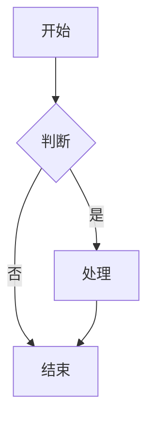

# 🎨 MDX 演示文稿系统

一个功能强大的 MDX 演示文稿系统，内置交互式对比组件，专为 AI 技术演示和对比分析设计。

## ✨ 特性

### 🎯 核心功能

- **MDX 支持**: 使用 Markdown + React 组件创建演示文稿
- **交互式组件**: 6+ 个精美的对比展示组件
- **Mermaid 图表**: 内置流程图、架构图支持
- **响应式设计**: 完美适配桌面和移动设备
- **实时预览**: Vite 驱动的快速热重载

### 🧩 组件库

1. **ComparisonCard** - 特性对比卡片
2. **ComparisonTable** - 交互式数据表格
3. **FeatureGrid** - 功能支持矩阵
4. **TabComparison** - 标签式内容切换
5. **MetricCard** - 多样式指标展示
6. **PricingCard** - 价格方案卡片

## 🚀 快速开始

### 安装依赖

```bash
cd presentations
npm install
```

### 启动开发服务器

```bash
npm run dev
```

访问 `http://localhost:5173` 查看演示文稿。

### 构建生产版本

```bash
npm run build
npm run preview
```

## 📁 项目结构

```
presentations/
├── src/
│   ├── components/          # React 组件
│   │   ├── ComparisonCard.jsx
│   │   ├── ComparisonTable.jsx
│   │   ├── FeatureGrid.jsx
│   │   ├── TabComparison.jsx
│   │   ├── MetricCard.jsx
│   │   ├── PricingCard.jsx
│   │   ├── Mermaid.jsx
│   │   └── ImageModal.jsx
│   ├── presentations/       # MDX 演示文稿
│   │   ├── AI-Comparison.mdx    # AI 对比演示
│   │   └── NotebookLM.mdx       # NotebookLM 介绍
│   ├── pages/              # 页面组件
│   │   └── Home.jsx
│   ├── App.jsx             # 主应用
│   ├── index.css           # 全局样式
│   └── main.jsx            # 入口文件
├── docs/                   # 文档
│   ├── COMPONENTS_GUIDE.md  # 组件使用指南
│   ├── SOLUTION.md
│   └── DIAGRAM_IMPROVEMENTS.md
├── package.json
└── vite.config.js
```

## 📝 创建新演示文稿

### 1. 创建 MDX 文件

在 `src/presentations/` 创建新的 `.mdx` 文件：

```mdx
import ComparisonCard from '../components/ComparisonCard'

# 我的演示文稿

## 第一部分

这里是内容...

<ComparisonCard
  provider="示例"
  logo="🎯"
  color="#FF6B6B"
  tagline="这是一个示例"
  features={['功能1', '功能2']}
/>
```

### 2. 注册路由

在 `src/App.jsx` 中添加：

```javascript
import MyPresentation from './presentations/MyPresentation.mdx'

const presentations = [
  // ...其他演示文稿
  { path: '/my-presentation', name: '我的演示', component: MyPresentation }
]
```

### 3. 访问演示

开发服务器会自动热重载，访问 `/my-presentation` 即可查看。

## 🎨 组件使用示例

### 对比卡片网格

```jsx
<div style={{
  display: 'grid',
  gridTemplateColumns: 'repeat(auto-fit, minmax(320px, 1fr))',
  gap: '2rem'
}}>
  <ComparisonCard
    provider="Claude"
    logo="🤖"
    color="#D97757"
    features={['特性1', '特性2']}
  />
  <ComparisonCard
    provider="GPT-4"
    logo="✨"
    color="#10A37F"
    features={['特性1', '特性2']}
  />
</div>
```

### 交互式表格

```jsx
export const tableData = [
  { name: 'Claude', speed: 95, price: 3 },
  { name: 'GPT-4', speed: 80, price: 10 }
]

export const columns = [
  { key: 'name', label: '名称' },
  { key: 'speed', label: '速度', type: 'number', highlightBest: true },
  { key: 'price', label: '价格', type: 'number' }
]

<ComparisonTable
  data={tableData}
  columns={columns}
  interactive={true}
  highlightBest={true}
/>
```

### 功能网格

```jsx
export const providers = [
  { name: 'Claude', logo: '🤖' },
  { name: 'GPT-4', logo: '✨' }
]

export const features = [
  { key: 'feature1', name: '功能1', description: '描述' }
]

export const support = {
  'Claude': { feature1: true },
  'GPT-4': { feature1: 'partial' }
}

<FeatureGrid
  providers={providers}
  features={features}
  support={support}
/>
```

### Mermaid 图表

````mdx

````

## 🎯 完整示例

查看 `src/presentations/AI-Comparison.mdx` 获取完整的使用示例，包含：

- ✅ 所有6个组件的使用
- ✅ 复杂的数据结构示例
- ✅ 响应式布局技巧
- ✅ Mermaid 图表集成
- ✅ 交互式元素配置

## 📚 文档

- [组件使用指南](./docs/COMPONENTS_GUIDE.md) - 详细的组件 API 文档
- [Mermaid 语法](https://mermaid.js.org/) - 图表绘制语法
- [MDX 文档](https://mdxjs.com/) - MDX 使用指南

## 🎨 样式定制

### 主题色

在 `src/index.css` 中修改全局主题色：

```css
:root {
  --primary-color: #c47645;
  --background-color: #f5f5f0;
  --text-color: #2d2d2d;
}
```

### 组件样式

每个组件都支持通过 props 自定义颜色：

```jsx
<ComparisonCard
  color="#custom-color"
  style={{ '--card-color': '#another-color' }}
  ...
/>
```

## 🔧 技术栈

- **React 18** - UI 框架
- **Vite** - 构建工具
- **MDX** - Markdown + JSX
- **React Router** - 路由管理
- **Mermaid** - 图表绘制

## 📊 性能优化

- ✅ Vite 快速热重载
- ✅ 代码分割（按路由）
- ✅ CSS 优化
- ✅ 图表懒加载

## 🤝 贡献

欢迎贡献新的组件和演示文稿！

### 添加新组件

1. 在 `src/components/` 创建组件文件
2. 在 `src/index.css` 添加样式
3. 更新 `docs/COMPONENTS_GUIDE.md`
4. 在示例演示文稿中使用

## 📄 许可证

MIT

## 🎉 演示文稿列表

### AI 大语言模型对比

全面对比 Claude、OpenAI GPT-4 和 Google Gemini：

- 📊 核心指标对比
- 🏗️ 架构流程图
- 💰 价格方案对比
- ⚡ 功能特性矩阵
- 🎯 应用场景推荐

访问路径: `/ai-comparison`

### NotebookLM 深度解析

Google NotebookLM 完整介绍：

- 📚 产品概述
- 🔧 技术架构
- 💡 使用场景
- 🎵 音频概览功能

访问路径: `/notebooklm`

---

**开始创建你的精彩演示文稿吧！** 🚀
