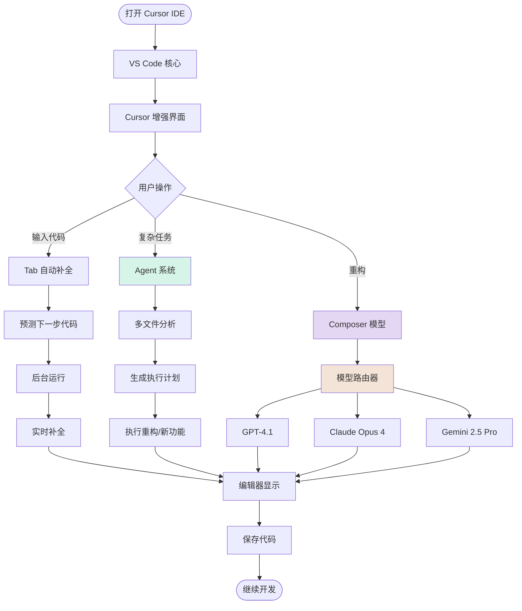
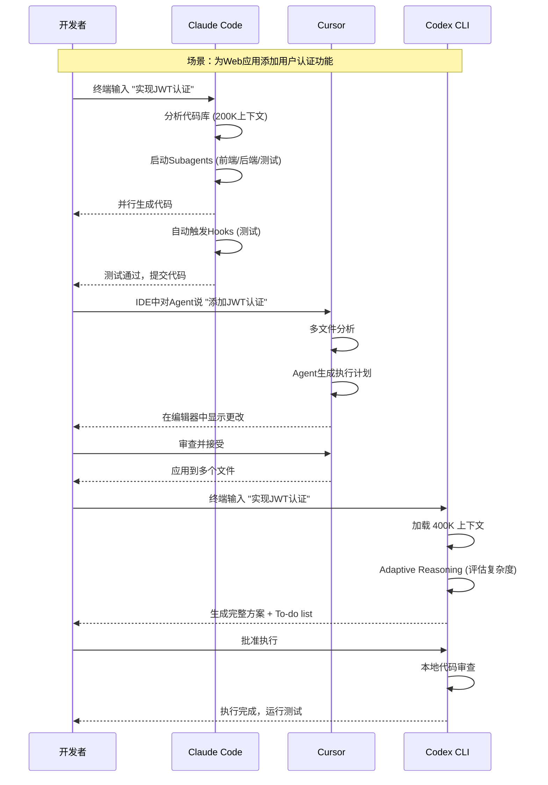
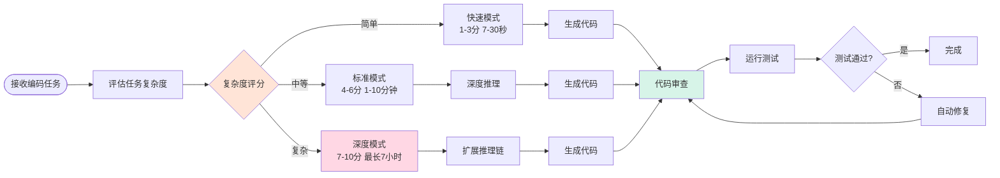
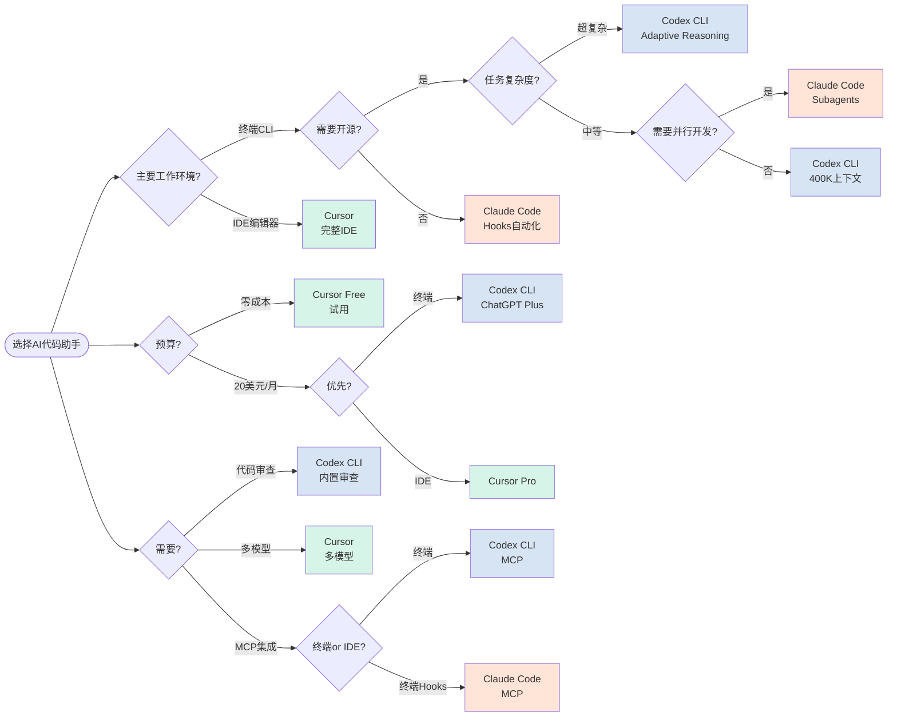
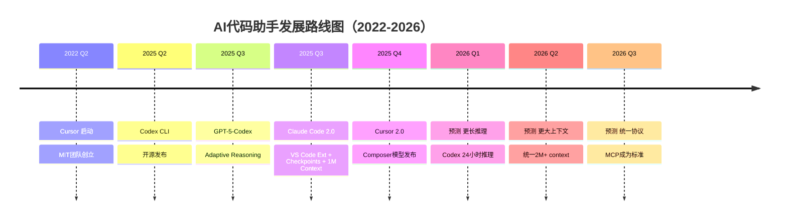

import ComparisonCard from '../components/ComparisonCard'
import ComparisonTable from '../components/ComparisonTable'
import FeatureGrid from '../components/FeatureGrid'
import TabComparison from '../components/TabComparison'
import MetricCard from '../components/MetricCard'
import PricingCard from '../components/PricingCard'

# AI 代码助手全面对比

**Claude Code vs Cursor vs Codex CLI** - 2025年最新AI编码工具深度剖析

---

## 概览

2025年，终端和IDE的AI代码助手进入了新纪元。本文将深入对比三大CLI/IDE解决方案：Anthropic的终端原生工具Claude Code、Anysphere的AI原生IDE Cursor，以及OpenAI的开源终端工具Codex CLI (搭载GPT-5-Codex)。它们代表了AI辅助编程的三种不同理念和技术路线。

> **最后更新**: 2025年11月 | **数据来源**: OpenAI官方文档、Anthropic文档、Cursor官网、AIMultiple Benchmark

---

## 快速对比

  <ComparisonCard
    provider="Claude Code"
    logo="🤖"
    color="#D97757"
    tagline="终端原生AI编程"
    metrics={{
      '类型': 'CLI + VS Code Extension',
      '上下文': '200K-1M tokens (Beta)',
      '发布': '2025年9月 v2.0'
    }}
    features={[
      'VS Code Extension (Beta) 原生IDE集成',
      'Checkpoint System 自动检查点/回退',
      '1M Context Window (Beta, /model sonnet[1m])',
      'Subagents 子代理并行开发',
      'Hooks 自动触发测试/检查',
      'Background Tasks 后台任务',
      'Claude Sonnet 4.5 (SWE-bench 82%)',
      'Terminal 2.0 + 可搜索历史 (Ctrl+R)'
    ]}
    highlight={true}
  />

  <ComparisonCard
    provider="Cursor"
    logo="✨"
    color="#10A37F"
    tagline="AI原生开发环境"
    metrics={{
      '类型': '完整 IDE',
      '估值': '$9.9B',
      '发布': '2025年10月 v2.0'
    }}
    features={[
      'VS Code完整体验',
      'Agent 复杂多文件任务',
      'Tab 智能代码补全',
      'Composer 专用编码模型',
      '多模型支持 (GPT/Claude/Gemini)',
      'Background Agents 后台代理',
      'Pro起步价 $20/月',
      '最高 $200/月 Ultra 套餐'
    ]}
    highlight={false}
  />

  <ComparisonCard
    provider="Codex CLI"
    logo="⚡"
    color="#4285F4"
    tagline="开源终端AI代理"
    metrics={{
      '类型': '开源 CLI',
      '上下文': '400K tokens',
      '发布': '2025年4月'
    }}
    features={[
      'GPT-5-Codex 模型 (2025年9月)',
      '400K超大上下文窗口',
      'Adaptive Reasoning (最长7小时)',
      '开源 (Rust构建)',
      'MCP协议支持',
      '多模态输入 (文本/截图/图表)',
      'To-do lists + Web search',
      'ChatGPT Plus $20/月起'
    ]}
    highlight={false}
  />

---

## 核心架构对比

### Claude Code 2.0 架构：终端/IDE双模式 + 检查点系统

```mermaid
flowchart LR
    Start(["用户输入"]) --> Interface{界面选择}
    Interface -->|终端| CLI["Claude Code CLI<br/>Terminal 2.0"]
    Interface -->|IDE| VSCode["VS Code Extension<br/>(Beta)"]

    CLI --> Parse["解析任务"]
    VSCode --> Parse

    Parse --> Checkpoint1["创建检查点<br/>(自动保存)"]
    Checkpoint1 --> Context["上下文加载<br/>200K-1M tokens"]
    Context --> Decision{"需要并行开发?"}

    Decision -->|是| Subagent["启动 Subagents"]
    Decision -->|否| Main["主代理处理<br/>Sonnet 4.5"]

    Subagent --> Frontend["前端代理"]
    Subagent --> Backend["后端代理"]
    Subagent --> Test["测试代理"]

    Frontend --> Merge["结果合并"]
    Backend --> Merge
    Test --> Merge
    Main --> Output["生成代码"]

    Merge --> Output
    Output --> Checkpoint2["保存检查点<br/>(Esc×2 回退)"]
    Checkpoint2 --> Hooks["触发 Hooks"]
    Hooks --> Check["运行测试/Lint"]
    Check --> BG["后台任务 Ctrl+B"]
    BG --> Display{显示方式}

    Display -->|终端| Terminal["终端输出<br/>Ctrl+R 历史"]
    Display -->|IDE| Sidebar["侧边栏+内联差异"]

    Terminal --> End(["完成"])
    Sidebar --> End

    style CLI fill:#ffe4d7
    style VSCode fill:#e4f4d7
    style Checkpoint1 fill:#f4d7e4
    style Checkpoint2 fill:#f4d7e4
    style Subagent fill:#ffd7e4
    style Hooks fill:#d7f4e8
```

**架构说明（2.0 新增）：**
- **双模式界面**: Terminal 2.0（Ctrl+R搜索历史）+ VS Code Extension Beta（侧边栏+内联差异）
- **Checkpoint System**: 每次更改前自动保存，Esc×2或/rewind即时回退，可恢复代码/对话/两者
- **1M Context Window (Beta)**: 使用 `/model sonnet[1m]` 激活，可处理约75,000行代码（需Tier 4或Max 20x订阅）
- **Subagents**: 委托专门任务（如后端API和前端并行开发）
- **Hooks系统**: 在特定点自动触发（代码更改后运行测试，提交前linting）
- **Background Tasks**: Ctrl+B保持开发服务器等进程，不阻塞其他工作
- **Sonnet 4.5**: SWE-bench Verified 82.0%，比前版本提升76%

---

### Cursor 架构：IDE 集成 + Agent 工作流

**架构说明：**
- **VS Code基础**: 基于VS Code fork，保留完整IDE功能
- **Tab补全**: 后台持续运行，预测你的下一步编码
- **Agent系统**: 处理复杂的多文件重构和大型功能开发
- **Composer模型**: Cursor专用的编码模型，优化agent工作流
- **多模型支持**: 可在GPT、Claude、Gemini间切换
- **Background Agents**: 在后台持续分析代码库

---

### Codex CLI 架构：开源终端 + GPT-5-Codex

```mermaid
flowchart LR
    Start(["终端输入命令"]) --> CLI["Codex CLI<br/>Rust"]
    CLI --> MCP{"使用MCP?"}

    MCP -->|是| MCPTools["第三方工具集成"]
    MCP -->|否| Direct["直接处理"]

    MCPTools --> Context["上下文收集"]
    Direct --> Context

    Context --> Load["加载 400K 上下文"]
    Load --> Multimodal{"多模态输入?"}

    Multimodal -->|文本| Text["文本处理"]
    Multimodal -->|截图| Image["图像理解"]
    Multimodal -->|图表| Diagram["图表解析"]

    Text --> GPT5Codex["GPT-5-Codex"]
    Image --> GPT5Codex
    Diagram --> GPT5Codex

    GPT5Codex --> Reasoning{"Adaptive Reasoning"}
    Reasoning -->|简单任务| Quick["快速响应<br/>秒级"]
    Reasoning -->|复杂任务| Deep["深度思考<br/>最长7小时"]

    Quick --> Review["代码审查"]
    Deep --> Review

    Review --> Execute["本地执行"]
    Execute --> Todo["更新 To-do List"]
    Todo --> WebSearch{"需要搜索?"}

    WebSearch -->|是| Search["Web Search"]
    WebSearch -->|否| Output["生成代码"]

    Search --> Output
    Output --> End(["完成"])

    style CLI fill:#d7e4f4
    style GPT5Codex fill:#ffd7e4
    style Reasoning fill:#ffe4d7
```

**架构说明：**
- **开源CLI**: Rust构建，轻量高效，可贡献代码
- **GPT-5-Codex**: 2025年9月发布，专为代码优化
- **Adaptive Reasoning**: 根据任务复杂度动态分配思考时间（7秒-7小时）
- **MCP协议**: 支持Model Context Protocol，可集成第三方工具
- **多模态输入**: 支持文本、截图、图表作为输入
- **400K上下文**: 比Claude Code大2倍，可处理超大代码库
- **内置功能**: To-do lists、Web search、代码审查

---

## 工作流程对比

### 典型开发场景：添加新功能

**流程说明：**
- **Claude Code**: 终端驱动，全自动并行开发，Hooks自动化测试
- **Cursor**: IDE内Agent对话，可视化审查所有更改，熟悉的编辑器体验
- **Codex CLI**: 终端驱动，Adaptive Reasoning智能分配思考时间，内置代码审查

---

## 性能指标对比

export const contextWindowData = [
  { provider: 'Claude Code 2.0', icon: '🤖', value: '1,000,000', unit: ' tokens (Beta)', color: '#D97757' },
  { provider: 'Codex CLI', icon: '⚡', value: '400,000', unit: ' tokens', color: '#4285F4' },
  { provider: 'Claude Code 2.0', icon: '🤖', value: '200,000', unit: ' tokens (默认)', color: '#D97757' },
  { provider: 'Cursor', icon: '✨', value: '可变', unit: ' (取决于模型)', color: '#10A37F' }
]

export const outputCapacityData = [
  { provider: 'Claude Code', value: 128, unit: 'K tokens', color: '#D97757', icon: '🤖' },
  { provider: 'Codex CLI', value: '未公开', unit: '', color: '#4285F4', icon: '⚡' },
  { provider: 'Cursor', value: '取决于模型', unit: '', color: '#10A37F', icon: '✨' }
]

<MetricCard
  title="上下文窗口大小对比"
  items={contextWindowData}
  type="bar"
/>

<MetricCard
  title="2025年主要里程碑"
  items={[
    { provider: 'Cursor', value: '2022年启动', icon: '✨', color: '#10A37F', note: 'MIT团队创立' },
    { provider: 'Codex CLI', value: '2025年4月', icon: '⚡', color: '#4285F4', note: '开源发布' },
    { provider: 'Claude Code 2.0', value: '2025年9月29日', icon: '🤖', color: '#D97757', note: 'VS Code Ext + 1M Context' },
    { provider: 'GPT-5-Codex', value: '2025年9月', icon: '⚡', color: '#4285F4', note: 'Adaptive Reasoning' },
    { provider: 'Cursor 2.0', value: '2025年10月', icon: '✨', color: '#10A37F', note: 'Composer模型发布' }
  ]}
  type="number"
/>

---

## 功能特性矩阵

export const providers = [
  { name: 'Claude Code', logo: '🤖' },
  { name: 'Cursor', logo: '✨' },
  { name: 'Codex CLI', logo: '⚡' }
]

export const features = [
  {
    key: 'cliSupport',
    name: '命令行原生',
    description: '完全在终端中操作',
    notes: {
      'Cursor': 'IDE only'
    }
  },
  {
    key: 'openSource',
    name: '开源',
    description: '代码开放，可贡献',
    notes: {
      'Claude': '闭源',
      'Cursor': '闭源',
      'Codex': 'GitHub开源'
    }
  },
  {
    key: 'largeContext',
    name: '超大上下文',
    description: '能理解整个代码库',
    notes: {
      'Claude': '200K tokens',
      'Cursor': '取决于模型',
      'Codex': '400K tokens'
    }
  },
  {
    key: 'adaptiveReasoning',
    name: '自适应推理',
    description: '动态分配思考时间',
    notes: {
      'Claude': '不支持',
      'Cursor': '不支持',
      'Codex': '7秒-7小时'
    }
  },
  {
    key: 'parallelDev',
    name: '并行开发',
    description: '同时处理多个任务',
    notes: {
      'Claude': 'Subagents',
      'Cursor': 'Background Agents',
      'Codex': '不支持'
    }
  },
  {
    key: 'codeReview',
    name: '代码审查',
    description: '自动审查代码质量',
    notes: {
      'Claude': '需手动',
      'Cursor': '部分',
      'Codex': '内置审查'
    }
  },
  {
    key: 'multiModel',
    name: '多模型支持',
    description: '可选择不同AI模型',
    notes: {
      'Claude': '仅Claude',
      'Cursor': 'GPT/Claude/Gemini',
      'Codex': '仅GPT-5-Codex'
    }
  },
  {
    key: 'mcpSupport',
    name: 'MCP协议',
    description: 'Model Context Protocol集成',
    notes: {
      'Claude': '支持',
      'Cursor': '支持',
      'Codex': '支持'
    }
  }
]

export const support = {
  'Claude Code': {
    cliSupport: true,
    openSource: false,
    largeContext: true,
    adaptiveReasoning: false,
    parallelDev: true,
    codeReview: 'partial',
    multiModel: false,
    mcpSupport: true
  },
  'Cursor': {
    cliSupport: false,
    openSource: false,
    largeContext: 'partial',
    adaptiveReasoning: false,
    parallelDev: true,
    codeReview: 'partial',
    multiModel: true,
    mcpSupport: true
  },
  'Codex CLI': {
    cliSupport: true,
    openSource: true,
    largeContext: true,
    adaptiveReasoning: true,
    parallelDev: false,
    codeReview: true,
    multiModel: false,
    mcpSupport: true
  }
}

<FeatureGrid
  providers={providers}
  features={features}
  support={support}
/>

---

## 价格对比

  <PricingCard
    provider="Claude Code"
    color="#D97757"
    icon="🤖"
    popular={true}
    pricing={{
      features: [
        'Claude.ai Pro: ~$20/月',
        '200K-1M 上下文窗口 (Beta)',
        '1M需Tier 4或Max 20x订阅',
        'API: $3/M输入, $15/M输出',
        '1M定价: 2x输入 + 1.5x输出 (>200K)',
        'Subagents 并行 + Checkpoints',
        'VS Code Extension (Beta)',
        '支持 Anthropic/Bedrock/Vertex'
      ],
      limits: {
        'Pro限制': '约45次请求/5小时',
        '1M Context': '/model sonnet[1m]',
        '部署选项': '3种云平台'
      }
    }}
  />

  <PricingCard
    provider="Cursor"
    color="#10A37F"
    icon="✨"
    pricing={{
      features: [
        'Free: 一周Pro试用',
        'Pro: $20/月 无限Tab + $20模型额度',
        'Pro+: $60/月 (3x模型用量)',
        'Ultra: $200/月 (20x模型用量)',
        'Business: $40/月/用户 + 团队管理',
        'Cursor 2.0 + Composer',
        '多模型选择 (GPT/Claude/Gemini)',
        'Background Agents'
      ],
      limits: {
        'Pro起步价': '$20/月',
        '最高套餐': '$200/月',
        '估值': '$9.9B'
      }
    }}
  />

  <PricingCard
    provider="Codex CLI"
    color="#4285F4"
    icon="⚡"
    pricing={{
      features: [
        'ChatGPT Plus: $20/月 (~45-225 local msg/5h)',
        'ChatGPT Pro: $200/月 (~300-1500 local msg/5h)',
        'API访问: $1.25/M输入, $10/M输出',
        'GPT-5-Codex-mini: $1.50/$6.00',
        '400K超大上下文',
        'Adaptive Reasoning (最长7小时)',
        '开源 - GitHub可贡献',
        'MCP协议支持'
      ],
      limits: {
        'Plus限制': '45-225 msg/5h',
        'Pro限制': '300-1500 msg/5h',
        'API定价': '$1.25/$10 per M'
      }
    }}
  />

---

## 详细对比表格

export const detailedComparisonData = [
  {
    feature: '工具类型',
    claude: 'CLI + VS Code Extension (Beta)',
    cursor: '完整 IDE',
    codex: '开源 CLI'
  },
  {
    feature: '发布时间',
    claude: '2025年9月29日 (2.0)',
    cursor: '2022年启动 (2.0: 2025年10月)',
    codex: '2025年4月 (GPT-5-Codex: 9月)'
  },
  {
    feature: '上下文窗口',
    claude: '200K tokens (默认) / 1M tokens (Beta)',
    cursor: '取决于所选模型',
    codex: '400K tokens'
  },
  {
    feature: '输出容量',
    claude: '128K tokens',
    cursor: '取决于所选模型',
    codex: '未公开'
  },
  {
    feature: '起步价',
    claude: 'Claude.ai 付费订阅',
    cursor: 'Free (Pro: $20/月)',
    codex: 'ChatGPT Plus $20/月'
  },
  {
    feature: '最贵套餐',
    claude: '单一订阅',
    cursor: '$200/月 (Ultra)',
    codex: 'ChatGPT Pro $200/月'
  },
  {
    feature: '支持的模型',
    claude: 'Claude Sonnet 4.5',
    cursor: 'GPT-4.1 / Claude Opus 4 / Gemini 2.5 Pro',
    codex: 'GPT-5-Codex / GPT-5-Codex-mini'
  },
  {
    feature: '开源',
    claude: '✗',
    cursor: '✗',
    codex: '✓ (GitHub)'
  },
  {
    feature: 'Adaptive Reasoning',
    claude: '✗',
    cursor: '✗',
    codex: '✓ (最长7小时)'
  },
  {
    feature: '并行开发',
    claude: '✓ (Subagents)',
    cursor: '✓ (Background Agents)',
    codex: '✗'
  },
  {
    feature: '代码审查',
    claude: '部分',
    cursor: '部分',
    codex: '✓ (内置)'
  },
  {
    feature: 'MCP协议',
    claude: '✓',
    cursor: '✗',
    codex: '✓'
  }
]

export const columns = [
  { key: 'feature', label: '特性', sortable: false },
  { key: 'claude', label: 'Claude Code', sortable: false },
  { key: 'cursor', label: 'Cursor', sortable: false },
  { key: 'codex', label: 'Codex CLI', sortable: false }
]

<ComparisonTable
  data={detailedComparisonData}
  columns={columns}
  interactive={true}
  highlightBest={false}
/>

---

## 按场景分类对比

export const useCaseContent = {
  terminal: (
    

      <h3>终端 / DevOps工作流</h3>
      <MetricCard
        title="终端工作流适配度"
        items={[
          { provider: 'Claude Code', value: 100, unit: '/100', color: '#D97757', icon: '🤖', note: '原生CLI设计' },
          { provider: 'Codex CLI', value: 95, unit: '/100', color: '#4285F4', icon: '⚡', note: '开源CLI + MCP' },
          { provider: 'Cursor', value: 20, unit: '/100', color: '#10A37F', icon: '✨', note: 'GUI优先' }
        ]}
        type="bar"
      />
      <h4>终端场景优势：</h4>
      <ul>
        <li><strong>Claude Code:</strong> 完全终端原生，Hooks自动化DevOps任务，Subagents并行开发</li>
        <li><strong>Codex CLI:</strong> 开源Rust构建，MCP协议集成工具，400K超大上下文</li>
        <li><strong>Cursor:</strong> 完整GUI IDE，不适合终端优先的开发者</li>
      </ul>
      <h4>推荐选择：</h4>
      
<strong>Claude Code</strong> - Hooks自动化 + Subagents；<strong>Codex CLI</strong> - 开源 + 400K上下文

    

  ),
  complex: (
    

      <h3>复杂代码重构 / 大型项目</h3>
      <MetricCard
        title="复杂任务处理能力"
        items={[
          { provider: 'Codex CLI', value: 95, unit: '/100', color: '#4285F4', icon: '⚡', note: 'Adaptive Reasoning 7h' },
          { provider: 'Cursor', value: 90, unit: '/100', color: '#10A37F', icon: '✨', note: 'Agent多文件重构' },
          { provider: 'Claude Code', value: 85, unit: '/100', color: '#D97757', icon: '🤖', note: 'Subagents并行' }
        ]}
        type="bar"
      />
      <h4>复杂任务特性：</h4>
      <ul>
        <li><strong>Codex CLI:</strong> Adaptive Reasoning最长7小时深度思考，400K上下文，内置代码审查</li>
        <li><strong>Cursor:</strong> Agent多文件重构，可视化审查，多模型选择</li>
        <li><strong>Claude Code:</strong> Subagents并行开发前后端，200K上下文，Hooks自动测试</li>
      </ul>
      <h4>推荐选择：</h4>
      
<strong>Codex CLI</strong> - 超复杂任务需长时间推理；<strong>Cursor</strong> - 需要IDE可视化审查

    

  ),
  cost: (
    

      <h3>成本敏感 / 个人开发者</h3>
      <MetricCard
        title="月费成本对比（个人起步价）"
        items={[
          { provider: 'Codex CLI', value: 20, unit: ' USD/月', color: '#4285F4', icon: '⚡', note: 'ChatGPT Plus' },
          { provider: 'Cursor', value: 20, unit: ' USD/月', color: '#10A37F', icon: '✨', note: 'Pro' },
          { provider: 'Claude Code', value: 'N/A', unit: ' (需订阅)', color: '#D97757', icon: '🤖', note: 'Claude.ai付费' }
        ]}
        type="bar"
      />
      <h4>成本考量：</h4>
      <ul>
        <li><strong>Codex CLI:</strong> $20/月 ChatGPT Plus起步，开源可自托管，API按量付费</li>
        <li><strong>Cursor:</strong> Free试用，Pro $20/月，性价比高</li>
        <li><strong>Claude Code:</strong> 需要Claude.ai付费订阅，价格未公开</li>
      </ul>
      <h4>推荐选择：</h4>
      
<strong>Cursor Free</strong> - 零成本试用；<strong>Codex CLI</strong> - $20/月 + 开源

    

  )
}

<TabComparison
  tabs={[
    { id: 'terminal', label: '终端工作流', icon: '💻', color: '#D97757', content: useCaseContent.terminal },
    { id: 'complex', label: '复杂重构', icon: '🔧', color: '#4285F4', content: useCaseContent.complex },
    { id: 'cost', label: '成本优先', icon: '💰', color: '#10A37F', content: useCaseContent.cost }
  ]}
  defaultTab="terminal"
/>

---

## 技术实现深度对比

### GPT-5-Codex: Adaptive Reasoning 工作流

**Adaptive Reasoning优势：**
- **智能时间分配**: 简单任务秒级完成，复杂任务可运行7小时
- **动态推理**: 根据任务复杂度自动调整思考深度
- **内置审查**: 每次生成后自动进行代码审查
- **持续优化**: 测试失败后自动修复并重新审查

---

## 使用场景决策树

---

## 总结与建议

### 三大工具定位

  

    <h3 style={{ color: '#D97757', marginTop: 0 }}>🤖 Claude Code 2.0</h3>
    
<strong>最佳场景：</strong>

    <ul style={{ marginLeft: '1.5rem' }}>
      <li><strong>超大代码库</strong> - 1M context处理75,000行代码</li>
      <li><strong>终端+IDE双模式</strong> - VS Code Extension (Beta)</li>
      <li><strong>Checkpoints</strong> - 即时回退代码/对话</li>
      <li><strong>并行开发</strong> - Subagents前后端同时</li>
      <li><strong>DevOps自动化</strong> - Hooks + Background Tasks</li>
      <li><strong>私有云</strong> - Bedrock/Vertex部署</li>
    </ul>
    
<strong>价格:</strong> API $3/$15/M，1M需Tier 4/Max 20x

  

  

    <h3 style={{ color: '#10A37F', marginTop: 0 }}>✨ Cursor</h3>
    
<strong>最佳场景：</strong>

    <ul style={{ marginLeft: '1.5rem' }}>
      <li><strong>全栈开发</strong> - Agent多文件重构</li>
      <li><strong>从零搭建产品</strong></li>
      <li><strong>多模型选择</strong> - GPT/Claude/Gemini</li>
      <li><strong>VS Code用户</strong> - 熟悉界面</li>
      <li>需要完整IDE可视化体验</li>
    </ul>
    
<strong>价格:</strong> Free试用，Pro $20/月

  

  

    <h3 style={{ color: '#4285F4', marginTop: 0 }}>⚡ Codex CLI</h3>
    
<strong>最佳场景：</strong>

    <ul style={{ marginLeft: '1.5rem' }}>
      <li><strong>超复杂任务</strong> - 7小时Adaptive Reasoning</li>
      <li><strong>开源优先</strong> - GitHub可贡献</li>
      <li><strong>400K超大上下文</strong> - 超大代码库</li>
      <li><strong>代码审查</strong> - 内置审查功能</li>
      <li><strong>MCP集成</strong> - DevOps工具链</li>
    </ul>
    
<strong>价格:</strong> ChatGPT Plus $20/月起

  

### 性价比分析

<MetricCard
  title="月费成本对比（个人起步价）"
  items={[
    { provider: 'Codex CLI', value: 20, unit: ' USD/月', color: '#4285F4', icon: '⚡', note: 'ChatGPT Plus' },
    { provider: 'Cursor', value: 20, unit: ' USD/月', color: '#10A37F', icon: '✨', note: 'Pro (Free试用)' },
    { provider: 'Claude Code', value: 'N/A', unit: ' (需订阅)', color: '#D97757', icon: '🤖', note: 'Claude.ai' }
  ]}
  type="bar"
/>

  <h4 style={{ marginTop: 0, color: '#4285F4' }}>💡 价格洞察</h4>
  <ul style={{ marginBottom: 0 }}>
    <li><strong>Claude Code 2.0</strong>: API $3/$15 per M，1M context (Beta) 需Tier 4/Max 20x，超200K有2x输入+1.5x输出额外费用</li>
    <li><strong>Codex CLI</strong>: $20/月 ChatGPT Plus，开源可自托管，API按量付费 ($1.25/$10 per M)</li>
    <li><strong>Cursor</strong>: Free试用，Pro $20/月，Pro+ $60/月 (3x用量)，Ultra $200/月 (20x用量)</li>
    <li><strong>1M Context优势</strong>: Claude Code可处理约75,000行代码或数十篇论文，是Codex CLI 400K的2.5倍</li>
    <li><strong>开源优势</strong>: 仅Codex CLI开源，可贡献代码，$1M API资助计划</li>
  </ul>

---

## Benchmark 性能对比

### 2025年AI代码助手评测

根据AIMultiple、OpenAI官方和Anthropic官方数据：

<MetricCard
  title="SWE-bench Verified 评分（真实代码库问题解决）"
  items={[
    { provider: 'Claude Code 2.0 (Sonnet 4.5)', value: 82.0, unit: '%', color: '#D97757', icon: '🤖', note: '比前版本↑76%' },
    { provider: 'Codex CLI (GPT-5-Codex)', value: 51.3, unit: '%', color: '#4285F4', icon: '⚡', note: 'Adaptive Reasoning' },
    { provider: 'Cursor (多模型)', value: '可变', unit: '', color: '#10A37F', icon: '✨', note: '取决于所选模型' }
  ]}
  type="bar"
/>

<MetricCard
  title="代码重构能力评分 (综合评测)"
  items={[
    { provider: 'Cursor', value: 92, unit: '/100', color: '#10A37F', icon: '✨', note: 'AIMultiple综合' },
    { provider: 'Claude Code 2.0', value: 90, unit: '/100', color: '#D97757', icon: '🤖', note: 'SWE-bench + 综合' },
    { provider: 'Codex CLI', value: 85, unit: '/100', color: '#4285F4', icon: '⚡', note: 'OpenAI官方' }
  ]}
  type="bar"
/>

**评测维度：**
1. **SWE-bench Verified**: Claude Code 2.0 (82.0%) 领先，比前版本提升76%
2. **上下文理解**: Claude Code 1M (Beta) > Codex CLI 400K > Claude Code 200K (默认)
3. **推理时间**: Codex CLI最长7小时 vs Claude实时 + Checkpoints回退
4. **并行能力**: Claude Code Subagents > Cursor BG Agents > Codex单线程
5. **开源生态**: 仅Codex CLI开源，GitHub活跃
6. **IDE集成**: Claude Code 2.0新增VS Code Extension，与Cursor直接竞争

---

## 快速选择指南

### 👨‍💻 如果你是...

**后端/DevOps工程师：**
- 选择 **Claude Code 2.0** - 1M超大上下文(Beta)，Hooks自动化，Checkpoints回退，终端+IDE双模式
- 或 **Codex CLI** - MCP集成DevOps工具，400K上下文，开源

**全栈开发者：**
- 选择 **Cursor** - Agent多文件重构，熟悉的VS Code体验，多模型选择

**算法/AI研究员：**
- 选择 **Codex CLI** - Adaptive Reasoning最长7小时深度思考，内置代码审查

**超大代码库维护者：**
- 选择 **Claude Code 2.0** - 1M context (约75,000行代码)，SWE-bench 82%，Checkpoints安全回退

**学生/个人开发者：**
- 选择 **Cursor Free** - 零成本一周试用
- 或 **Codex CLI** - $20/月ChatGPT Plus，开源可贡献

**开源贡献者：**
- 选择 **Codex CLI** - 唯一开源CLI，GitHub可贡献，$1M API资助

**企业团队：**
- 选择 **Cursor Business** - $40/月/用户，团队管理，SAML认证
- 或 **Claude Code 2.0** - 私有云部署 (Bedrock/Vertex)，1M context处理超大项目

---

## 未来趋势

### 2025-2026 发展方向

### 行业趋势

1. **更大上下文**: Claude Code 2.0突破1M (2025年9月)，预计2026年统一2M+
2. **更长推理**: Codex Adaptive Reasoning从7小时 → 预测24小时+
3. **双模式工作流**: 终端CLI + IDE Extension成为标配 (Claude Code 2.0引领)
4. **Checkpoints系统**: 即时回退成为新标准，降低试错成本
5. **开源运动**: Codex CLI带动更多工具开源
6. **MCP标准化**: Model Context Protocol成为行业标准
7. **代码审查**: 从辅助工具 → 内置核心功能

---

## 参考资源

- **Claude Code官方文档**: [docs.anthropic.com](https://docs.anthropic.com)
- **Cursor官方网站**: [cursor.com](https://cursor.com)
- **Codex CLI GitHub**: [github.com/openai/codex](https://github.com/openai/codex)
- **GPT-5-Codex文档**: [openai.com](https://openai.com/index/gpt-5-system-card-addendum-gpt-5-codex/)
- **AIMultiple Benchmark**: AI代码助手评测

---

## 总结表格

| 维度           | 🥇 第一名                      | 🥈 第二名           | 🥉 第三名         |
| -------------- | ------------------------------- | -------------------- | ------------------ |
| **上下文窗口** | Claude Code 2.0 (1M Beta)       | Codex CLI (400K)     | Claude Code (200K) |
| **开源**       | Codex CLI (GitHub)       | -                    | -                  |
| **推理时间**   | Codex CLI (最长7小时)    | -                    | -                  |
| **并行开发**   | Claude Code (Subagents)  | Cursor (BG Agents)   | Codex CLI (无)     |
| **性价比**     | Codex CLI / Cursor ($20) | -                    | Claude Code (订阅) |
| **IDE体验**    | Cursor (完整IDE)         | -                    | -                  |
| **终端体验**   | Claude Code (原生)       | Codex CLI (开源)     | Cursor (无)        |
| **代码审查**   | Codex CLI (内置)         | Cursor/Claude (部分) | -                  |

---

*最后更新: 2025年11月*
*数据来源: OpenAI官方文档、Anthropic文档、Cursor官网、AIMultiple Benchmark、TechCrunch*
*价格和功能可能随时更新，请以官方网站为准*
