import ComparisonCard from '../components/ComparisonCard'
import ComparisonTable from '../components/ComparisonTable'
import FeatureGrid from '../components/FeatureGrid'
import TabComparison from '../components/TabComparison'
import MetricCard from '../components/MetricCard'
import PricingCard from '../components/PricingCard'

# AI 大语言模型全面对比

**Claude Sonnet 4.5 vs GPT-5 vs Gemini 2.5 Pro** - 2025年最新旗舰模型深度剖析

---

## 概览

2025年，三大AI巨头相继发布了最新旗舰模型：Anthropic的Claude Sonnet 4.5专注于代码与推理，OpenAI的GPT-5实现性价比突破，Google的Gemini 2.5 Pro则以超长上下文领先。本文将基于最新数据深入对比它们的架构、性能、定价和应用场景。

> **最后更新**: 2025年11月 | **数据来源**: 各平台官方API文档及LMSys Benchmark

---

## 快速对比

  <ComparisonCard
    provider="Claude Sonnet 4.5"
    logo="🤖"
    color="#D97757"
    tagline="代码与推理之王"
    metrics={{
      '上下文窗口': '200K',
      '最大输出': '64K',
      '发布时间': '2025年9月'
    }}
    features={[
      'SWE-bench 82% - 业界最强编码能力',
      'AIME 2025 数学满分 (100%)',
      '64K超大输出窗口',
      'Constitutional AI 安全保障',
      '扩展上下文支持（>200K）',
      '批处理50%成本优惠',
      '提示缓存90%成本节省',
      '工具调用和函数执行'
    ]}
    highlight={true}
  />

  <ComparisonCard
    provider="GPT-5"
    logo="✨"
    color="#10A37F"
    tagline="性价比与智能路由"
    metrics={{
      '上下文窗口': '400K',
      '最大输出': '128K',
      '发布时间': '2025年8月'
    }}
    features={[
      '400K超大上下文窗口',
      '128K最大输出 - 三者最高',
      '智能路由系统（标准/推理模式）',
      '幻觉率降低45-80%',
      'MMMU多模态理解 84.2%',
      '实时语音对话能力',
      '知识截止2024年9月',
      '多变体：mini/nano/chat'
    ]}
    highlight={false}
  />

  <ComparisonCard
    provider="Gemini 2.5 Pro"
    logo="⚡"
    color="#4285F4"
    tagline="超长上下文专家"
    metrics={{
      '上下文窗口': '1M',
      '最大输出': '8K',
      '发布时间': '2025年3月'
    }}
    features={[
      '1M超长上下文（2M即将推出）',
      '原生多模态（文本/图像/视频/音频）',
      'LMArena排行榜领先',
      'GPQA Diamond 84.0%',
      'Google搜索实时增强',
      'Google Workspace深度集成',
      '上下文缓存优化',
      'NotebookLM音频生成'
    ]}
    highlight={false}
  />

---

## 核心架构对比

### 架构设计理念

**Claude Sonnet 4.5 架构:**

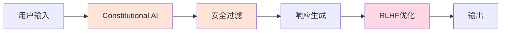

**GPT-5 架构:**

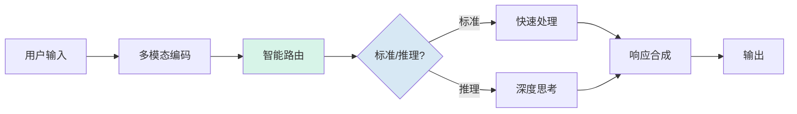

**Gemini 2.5 Pro 架构:**

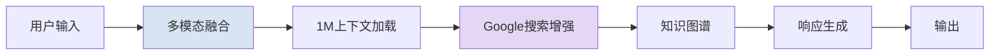

### 处理流程对比

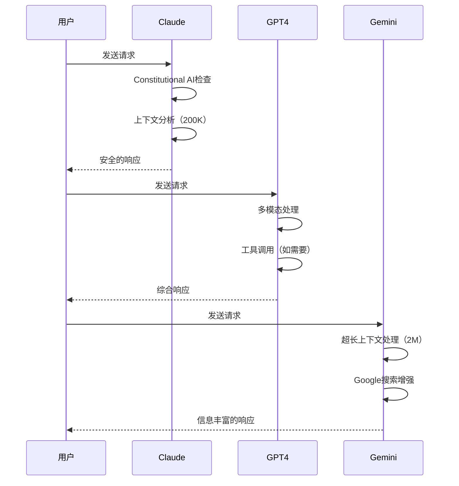

---

## 性能指标对比

export const contextWindowData = [
  { provider: 'Gemini 2.5 Pro', icon: '⚡', value: '1,000,000', unit: ' tokens', color: '#4285F4' },
  { provider: 'GPT-5', icon: '✨', value: '400,000', unit: ' tokens', color: '#10A37F' },
  { provider: 'Claude Sonnet 4.5', icon: '🤖', value: '200,000', unit: ' tokens', color: '#D97757' }
]

export const outputWindowData = [
  { provider: 'GPT-5', value: 128, unit: 'K tokens', color: '#10A37F', icon: '✨' },
  { provider: 'Claude Sonnet 4.5', value: 64, unit: 'K tokens', color: '#D97757', icon: '🤖' },
  { provider: 'Gemini 2.5 Pro', value: 8, unit: 'K tokens', color: '#4285F4', icon: '⚡' }
]

<MetricCard
  title="上下文窗口大小对比"
  items={contextWindowData}
  type="bar"
/>

<MetricCard
  title="最大输出窗口对比"
  items={outputWindowData}
  type="bar"
/>

<MetricCard
  title="2025年旗舰模型发布时间"
  items={[
    { provider: 'Gemini 2.5 Pro', value: '2025年3月', icon: '⚡', color: '#4285F4', note: '首发超长上下文' },
    { provider: 'GPT-5', value: '2025年8月', icon: '✨', color: '#10A37F', note: '智能路由系统' },
    { provider: 'Claude Sonnet 4.5', value: '2025年9月', icon: '🤖', color: '#D97757', note: '代码能力突破' }
  ]}
  type="number"
/>

---

## 功能特性矩阵

export const providers = [
  { name: 'Claude Sonnet 4.5', logo: '🤖' },
  { name: 'GPT-5', logo: '✨' },
  { name: 'Gemini 2.5 Pro', logo: '⚡' }
]

export const features = [
  {
    key: 'longContext',
    name: '超长上下文支持',
    description: '能够处理超过100K tokens的上下文',
    notes: {}
  },
  {
    key: 'multimodal',
    name: '多模态理解',
    description: '支持文本、图像、音频等多种输入',
    notes: {
      'Claude': '仅图像',
      'Gemini': '原生支持'
    }
  },
  {
    key: 'codeGeneration',
    name: '代码生成',
    description: '生成高质量的编程代码',
    notes: {}
  },
  {
    key: 'realTimeData',
    name: '实时数据访问',
    description: '访问最新的网络信息',
    notes: {
      'Claude': '需要工具',
      'GPT-4': '需要插件'
    }
  },
  {
    key: 'functionCalling',
    name: '函数调用',
    description: 'API函数调用能力',
    notes: {}
  },
  {
    key: 'imageGeneration',
    name: '图像生成',
    description: '生成AI图像',
    notes: {
      'Claude': '不支持',
      'GPT-4': 'DALL-E 3',
      'Gemini': 'Imagen 3'
    }
  },
  {
    key: 'voiceConversation',
    name: '语音对话',
    description: '实时语音交互',
    notes: {}
  },
  {
    key: 'customInstructions',
    name: '自定义指令',
    description: '设置个性化的AI行为',
    notes: {}
  }
]

export const support = {
  'Claude Sonnet 4.5': {
    longContext: true,
    multimodal: 'partial',
    codeGeneration: true,
    realTimeData: 'partial',
    functionCalling: true,
    imageGeneration: false,
    voiceConversation: false,
    customInstructions: true
  },
  'GPT-5': {
    longContext: true,
    multimodal: true,
    codeGeneration: true,
    realTimeData: 'partial',
    functionCalling: true,
    imageGeneration: 'partial',
    voiceConversation: true,
    customInstructions: true
  },
  'Gemini 2.5 Pro': {
    longContext: true,
    multimodal: true,
    codeGeneration: true,
    realTimeData: true,
    functionCalling: true,
    imageGeneration: 'partial',
    voiceConversation: 'partial',
    customInstructions: true
  }
}

<FeatureGrid
  providers={providers}
  features={features}
  support={support}
/>

---

## 价格对比

  <PricingCard
    provider="GPT-5"
    color="#10A37F"
    icon="✨"
    popular={true}
    pricing={{
      input: '1.25',
      output: '10.00',
      features: [
        '400K 上下文窗口',
        '128K 最大输出',
        '缓存输入90%折扣（$0.125/M）',
        '智能路由（标准/推理）',
        '多变体（mini/nano/chat）',
        'GPT-5 mini更低价格',
        '知识截止2024年9月',
        '多模态支持'
      ],
      limits: {
        '速率限制': '10,000 RPM',
        '缓存折扣': '90%',
        'GPT-5 Pro': '$120/M输出'
      }
    }}
  />

  <PricingCard
    provider="Gemini 2.5 Pro"
    color="#4285F4"
    icon="⚡"
    pricing={{
      input: '1.25',
      output: '10.00',
      features: [
        '1M 上下文窗口（2M即将）',
        '8K 最大输出',
        '上下文缓存$4.50/M/h',
        'Google搜索实时增强',
        '原生多模态支持',
        'Google Workspace集成',
        '图像输入$0.005/张',
        'NotebookLM访问'
      ],
      limits: {
        '速率限制': '360 RPM',
        '图像定价': '$0.005/张',
        '缓存费用': '$4.50/M/h'
      }
    }}
  />

  <PricingCard
    provider="Claude Sonnet 4.5"
    color="#D97757"
    icon="🤖"
    pricing={{
      input: '3.00',
      output: '15.00',
      features: [
        '200K 标准上下文',
        '64K 最大输出',
        '扩展上下文$6/$22.50',
        '批处理50%折扣',
        '提示缓存90%节省',
        '企业级安全保障',
        '最强代码能力',
        '工具调用支持'
      ],
      limits: {
        '速率限制': '500 RPM',
        '扩展上下文': '>200K',
        '批处理折扣': '50%'
      }
    }}
  />

---

## 详细对比表格

export const detailedComparisonData = [
  {
    feature: '模型名称',
    claude: 'Claude Sonnet 4.5',
    gpt5: 'GPT-5',
    gemini: 'Gemini 2.5 Pro'
  },
  {
    feature: '发布时间',
    claude: '2025年9月',
    gpt5: '2025年8月',
    gemini: '2025年3月'
  },
  {
    feature: '上下文窗口',
    claude: '200K tokens',
    gpt5: '400K tokens',
    gemini: '1M tokens'
  },
  {
    feature: '最大输出',
    claude: '64K tokens',
    gpt5: '128K tokens',
    gemini: '8K tokens'
  },
  {
    feature: '输入价格(/M)',
    claude: '$3.00',
    gpt5: '$1.25',
    gemini: '$1.25'
  },
  {
    feature: '输出价格(/M)',
    claude: '$15.00',
    gpt5: '$10.00',
    gemini: '$10.00'
  },
  {
    feature: 'SWE-bench',
    claude: '82.0%',
    gpt5: '74.9%',
    gemini: '67.2%'
  },
  {
    feature: 'AIME 2025',
    claude: '100%',
    gpt5: '94.6%',
    gemini: '86.7%'
  },
  {
    feature: '多模态',
    claude: '文本+图像',
    gpt5: '文本+图像+音频',
    gemini: '文本+图像+音频+视频'
  },
  {
    feature: '缓存优化',
    claude: '90%节省',
    gpt5: '90%折扣',
    gemini: '$4.50/M/h'
  },
  {
    feature: '函数调用',
    claude: '✓',
    gpt5: '✓',
    gemini: '✓'
  },
  {
    feature: '流式输出',
    claude: '✓',
    gpt5: '✓',
    gemini: '✓'
  }
]

export const columns = [
  { key: 'feature', label: '特性', sortable: false },
  { key: 'claude', label: 'Claude Sonnet 4.5', sortable: true },
  { key: 'gpt5', label: 'GPT-5', sortable: true },
  { key: 'gemini', label: 'Gemini 2.5 Pro', sortable: true }
]

<ComparisonTable
  data={detailedComparisonData}
  columns={columns}
  interactive={true}
  highlightBest={false}
/>

---

## 按场景分类对比

export const useCaseContent = {
  coding: (
    

      <h3>代码生成与调试</h3>
      <MetricCard
        title="SWE-bench Verified 代码能力评分"
        items={[
          { provider: 'Claude Sonnet 4.5', value: 82, unit: '%', color: '#D97757', icon: '🤖' },
          { provider: 'GPT-5', value: 74.9, unit: '%', color: '#10A37F', icon: '✨' },
          { provider: 'Gemini 2.5 Pro', value: 67.2, unit: '%', color: '#4285F4', icon: '⚡' }
        ]}
        type="bar"
      />
      <h4>各平台优势：</h4>
      <ul>
        <li><strong>Claude Sonnet 4.5:</strong> SWE-bench 82% - 业界最强，擅长大型代码库理解与重构</li>
        <li><strong>GPT-5:</strong> 智能路由系统，128K超大输出，实时代码执行</li>
        <li><strong>Gemini 2.5 Pro:</strong> 1M超长上下文，深度集成Google Colab，视频代码教程理解</li>
      </ul>
    

  ),
  writing: (
    

      <h3>内容创作与写作</h3>
      <MetricCard
        title="最大输出窗口对比（适合长文本创作）"
        items={[
          { provider: 'GPT-5', value: 128, unit: 'K tokens', color: '#10A37F', icon: '✨' },
          { provider: 'Claude Sonnet 4.5', value: 64, unit: 'K tokens', color: '#D97757', icon: '🤖' },
          { provider: 'Gemini 2.5 Pro', value: 8, unit: 'K tokens', color: '#4285F4', icon: '⚡' }
        ]}
        type="bar"
      />
      <h4>各平台特色：</h4>
      <ul>
        <li><strong>Claude Sonnet 4.5:</strong> 64K超大输出，最自然流畅的长文本写作</li>
        <li><strong>GPT-5:</strong> 128K最大输出，幻觉率降低45-80%，创意丰富</li>
        <li><strong>Gemini 2.5 Pro:</strong> 1M超长上下文，与Google Docs集成，实时协作写作</li>
      </ul>
    

  ),
  research: (
    

      <h3>研究与分析</h3>
      <MetricCard
        title="GPQA Diamond 推理能力评分"
        items={[
          { provider: 'Gemini 2.5 Pro', value: 84.0, unit: '%', color: '#4285F4', icon: '⚡' },
          { provider: 'GPT-5', value: 83.0, unit: '%', color: '#10A37F', icon: '✨' },
          { provider: 'Claude Sonnet 4.5', value: 83.4, unit: '%', color: '#D97757', icon: '🤖' }
        ]}
        type="bar"
      />
      <h4>研究优势：</h4>
      <ul>
        <li><strong>Gemini 2.5 Pro:</strong> 1M-2M超长上下文处理海量文献，Google Scholar集成</li>
        <li><strong>GPT-5:</strong> 400K上下文，幻觉率降低80%，信息准确性最高</li>
        <li><strong>Claude Sonnet 4.5:</strong> 64K输出，精确的文档分析和摘要能力</li>
      </ul>
    

  )
}

<TabComparison
  tabs={[
    { id: 'coding', label: '编程开发', icon: '💻', color: '#D97757', content: useCaseContent.coding },
    { id: 'writing', label: '内容创作', icon: '✍️', color: '#10A37F', content: useCaseContent.writing },
    { id: 'research', label: '研究分析', icon: '🔬', color: '#4285F4', content: useCaseContent.research }
  ]}
  defaultTab="coding"
/>

---

## 技术架构深度对比

### Claude 架构流程

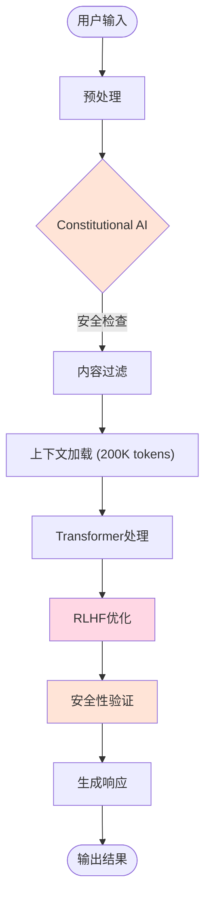

### GPT-4 架构流程

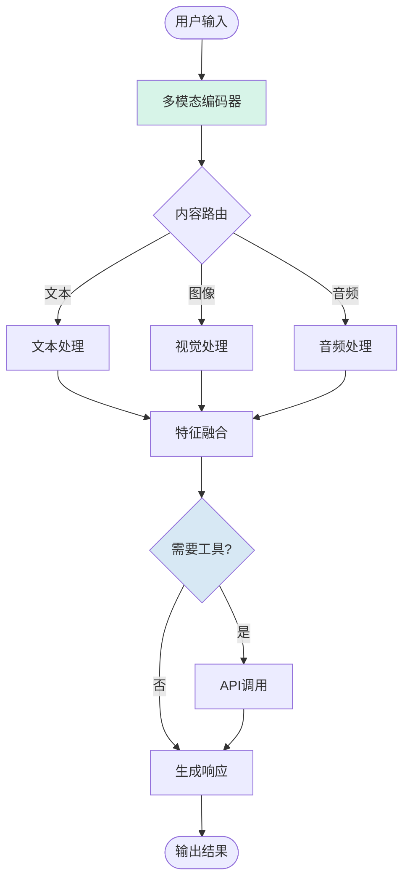

### Gemini 架构流程

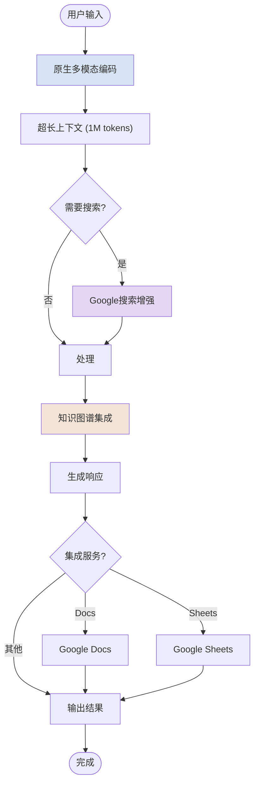

---

## RAG 实现对比

### Claude RAG 流程

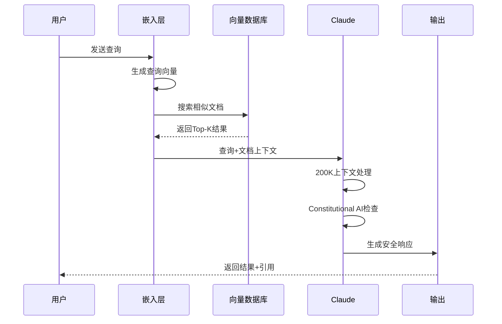

### GPT-4 RAG 流程

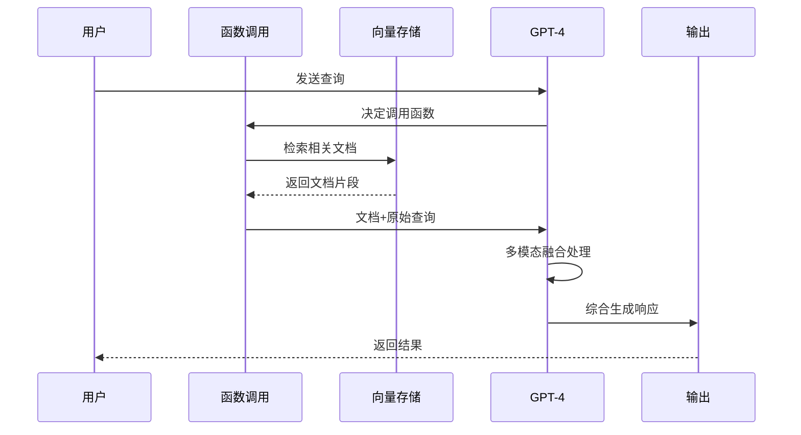

### Gemini RAG 流程

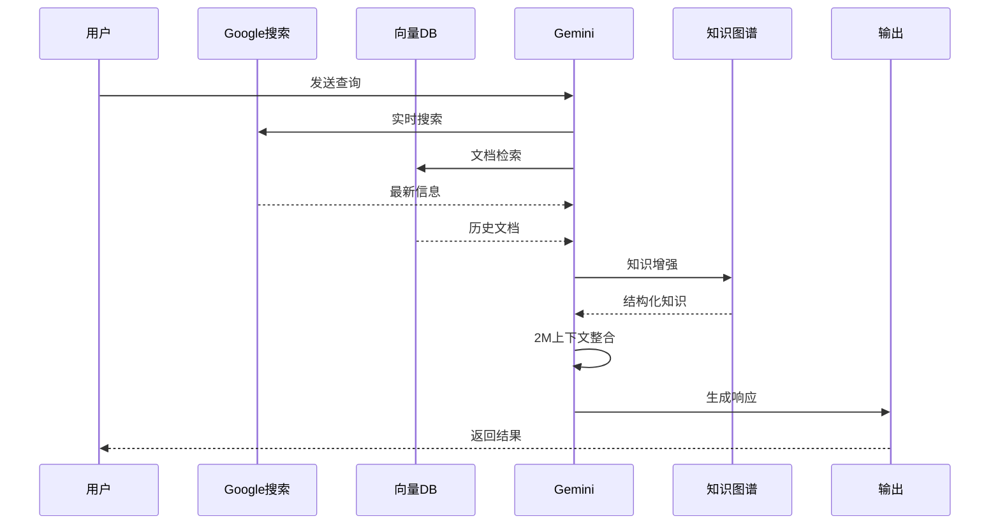

---

## API 使用对比

### 请求响应流程

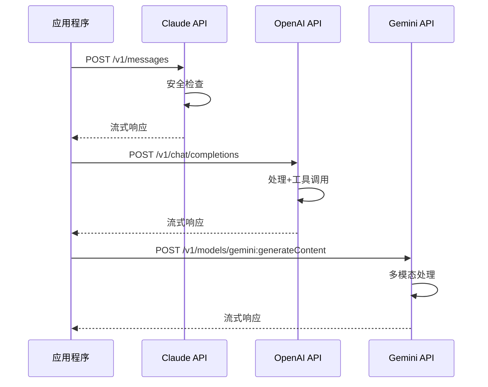

---

## 最佳实践建议

### 选择决策流程

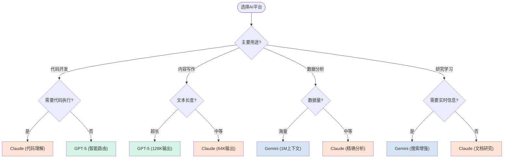

---

## 总结与建议

### 三大平台定位

  

    <h3 style={{ color: '#D97757', marginTop: 0 }}>🤖 Claude Sonnet 4.5</h3>
    
<strong>最佳场景：</strong>

    <ul style={{ marginLeft: '1.5rem' }}>
      <li><strong>代码开发</strong> - SWE-bench 82%</li>
      <li><strong>数学推理</strong> - AIME 100%</li>
      <li><strong>长文本输出</strong> - 64K tokens</li>
      <li><strong>安全敏感应用</strong></li>
      <li>大型代码库重构</li>
    </ul>
    
<strong>价格定位:</strong> 高端 ($3/$15)

  

  

    <h3 style={{ color: '#10A37F', marginTop: 0 }}>✨ GPT-5</h3>
    
<strong>最佳场景：</strong>

    <ul style={{ marginLeft: '1.5rem' }}>
      <li><strong>超长输出</strong> - 128K tokens</li>
      <li><strong>准确性优先</strong> - 幻觉率-80%</li>
      <li><strong>多模态任务</strong></li>
      <li><strong>智能路由</strong> - 标准/推理</li>
      <li>实时语音对话</li>
    </ul>
    
<strong>价格定位:</strong> 性价比 ($1.25/$10)

  

  

    <h3 style={{ color: '#4285F4', marginTop: 0 }}>⚡ Gemini 2.5 Pro</h3>
    
<strong>最佳场景：</strong>

    <ul style={{ marginLeft: '1.5rem' }}>
      <li><strong>海量文档</strong> - 1M-2M上下文</li>
      <li><strong>视频理解</strong> - 原生多模态</li>
      <li><strong>实时搜索</strong> - Google增强</li>
      <li><strong>协作写作</strong> - Workspace集成</li>
      <li>NotebookLM音频生成</li>
    </ul>
    
<strong>价格定位:</strong> 性价比 ($1.25/$10)

  

### 性价比分析

<MetricCard
  title="每百万tokens成本对比（输入+输出平均）"
  items={[
    { provider: 'GPT-5', value: 5.625, unit: ' USD', color: '#10A37F', icon: '✨' },
    { provider: 'Gemini 2.5 Pro', value: 5.625, unit: ' USD', color: '#4285F4', icon: '⚡' },
    { provider: 'Claude Sonnet 4.5', value: 9.00, unit: ' USD', color: '#D97757', icon: '🤖' }
  ]}
  type="bar"
/>

  <h4 style={{ marginTop: 0, color: '#D97757' }}>💡 价格洞察</h4>
  <ul style={{ marginBottom: 0 }}>
    <li><strong>GPT-5 & Gemini 2.5 Pro</strong>: 同价位（$1.25/$10），性价比最高</li>
    <li><strong>Claude Sonnet 4.5</strong>: 价格高60%，但代码能力领先10%+</li>
    <li><strong>缓存优化</strong>: 三者均提供90%缓存折扣，大幅降低实际成本</li>
    <li><strong>隐藏成本</strong>: GPT-5推理模式会产生额外"推理tokens"，成本可能增加5倍</li>
  </ul>

---

## 未来展望

### 技术发展趋势

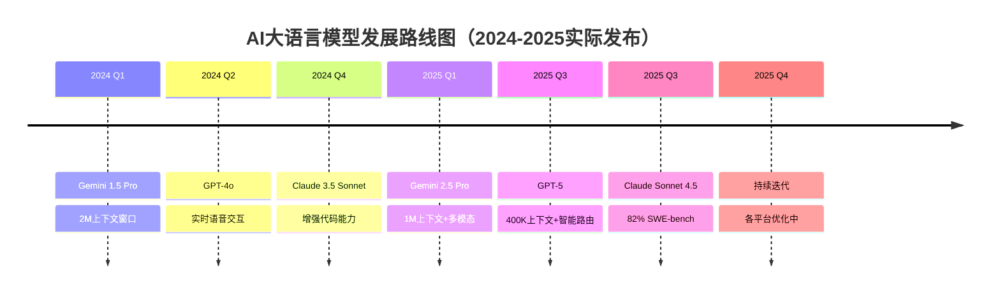

### 2025年已实现的突破

1. **超长上下文**: Gemini 1M → 2M（即将）
2. **输出窗口**: GPT-5 达到 128K tokens
3. **代码能力**: Claude SWE-bench 82%
4. **幻觉控制**: GPT-5 降低 45-80%
5. **性价比**: GPT-5/Gemini 降至 $1.25/M

### 下一步发展方向

1. **上下文窗口**: Gemini 2M → 10M+
2. **输出质量**: 幻觉率持续降低
3. **专业化**: 医疗、法律等垂直领域模型
4. **推理能力**: 更长链条的复杂推理
5. **多模态**: 真正的统一多模态理解

---

## 参考资源

- **Claude官方文档**: [docs.anthropic.com](https://docs.anthropic.com)
- **OpenAI API文档**: [platform.openai.com](https://platform.openai.com)
- **Google AI文档**: [ai.google.dev](https://ai.google.dev)
- **Benchmark数据**: [LMSys Chatbot Arena](https://chat.lmsys.org)

---

## 快速选择指南

### 👨‍💻 如果你是开发者...

- **复杂代码项目**: 选择 **Claude Sonnet 4.5** (SWE-bench 82%)
- **需要大量输出**: 选择 **GPT-5** (128K输出)
- **预算有限**: 选择 **GPT-5** 或 **Gemini 2.5 Pro** ($1.25/$10)

### ✍️ 如果你是内容创作者...

- **长篇文章/小说**: 选择 **GPT-5** (128K输出 + 低幻觉)
- **技术文档**: 选择 **Claude Sonnet 4.5** (64K输出 + 准确性)
- **多媒体内容**: 选择 **Gemini 2.5 Pro** (视频理解)

### 🔬 如果你是研究人员...

- **海量文献分析**: 选择 **Gemini 2.5 Pro** (1M-2M上下文)
- **准确性优先**: 选择 **GPT-5** (幻觉率-80%)
- **综合摘要**: 选择 **Claude Sonnet 4.5** (64K输出)

### 💰 如果你注重成本...

1. **GPT-5 / Gemini 2.5 Pro**: $1.25/$10 - 最佳性价比
2. **利用缓存**: 90%折扣，大幅降低成本
3. **批处理**: Claude提供50%批处理折扣
4. **注意隐藏成本**: GPT-5推理模式额外收费

---

## 总结表格

| 维度           | 🥇 第一名          | 🥈 第二名       | 🥉 第三名         |
| -------------- | ------------------- | ---------------- | ------------------ |
| **代码能力**   | Claude 4.5 (82%)    | GPT-5 (74.9%)    | Gemini 2.5 (67.2%) |
| **数学推理**   | Claude 4.5 (100%)   | GPT-5 (94.6%)    | Gemini 2.5 (86.7%) |
| **上下文窗口** | Gemini 2.5 (1M)     | GPT-5 (400K)     | Claude 4.5 (200K)  |
| **输出窗口**   | GPT-5 (128K)        | Claude 4.5 (64K) | Gemini 2.5 (8K)    |
| **性价比**     | GPT-5/Gemini (并列) | -                | Claude 4.5         |
| **准确性**     | GPT-5 (幻觉-80%)    | Claude 4.5       | Gemini 2.5         |
| **多模态**     | Gemini 2.5 (视频)   | GPT-5            | Claude 4.5         |

---

*最后更新: 2025年11月*
*数据来源: 官方API文档、SWE-bench、AIME 2025、LMSys Benchmark*
*价格和性能数据可能随时更新，请以官方文档为准*
