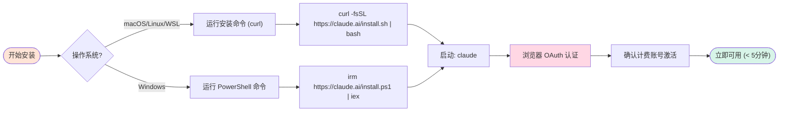
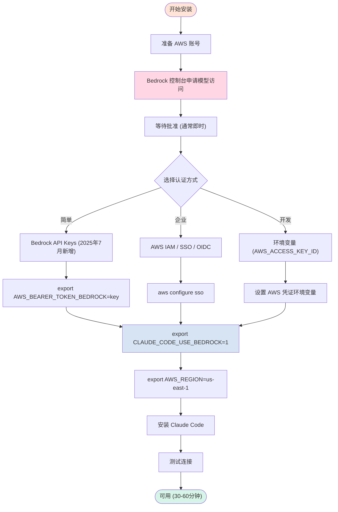
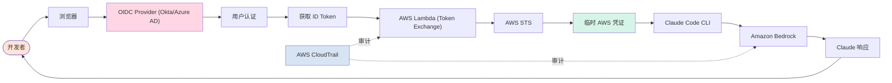
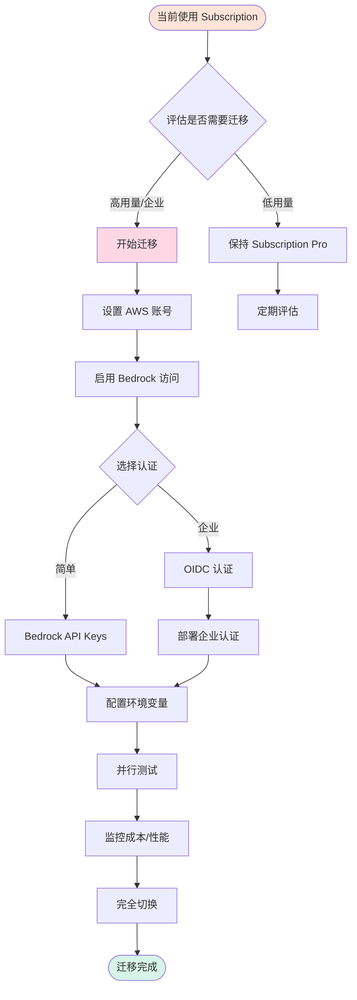
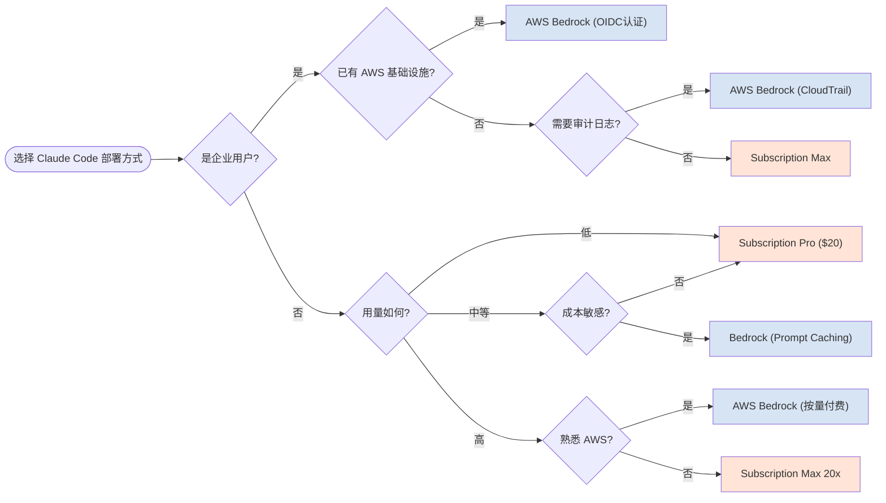

import ComparisonCard from '../components/ComparisonCard'
import ComparisonTable from '../components/ComparisonTable'
import MetricCard from '../components/MetricCard'
import PricingCard from '../components/PricingCard'
import TabComparison from '../components/TabComparison'

# Claude Code 安装使用指南

**Subscription 订阅 vs AWS Bedrock 部署** - 2025年完整对比与最佳实践

> **最后更新**: 2025年11月 | **数据来源**: Anthropic官方文档、AWS Bedrock文档、社区最佳实践

---

## 概览

Claude Code 提供两种主要使用方式：直接使用 Anthropic 订阅账号，或通过 AWS Bedrock 部署。本文将深入对比两种方案的安装流程、定价、优缺点，帮助您选择最适合的部署方式。

---

## 快速对比

<div style={{ display: 'grid', gridTemplateColumns: 'repeat(auto-fit, minmax(320px, 1fr))', gap: '2rem', margin: '3rem 0' }}>
  <ComparisonCard
    provider="Subscription 订阅"
    logo="🔐"
    color="#D97757"
    tagline="简单快速，开箱即用"
    metrics={{
      '安装时间': '< 5 分钟',
      '起步价': '$20/月',
      '认证方式': 'OAuth 2.0'
    }}
    features={[
      '一键安装，浏览器认证',
      'Pro $20/月 (45次请求/5小时)',
      'Max 5x $100/月 (225次请求/5小时)',
      'Max 20x $200/月 (200-800次请求/5小时)',
      '与 claude.ai 共享使用限制',
      '固定月费，成本可预测',
      '无需 AWS 账号或基础设施',
      '适合个人开发者和小团队'
    ]}
    highlight={true}
  />

  <ComparisonCard
    provider="AWS Bedrock"
    logo="☁️"
    color="#4285F4"
    tagline="企业级，按量付费"
    metrics={{
      '安装时间': '30-60 分钟',
      '起步价': '按 Token 计费',
      '认证方式': 'AWS IAM / SSO'
    }}
    features={[
      'Prompt Caching (90%成本降低)',
      'Claude Sonnet 4.5: $3/$15 per M tokens (2025年9月)',
      'Claude Haiku 4.5: $1/$5 per M tokens (2025年10月)',
      'Bedrock API Keys (2025年7月新增)',
      '企业级 OIDC 认证 (Okta/Azure AD)',
      'AWS 基础设施内部署',
      'CloudTrail 审计日志',
      '适合企业和高用量场景'
    ]}
    highlight={false}
  />
</div>

---

## 安装流程对比

### Subscription 订阅方式安装



**安装命令：**

```bash
# macOS / Linux / WSL
curl -fsSL https://claude.ai/install.sh | bash

# Windows PowerShell
irm https://claude.ai/install.ps1 | iex

# 启动 Claude Code
claude
```

**系统要求：**
- macOS 10.15+
- Ubuntu 20.04+ / Debian 10+
- Windows 10+ (WSL 1, WSL 2, 或 Git for Windows)
- 无需 Node.js (原生安装器)

---

### AWS Bedrock 方式安装



**详细安装步骤：**

```bash
# 1. 在 AWS Bedrock 控制台启用模型访问
# 导航至 Bedrock > Model access > Request access
# 选择 Claude Sonnet 4.5 / Claude Haiku 4.5

# 2. 配置 AWS 凭证 (选择一种方式)

## 方式 A: Bedrock API Keys (最简单, 2025年7月新增)
export AWS_BEARER_TOKEN_BEDROCK="your-bedrock-api-key"

## 方式 B: AWS SSO (企业推荐)
aws configure sso
# 按提示完成 SSO 配置

## 方式 C: 环境变量
export AWS_ACCESS_KEY_ID="your-access-key"
export AWS_SECRET_ACCESS_KEY="your-secret-key"
export AWS_SESSION_TOKEN="your-session-token"  # 可选

# 3. 启用 Bedrock 集成
export CLAUDE_CODE_USE_BEDROCK=1
export AWS_REGION=us-east-1  # 或其他支持 Claude 的区域

# 4. 可选：指定模型
export ANTHROPIC_MODEL='global.anthropic.claude-sonnet-4-5-20250929-v1:0'

# 5. 安装 Claude Code (如果尚未安装)
curl -fsSL https://claude.ai/install.sh | bash

# 6. 启动
claude
```

**支持的 AWS 区域 (Prompt Caching):**
- `us-east-1` (US East - N. Virginia)
- `us-west-2` (US West - Oregon)

---

## 定价对比

export const pricingData = [
  {
    provider: 'Subscription Pro',
    value: 20,
    unit: ' USD/月',
    color: '#D97757',
    icon: '🔐',
    note: '45次请求/5小时'
  },
  {
    provider: 'Subscription Max 5x',
    value: 100,
    unit: ' USD/月',
    color: '#D97757',
    icon: '🔐',
    note: '225次请求/5小时'
  },
  {
    provider: 'Subscription Max 20x',
    value: 200,
    unit: ' USD/月',
    color: '#D97757',
    icon: '🔐',
    note: '200-800次请求/5小时'
  },
  {
    provider: 'Bedrock Sonnet 4.5',
    value: '按量',
    unit: ' ($3/$15 per M)',
    color: '#4285F4',
    icon: '☁️',
    note: '输入/输出 tokens'
  }
]

<MetricCard
  title="月费成本对比"
  items={pricingData}
  type="number"
/>

<div style={{ display: 'grid', gridTemplateColumns: 'repeat(auto-fit, minmax(320px, 1fr))', gap: '2rem', margin: '3rem 0' }}>
  <PricingCard
    provider="Subscription"
    color="#D97757"
    icon="🔐"
    popular={true}
    pricing={{
      features: [
        'Pro: $20/月 (或 $17/月年付)',
        '~45次请求 或 10-40次prompt/5小时',
        '每周约 40-80小时 Sonnet 4',
        'Max 5x: $100/月',
        '~225次请求 或 50-200次prompt/5小时',
        '每周约 140-280小时 Sonnet 4',
        'Max 20x: $200/月',
        '200-800次prompt/5小时',
        '每周约 240-480小时 Sonnet 4',
        '包含 Opus 4.1 访问 (Max)'
      ],
      limits: {
        '使用限制': '与 claude.ai 共享',
        '重置周期': '每 5 小时',
        '适合场景': '个人/小团队'
      }
    }}
  />

  <PricingCard
    provider="AWS Bedrock"
    color="#4285F4"
    icon="☁️"
    pricing={{
      features: [
        'Claude Sonnet 4.5 (2025年9月):',
        '  输入: $3 / M tokens',
        '  输出: $15 / M tokens',
        'Claude Haiku 4.5 (2025年10月):',
        '  输入: $1 / M tokens',
        '  输出: $5 / M tokens',
        'Prompt Caching 节省:',
        '  成本降低 75-90%',
        '  延迟降低 85%',
        'Batch Processing:',
        '  最高节省 50%'
      ],
      limits: {
        '计费模式': '按 token 用量',
        '成本优化': 'Prompt Caching',
        '适合场景': '企业/高用量'
      }
    }}
  />
</div>

---

## Prompt Caching 成本优势

export const cachingSavings = [
  {
    provider: '无缓存',
    value: 100,
    unit: '%',
    color: '#999',
    icon: '❌',
    note: '原始成本'
  },
  {
    provider: '有缓存 (首次)',
    value: 125,
    unit: '%',
    color: '#FFA500',
    icon: '◐',
    note: '1.25x成本'
  },
  {
    provider: '有缓存 (后续)',
    value: 10,
    unit: '%',
    color: '#10A37F',
    icon: '✓',
    note: '0.10x成本 (90%节省)'
  }
]

<MetricCard
  title="Prompt Caching 成本对比"
  items={cachingSavings}
  type="bar"
/>

**真实案例：**

- **3,500 token 系统提示**：约 65% 成本降低
- **计算器应用**：从 $0.1029 降至 $0.0827 (成本降低 20%)，执行时间从 1分17秒降至 42秒 (67% 加速)
- **文档处理 (10,000文档/月)**：每月节省超过 $5,400
- **单用户会话 (Claude Sonnet 4.5)**：75.6% 成本降低

---

## 详细功能对比

export const detailedComparisonData = [
  {
    feature: '安装时间',
    subscription: '< 5 分钟',
    bedrock: '30-60 分钟'
  },
  {
    feature: '安装难度',
    subscription: '⭐ 简单 (一键安装)',
    bedrock: '⭐⭐⭐ 中等 (需AWS经验)'
  },
  {
    feature: '认证方式',
    subscription: 'OAuth 2.0 (浏览器)',
    bedrock: 'AWS IAM / SSO / API Keys / OIDC'
  },
  {
    feature: '起步价',
    subscription: '$20/月 (Pro)',
    bedrock: '按量 ($3/$15 per M tokens)'
  },
  {
    feature: '计费模式',
    subscription: '固定月费',
    bedrock: '按 token 用量'
  },
  {
    feature: '成本可预测性',
    subscription: '✓ 高 (固定月费)',
    bedrock: '◐ 中 (取决于用量)'
  },
  {
    feature: 'Prompt Caching',
    subscription: '✗ 不支持',
    bedrock: '✓ 支持 (90%成本降低)'
  },
  {
    feature: '企业认证 (OIDC)',
    subscription: '✗ 不支持',
    bedrock: '✓ 支持 (Okta/Azure AD)'
  },
  {
    feature: 'AWS 集成',
    subscription: '✗ 无',
    bedrock: '✓ 完整集成'
  },
  {
    feature: '审计日志',
    subscription: '✗ 基础',
    bedrock: '✓ CloudTrail'
  },
  {
    feature: '私有部署',
    subscription: '✗ 公有云',
    bedrock: '✓ AWS VPC内'
  },
  {
    feature: '使用限制',
    subscription: '与 claude.ai 共享',
    bedrock: '独立 (取决于配额)'
  },
  {
    feature: '最适合场景',
    subscription: '个人开发者/小团队',
    bedrock: '企业/高用量/AWS生态'
  }
]

export const columns = [
  { key: 'feature', label: '特性', sortable: false },
  { key: 'subscription', label: 'Subscription 订阅', sortable: false },
  { key: 'bedrock', label: 'AWS Bedrock', sortable: false }
]

<ComparisonTable
  data={detailedComparisonData}
  columns={columns}
  interactive={true}
  highlightBest={false}
/>

---

## 按场景选择

export const useCaseContent = {
  individual: (
    <div>
      <h3>个人开发者</h3>
      <MetricCard
        title="推荐方案评分"
        items={[
          { provider: 'Subscription Pro', value: 95, unit: '/100', color: '#D97757', icon: '🔐', note: '最佳选择' },
          { provider: 'AWS Bedrock', value: 40, unit: '/100', color: '#4285F4', icon: '☁️', note: '过于复杂' }
        ]}
        type="bar"
      />
      <h4>为什么选择 Subscription:</h4>
      <ul>
        <li><strong>5分钟安装</strong> - 一键安装，浏览器认证，立即开始编码</li>
        <li><strong>固定月费 $20</strong> - 成本可预测，无需担心用量突增</li>
        <li><strong>无需 AWS 账号</strong> - 不需要学习 AWS IAM/Bedrock</li>
        <li><strong>与 claude.ai 统一</strong> - 同一账号，无缝切换</li>
      </ul>
      <h4>何时考虑 Bedrock:</h4>
      <ul>
        <li>已有 AWS 账号且熟悉 AWS 服务</li>
        <li>用量极大，按量付费更划算</li>
        <li>需要 Prompt Caching 优化成本</li>
      </ul>
    </div>
  ),
  enterprise: (
    <div>
      <h3>企业用户</h3>
      <MetricCard
        title="推荐方案评分"
        items={[
          { provider: 'AWS Bedrock', value: 95, unit: '/100', color: '#4285F4', icon: '☁️', note: '最佳选择' },
          { provider: 'Subscription Max', value: 60, unit: '/100', color: '#D97757', icon: '🔐', note: '备选方案' }
        ]}
        type="bar"
      />
      <h4>为什么选择 Bedrock:</h4>
      <ul>
        <li><strong>企业级认证</strong> - OIDC 集成 (Okta, Azure AD, Auth0)</li>
        <li><strong>AWS 基础设施</strong> - 部署在自己的 AWS 账号，数据不出境</li>
        <li><strong>CloudTrail 审计</strong> - 完整的审计日志，满足合规要求</li>
        <li><strong>Prompt Caching</strong> - 大规模使用节省 75-90% 成本</li>
        <li><strong>临时凭证</strong> - 无需管理长期 API keys</li>
        <li><strong>统一计费</strong> - 与其他 AWS 服务合并账单</li>
      </ul>
      <h4>何时考虑 Subscription Max:</h4>
      <ul>
        <li>团队规模较小 (&lt; 10人)</li>
        <li>不想管理 AWS 基础设施</li>
        <li>快速开始，稍后迁移到 Bedrock</li>
      </ul>
    </div>
  ),
  cost: (
    <div>
      <h3>成本敏感用户</h3>
      <MetricCard
        title="月成本估算 (中等用量)"
        items={[
          { provider: 'Subscription Pro', value: 20, unit: ' USD/月', color: '#D97757', icon: '🔐', note: '固定成本' },
          { provider: 'Bedrock (无缓存)', value: 35, unit: ' USD/月', color: '#999', icon: '❌', note: '估算' },
          { provider: 'Bedrock (有缓存)', value: 8, unit: ' USD/月', color: '#10A37F', icon: '✓', note: '节省 77%' }
        ]}
        type="bar"
      />
      <h4>成本分析:</h4>
      <ul>
        <li><strong>低用量 (&lt; 45次请求/5小时)</strong>: Subscription Pro $20/月最经济</li>
        <li><strong>中等用量</strong>: Bedrock + Prompt Caching 可能更便宜</li>
        <li><strong>高用量</strong>: Bedrock Prompt Caching 节省可达 90%</li>
        <li><strong>突发用量</strong>: Subscription 固定月费避免意外账单</li>
      </ul>
      <h4>成本优化建议:</h4>
      <ul>
        <li>开始时使用 Subscription Pro ($20/月)</li>
        <li>监控使用量，如果超过 Pro 限制频繁</li>
        <li>用量大且稳定时，评估迁移到 Bedrock + Caching</li>
        <li>使用 /cost 命令监控 token 用量</li>
      </ul>
    </div>
  )
}

<TabComparison
  tabs={[
    { id: 'individual', label: '个人开发者', icon: '👤', color: '#D97757', content: useCaseContent.individual },
    { id: 'enterprise', label: '企业用户', icon: '🏢', color: '#4285F4', content: useCaseContent.enterprise },
    { id: 'cost', label: '成本优先', icon: '💰', color: '#10A37F', content: useCaseContent.cost }
  ]}
  defaultTab="individual"
/>

---

## 优缺点对比

### Subscription 订阅方式

**优点：**
- ✅ **安装简单** - 5分钟内完成，一键安装
- ✅ **固定成本** - 月费可预测，无需担心用量突增
- ✅ **无需 AWS** - 不需要 AWS 账号或基础设施知识
- ✅ **浏览器认证** - OAuth 2.0，与 claude.ai 统一
- ✅ **即时可用** - 安装后立即开始使用

**缺点：**
- ❌ **与 claude.ai 共享限制** - 使用 web 界面会消耗相同配额
- ❌ **无 Prompt Caching** - 无法利用缓存降低成本
- ❌ **固定限制** - 即使需求低也需支付全额月费
- ❌ **无企业认证** - 不支持 OIDC/SAML
- ❌ **无审计日志** - 基础日志，不满足企业合规

---

### AWS Bedrock 方式

**优点：**
- ✅ **Prompt Caching** - 成本降低 75-90%，延迟降低 85%
- ✅ **企业认证** - OIDC 集成 (Okta, Azure AD)
- ✅ **AWS 集成** - 部署在自己的基础设施，统一计费
- ✅ **CloudTrail 审计** - 完整审计日志
- ✅ **按量付费** - 用多少付多少，低用量成本低
- ✅ **临时凭证** - 无需长期 API keys
- ✅ **Bedrock API Keys** - 2025年7月新增，认证简化

**缺点：**
- ❌ **安装复杂** - 需要 30-60 分钟，需要 AWS 经验
- ❌ **成本不可预测** - 用量突增可能导致意外账单
- ❌ **需要 AWS 账号** - 必须有 AWS 账号并启用 Bedrock
- ❌ **配置繁琐** - 多个环境变量，易出错
- ❌ **区域限制** - Prompt Caching 仅部分区域支持

---

## 企业级认证方案

### AWS Bedrock OIDC 认证架构



**企业认证优势：**
- 无需管理个人 API keys
- 临时凭证自动过期
- 与现有身份系统集成
- 完整审计追踪
- 支持 MFA 和条件访问

---

## 迁移指南

### 从 Subscription 迁移到 Bedrock



---

## 快速决策树



---

## 总结与建议

### 核心建议

<div style={{ display: 'grid', gridTemplateColumns: 'repeat(auto-fit, minmax(280px, 1fr))', gap: '2rem', margin: '2rem 0', padding: '2rem', background: '#fafafa', borderRadius: '1rem' }}>
  <div style={{ padding: '1.5rem', background: 'white', borderRadius: '0.75rem', borderTop: '4px solid #D97757' }}>
    <h3 style={{ color: '#D97757', marginTop: 0 }}>🔐 Subscription 订阅</h3>
    <p><strong>最适合：</strong></p>
    <ul style={{ marginLeft: '1.5rem' }}>
      <li>个人开发者</li>
      <li>小团队 (&lt; 10人)</li>
      <li>快速开始项目</li>
      <li>成本可预测优先</li>
      <li>不想管理 AWS</li>
    </ul>
    <p style={{ fontSize: '0.9rem', color: '#666', marginTop: '1rem' }}><strong>起步:</strong> $20/月 Pro，5分钟安装</p>
  </div>

  <div style={{ padding: '1.5rem', background: 'white', borderRadius: '0.75rem', borderTop: '4px solid #4285F4' }}>
    <h3 style={{ color: '#4285F4', marginTop: 0 }}>☁️ AWS Bedrock</h3>
    <p><strong>最适合：</strong></p>
    <ul style={{ marginLeft: '1.5rem' }}>
      <li>企业用户</li>
      <li>已有 AWS 基础设施</li>
      <li>需要企业认证 (OIDC)</li>
      <li>高用量场景</li>
      <li>需要审计日志</li>
    </ul>
    <p style={{ fontSize: '0.9rem', color: '#666', marginTop: '1rem' }}><strong>起步:</strong> 按量付费，Prompt Caching 节省 90%</p>
  </div>
</div>

### 推荐路径

1. **初学者/个人**: 从 Subscription Pro ($20/月) 开始
2. **中小团队**: Subscription Max 5x/20x，稍后评估 Bedrock
3. **企业/AWS 用户**: 直接使用 Bedrock + OIDC 认证
4. **成本优化**: 高用量时迁移到 Bedrock + Prompt Caching

---

## 参考资源

- **Claude Code 官方文档**: [docs.claude.com/claude-code](https://docs.claude.com/en/docs/claude-code)
- **AWS Bedrock 集成**: [docs.claude.com/claude-code/amazon-bedrock](https://docs.claude.com/en/docs/claude-code/amazon-bedrock)
- **Bedrock 定价**: [aws.amazon.com/bedrock/pricing](https://aws.amazon.com/bedrock/pricing/)
- **企业认证指南**: [GitHub - guidance-for-claude-code-with-amazon-bedrock](https://github.com/aws-solutions-library-samples/guidance-for-claude-code-with-amazon-bedrock)
- **Prompt Caching**: [anthropic.com/news/prompt-caching](https://www.anthropic.com/news/prompt-caching)

---

*最后更新: 2025年11月*
*数据来源: Anthropic 官方文档、AWS Bedrock 文档、社区最佳实践*
*价格和功能可能随时更新，请以官方网站为准*
