# NotebookLM: AI 驱动的研究助手

**2025年最新版本 - 由 Gemini 2.5 Flash 驱动**

> **最后更新**: 2025年11月 | **当前版本**: Gemini 2.5 Flash | **状态**: 免费可用 + Plus付费版

## 概述

**NotebookLM** 是 Google 创新的 AI 驱动研究和笔记工具，现已升级至 **Gemini 2.5 Flash**（2025年5月），带来更强大的推理能力和多语言支持。它充当个性化的 AI 协作者，帮助你理解、综合和探索来自多个资料源的复杂信息。

### 🆕 2025年重大更新

- **🧠 Gemini 2.5 Flash**: 思维模型，深度推理能力提升
- **🎥 视频概览**: 生成带叙述的幻灯片视频（2025年7月）
- **🗺️ 思维导图**: 交互式主题导航和连接探索（2025年3月）
- **🌍 80+语言**: 音频概览支持全球80多种语言
- **🎙️ 交互模式**: 可加入AI主持人对话，实时提问
- **📱 移动应用**: Android/iOS 应用即将推出
- **💼 企业版**: Google Workspace核心服务集成

### 核心亮点

- **源文档基础**: 所有回复都基于你上传的文档（RAG技术）
- **多源整合**: 支持 PDF、Google Docs、网站、YouTube、多模态PDF
- **音频概览**: AI播客生成，支持80+语言，可交互
- **视频概览**: 自动生成带叙述的演示视频
- **智能摘要**: 创建全面的摘要和学习指南
- **交互式问答**: 提问并获得基于你的资料源的答案
- **思维导图**: 可视化探索知识连接

---

## 架构概览

NotebookLM 2025 架构，现由 Gemini 2.5 Flash 驱动，带来更强的推理和多模态能力：

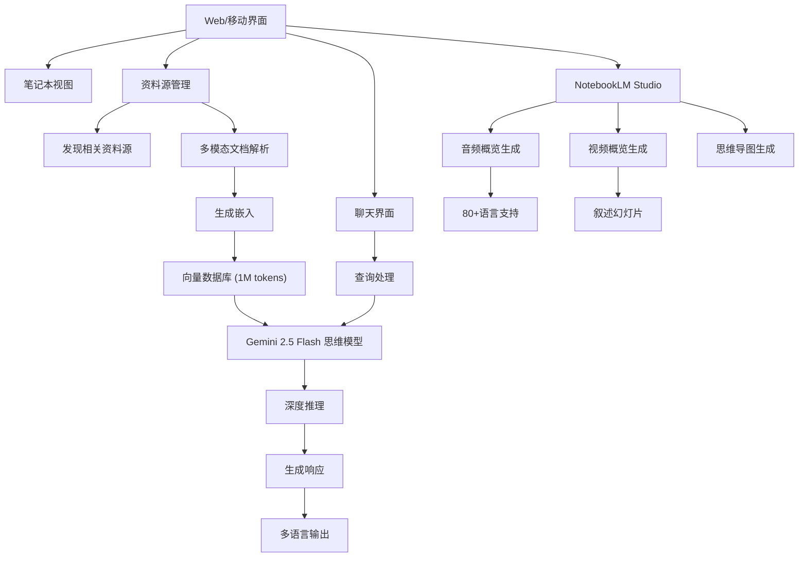

---

## 核心组件

### 1. 资料源管理

NotebookLM 允许你上传和管理各种类型的资料源:

**支持的格式:**
- **PDF 文档** (包括多模态PDF - 文本、图像、图表)
- **Google Docs** (实时同步)
- **Google Slides** (演示文稿)
- **Web URL** (网页抓取)
- **YouTube 视频** (自动转录)
- **Markdown 文件**
- **文本文件**
- **🆕 发现资料源**: 自动从网络发现相关资料

**处理流程:**

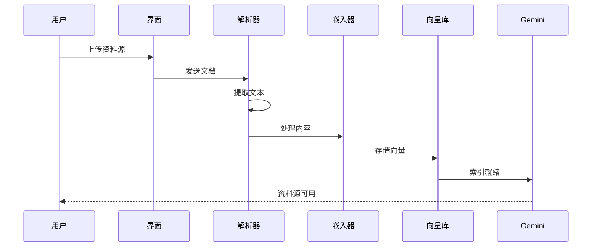

### 2. 上下文理解

NotebookLM 使用**检索增强生成(RAG)**来确保准确性:

1. **索引**: 文档被分块并嵌入为向量表示
2. **检索**: 用户查询与相关文档片段匹配
3. **生成**: Gemini 仅使用检索到的上下文合成响应
4. **基础**: 所有答案都包含对源材料的引用

### 3. 音频概览生成 🎙️

NotebookLM 的突出功能，现已支持 **80+语言** 和 **交互模式**：

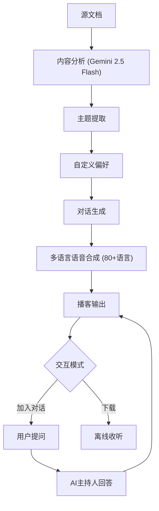

**🆕 2025年音频功能:**
- ✅ **80+语言支持**: 全球多语言音频生成
- ✅ **交互模式**: 可加入对话，向AI主持人提问
- ✅ **自定义长度**: 选择理想的音频时长
- ✅ **语言选择器**: 输出语言可自由选择
- ✅ **多个输出**: 单个笔记本可存储多个音频
- ✅ 两个 AI 主持人之间的自然对话
- ✅ 用通俗易懂的语言解释复杂概念
- ✅ 突出显示关键见解和要点
- ✅ 可下载离线收听

---

## 🆕 2025年新增功能

### 4. 视频概览 🎥 (2025年7月新增)

自动生成带叙述的幻灯片视频：

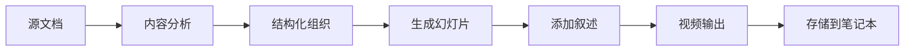

**视频功能:**
- 📊 自动生成演示幻灯片
- 🎙️ AI叙述配音
- 📁 单个笔记本可存储多个视频
- 🎬 适合教育和培训内容

### 5. 思维导图 🗺️ (2025年3月新增)

交互式主题导航和知识连接：

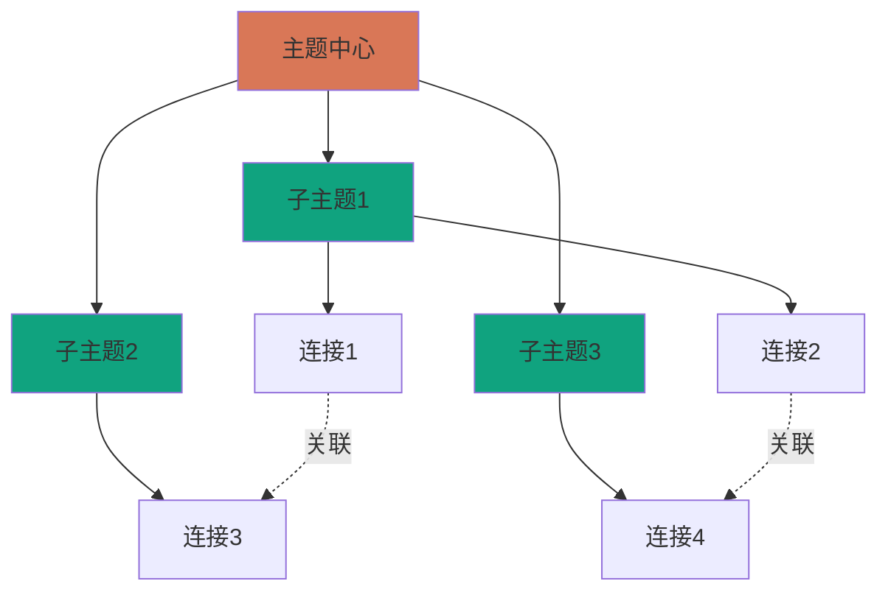

**思维导图功能:**
- 🔗 自动识别知识连接
- 🎯 导航复杂主题
- 📚 深入理解材料
- 💡 发现新见解

### 6. 自定义聊天 🎭 (2025年新增)

可自定义AI的目标、语气和角色：

- **目标导向**: 设置特定研究目标
- **语气控制**: 学术、轻松、专业等
- **角色扮演**: 如教师、研究助手、编辑
- **对话保存**: 自动保存所有对话

---

## 用户工作流程

以下是 NotebookLM 2025 中典型研究会话的流程:

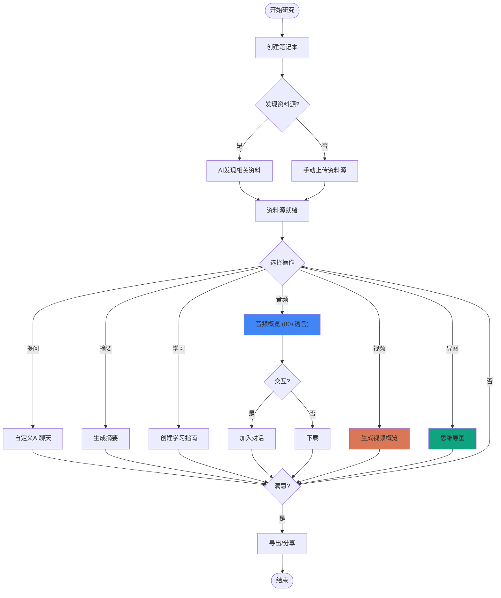

---

## 核心功能深度解析

### 智能引用

NotebookLM 的每个响应都包含**行内引用**,链接回你的资料源的特定部分:

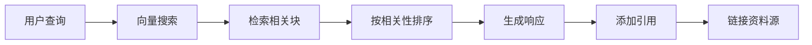

### 自动学习指南

NotebookLM 可以生成全面的学习材料:

- **摘要**: 所有资料源的高级概览
- **关键主题**: 主要主题和概念
- **常见问题**: 常见问题及答案
- **时间线**: 按时间顺序排列的事件(如果适用)
- **术语表**: 重要术语和定义

### 多源综合

与单文档工具不同,NotebookLM 擅长连接多个资料源的信息:

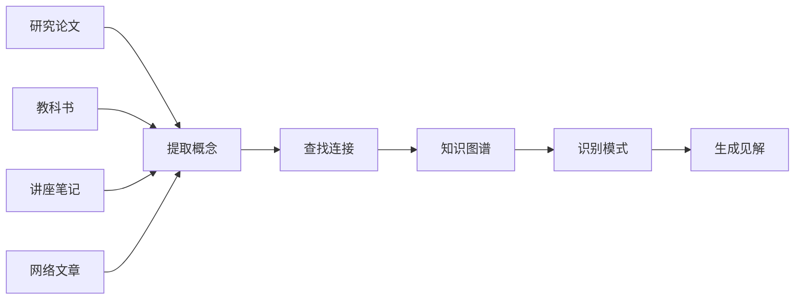

---

## 技术架构

### RAG 实现

NotebookLM 的检索增强生成系统确保准确、基于资料源的响应:

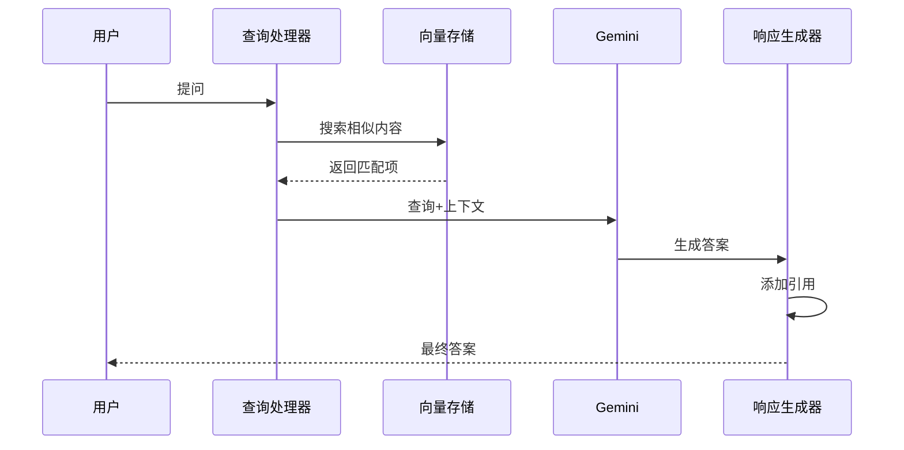

### 上下文窗口管理 (2025更新)

**Gemini 2.5 Flash** 提供 **1M token 上下文窗口**，专为思维推理优化：

**Token 分配:**
- 源文档: 最多约 75万 tokens (75%)
- 对话历史: 约 10万 tokens (10%)
- 推理空间: 约 10万 tokens (10%) 🆕
- 系统提示: 约 2.5万 tokens (2.5%)
- 响应生成: 约 2.5万 tokens (2.5%)

**性能提升:**
- 📈 **上下文提升 8倍**
- 🧠 **对话记忆 6倍**
- ⚡ **响应质量 +50%**

---

## 数据流

### 完整的请求-响应周期

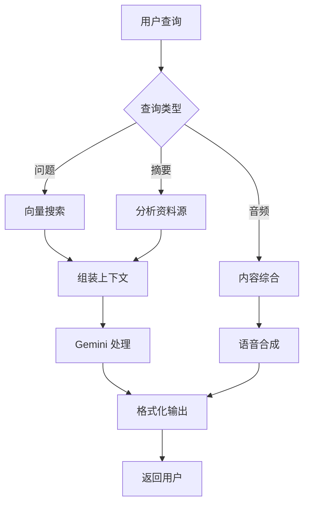

---

## 隐私和安全

NotebookLM 非常重视数据隐私:

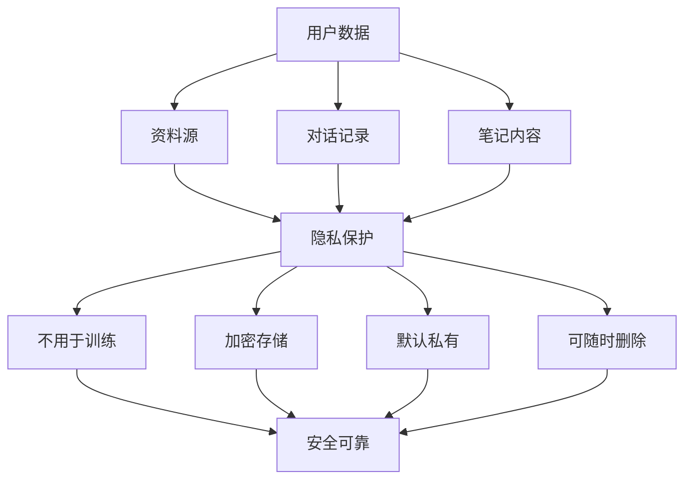

**关键隐私功能:**
- 资料源**不会**用于训练 AI 模型
- 数据是**私有的**,不与他人共享
- 用户可以**随时删除**笔记本和资料源
- 所有数据在静态和传输过程中都是**加密的**

---

## 使用场景

### 学术研究

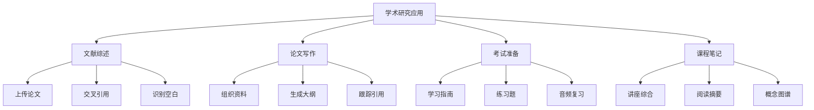

### 专业应用

- **法律**: 判例法研究和摘要准备
- **医疗**: 临床研究分析和文献综述
- **商业**: 市场调研和竞争分析
- **新闻**: 资料源验证和事实核查
- **教育**: 课程开发和课程规划

### 个人学习

- 书籍摘要和见解
- 课程材料理解
- 语言学习支持
- 爱好研究和探索

---

## 定价与可用性 💰

### 免费版 (NotebookLM)

**完全免费** - 适合个人用户和小型项目

- ✅ 所有核心功能
- ✅ 音频/视频概览
- ✅ 思维导图
- ✅ 多语言支持
- ✅ 基础使用量

### NotebookLM Plus ($20/月)

**付费增强版** - 适合重度用户

**价格:**
- 💰 **个人**: $20/月 (Google One AI Premium)
- 🎓 **学生**: $9.99/月 (50%折扣，仅美国)
- 💼 **企业**: $20/用户/月 (Gemini for Workspace附加)

**Plus版特权:**
- 📦 **5倍使用量**: 500个笔记本
- 📚 **300个资料源/笔记本** (vs 免费版更少)
- 💬 **500次聊天查询/天**
- 🎙️ **20次音频生成/天**
- 🏢 **企业级数据保护**

### NotebookLM Enterprise

**企业定制** - 适合大型组织

- 📊 定制定价
- 🔒 数据留存在 Google Cloud 项目
- 🌎 美国多区域可用
- 🛡️ Google Workspace 服务条款保护
- ⚠️ 注：欧盟多区域暂不可用

---

## 限制和注意事项

NotebookLM 2025 虽然功能强大，但仍有一些限制：

| 限制           | 免费版                       | Plus版           | 解决方法         |
| -------------- | ---------------------------- | ---------------- | ---------------- |
| **资料源依赖** | 仅了解你上传的内容           | 可AI发现资料源   | 使用"发现资料源" |
| **笔记本数量** | 有限                         | 500个笔记本      | 升级Plus版       |
| **每日查询**   | 有限                         | 500次/天         | 合理规划使用     |
| **音频生成**   | 有限                         | 20次/天          | 批量生成         |
| **资料源/本**  | 较少                         | 300个            | 升级Plus版       |
| **语言支持**   | 80+语言（仅音频概览部分）    | 80+语言          | 使用多语言功能   |
| **上下文窗口** | 1M tokens (Gemini 2.5 Flash) | 1M tokens        | 拆分超大文档     |

---

## 与其他工具的比较

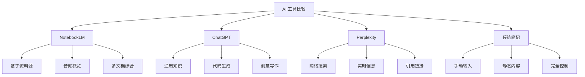

**NotebookLM 优势:**
- 高度准确(基于资料源)
- 独特的音频功能
- 非常适合研究
- 资料源上不会产生幻觉

**何时使用替代方案:**
- **ChatGPT**: 一般问题、编程、创意任务
- **Perplexity**: 时事、网络研究
- **传统工具**: 当你需要完全手动控制时

---

## 2025年路线图与未来发展

### 已实现 (2025)

- ✅ **Gemini 2.5 Flash 集成** (5月)
- ✅ **视频概览** (7月)
- ✅ **思维导图** (3月)
- ✅ **80+语言支持** (4月)
- ✅ **交互式音频** (12月2024)
- ✅ **NotebookLM Plus** (2月)
- ✅ **企业版** (2月)
- ✅ **发现资料源** (4月)
- ✅ **多模态PDF** (4月)

### 即将推出

- 📱 **移动应用**: Android/iOS (预注册已开放)
- 🌍 **欧盟数据留存**: 企业版欧盟支持
- 🔗 **API访问**: 程序化集成
- 👥 **协作功能**: 团队笔记本共享
- 🎯 **更多自定义**: AI角色和目标

### 长期愿景

- 🧠 **更强推理**: 持续升级Gemini模型
- 🌐 **实时协作**: 多人实时编辑
- 🎨 **视觉增强**: 图表和可视化生成
- 🔊 **语音输入**: 直接语音提问
- 🤖 **AI代理**: 自动化研究任务

---

## 2025年技术栈

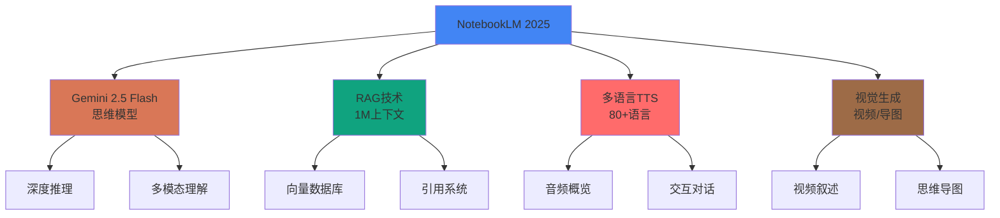

---

## 快速入门

### 2025年快速入门指南

1. **访问** [notebooklm.google.com](https://notebooklm.google.com)
2. **登录** 你的 Google 账户（免费）
3. **创建** 新笔记本
4. **🆕 发现资料源** 或手动上传（PDF、Doc、URL、YouTube等）
5. **等待** AI处理（Gemini 2.5 Flash，通常 < 30 秒）
6. **🆕 自定义聊天** 设置AI目标和语气
7. **提问** 或请求摘要
8. **🆕 生成内容**:
   - 🎙️ **音频概览** (80+语言，可交互)
   - 🎥 **视频概览** (带叙述幻灯片)
   - 🗺️ **思维导图** (可视化连接)
9. **💡 交互模式**: 加入AI主持人对话
10. **📱 移动应用**: 即将推出，敬请期待

### 升级到 Plus

如需更多使用量，访问 [Google One AI Premium](https://one.google.com/about/google-ai-plans/)
- 💰 $20/月 (学生$9.99/月)
- 📦 5倍使用量
- 📚 500个笔记本
- 💬 500次查询/天

---

## 最佳实践

### 最大化 NotebookLM 效果

**资料源选择:**
- 上传高质量、权威的资料源
- 包含你主题的不同观点
- 保持资料源相关和专注
- 随着新信息的出现更新资料源

**查询技巧:**
- 提出具体、明确的问题
- 请求跨资料源比较
- 使用后续问题深入挖掘
- 尝试不同的措辞以获得更好的结果

**组织:**
- 为不同项目创建单独的笔记本
- 使用描述性的笔记本名称
- 定期审查和更新资料源
- 删除过时或无关的材料

---

## 结论

**NotebookLM 2025** 代表了AI研究助手的重大飞跃。通过升级到 **Gemini 2.5 Flash** 思维模型，它提供：

- **🧠 深度推理**: 思维模型带来更强的多步推理能力
- **🌍 全球化**: 80+语言支持，打破语言障碍
- **🎙️ 创新交互**: 可加入AI播客对话，实时提问
- **🎥 多模态输出**: 音频+视频+思维导图，全方位内容生成
- **💰 灵活定价**: 免费版强大，Plus版更强，企业版最强
- **📱 无处不在**: Web + 移动应用（即将）

### 2025年关键优势

| 维度 | 能力 | 竞争优势 |
|------|------|----------|
| **AI引擎** | Gemini 2.5 Flash | 思维模型，深度推理 |
| **上下文** | 1M tokens | 处理海量文档 |
| **多语言** | 80+语言 | 全球最广支持 |
| **交互性** | 可加入对话 | 业界首创 |
| **多模态** | 音频+视频+导图 | 最丰富输出 |
| **定价** | 免费+$20/月 | 性价比最高 |

### 适用场景

- 🎓 **学生**: 学习笔记、考试准备、论文研究
- 👨‍🔬 **研究人员**: 文献综述、数据分析、学术写作
- 💼 **专业人士**: 会议纪要、项目管理、知识整理
- 📚 **终身学习者**: 读书笔记、技能提升、知识探索
- 👥 **团队协作**: 共享笔记本、集体智慧（企业版）

无论你是学生、研究人员、专业人士还是终身学习者，**NotebookLM 2025** 都能将分散的信息转化为有组织、可操作、多维度的见解。

---

## 其他资源

- **官方网站**: [notebooklm.google.com](https://notebooklm.google.com)
- **帮助中心**: Google NotebookLM 文档
- **博客**: Google AI 博客了解更新和公告
- **社区**: Reddit r/NotebookLM 和 Discord 社区

---

## 快速对比表

| 功能 | 免费版 | Plus版 | 企业版 |
|------|--------|--------|--------|
| **价格** | $0 | $20/月 | 定制 |
| **笔记本数量** | 有限 | 500个 | 无限 |
| **资料源/本** | 有限 | 300个 | 无限 |
| **每日查询** | 有限 | 500次 | 无限 |
| **音频生成** | 有限 | 20次/天 | 无限 |
| **Gemini 2.5** | ✅ | ✅ | ✅ |
| **80+语言** | ✅ | ✅ | ✅ |
| **视频概览** | ✅ | ✅ | ✅ |
| **思维导图** | ✅ | ✅ | ✅ |
| **交互音频** | ✅ | ✅ | ✅ |
| **数据保护** | 标准 | 标准 | 企业级 |
| **技术支持** | 社区 | 社区 | 专业 |

---

*最后更新: 2025年11月*
*基于 Gemini 2.5 Flash (2025年5月)*
*数据来源: Google官方博客、NotebookLM Help Center*

**开始使用**: [notebooklm.google.com](https://notebooklm.google.com)
