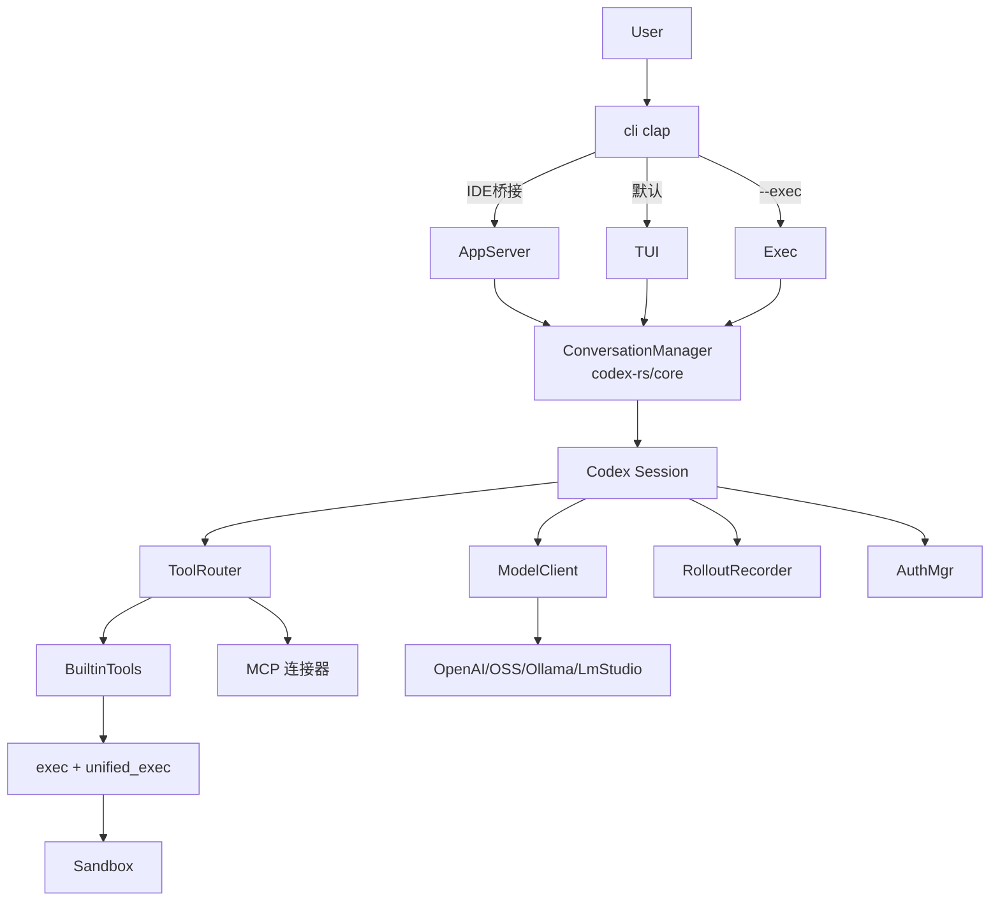
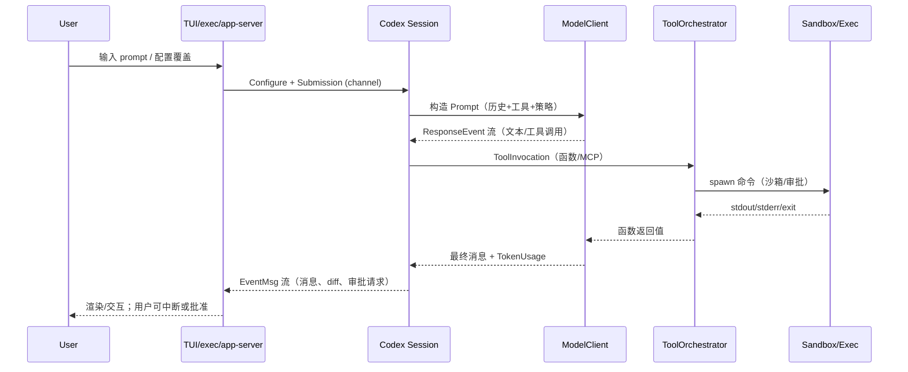

# Codex（venders/codex）架构分析

本文基于 `venders/codex` 代码树撰写，重点覆盖当前 Rust 实现的 CLI 及其配套组件，兼顾仓库内的遗留 TypeScript 部分。

## 仓库全景

- Rust 工作区 `codex-rs/`（`Cargo.toml` 工作区）是主实现，含 CLI/TUI、业务核心、工具链、安全沙箱等多个 crate。
- 遗留 TypeScript CLI 位于 `codex-cli/`，已在 `codex-cli/README.md` 标注为 legacy，仅保留文档与脚本。
- 其他前端/SDK：`sdk/typescript/`（TypeScript SDK）、`shell-tool-mcp/`（MCP shell 工具），以及顶层 `docs/` 提供用户文档。

## 顶层组件与职责

- `cli/`（如 `cli/src/main.rs`）：clap 多子命令入口。默认启动交互式 TUI（`codex-tui`），其它子命令包括 `exec`（无界面）、`login`、`mcp`、`app-server`、沙箱测试等。
- `tui/`：基于 Ratatui 的全屏终端界面（`tui/src/lib.rs`）。负责会话管理、快捷键、文件/差异浏览、额外指引等，可切换全自动/危险模式。
- `exec/`：头less 模式（`exec/src/lib.rs`），从 CLI 读取 prompt 或 stdin，处理事件流（人类可读或 JSONL），适合 CI/自动化。
- `app-server/` 与 `app-server-protocol/`：JSON-RPC（stdio 流）服务，面向 IDE 扩展等富客户端；暴露线程/turn API 与事件流（详见 `app-server/README.md`）。
- `mcp-server/` + `mcp-types/`：让 Codex 以 MCP 服务器形式暴露工具；`core` 也作为 MCP 客户端连接外部服务器。
- 安全/执行相关独立 crates：`linux-sandbox/`（Landlock+seccomp）、`windows-sandbox-rs/`、`apply-patch/`（虚拟 apply_patch）、`process-hardening/` 等。
- 生态工具：`execpolicy/`（Starlark 规则驱动的命令白名单/审批）、`file-search/`、`keyring-store/`、`ollama/` & `lmstudio/`（本地模型提供方）。

## 核心运行时（`codex-rs/core`）

### 会话与生命周期

- 入口 `codex::Codex`（`core/src/codex.rs`）通过有界 `tx_sub` / 无界 `rx_event` 管道工作；`spawn` 创建 `Session`、发送初始 `SessionConfigured` 事件并返回 `CodexSpawnOk`。
- `Session`（同文件）持有：
  - `SessionState`（`state/session.rs`）：当前配置、历史上下文（`ContextManager`）、token/速率信息。
  - `SessionServices`（`state/service.rs`）：`AuthManager`、`McpConnectionManager`、工具审批缓存、`RolloutRecorder` 等共享服务。
  - `ActiveTurn` / 任务状态（`state/turn.rs`），支持取消/替换。
- `TurnContext` 封装单 turn 的环境：`ModelClient`、CWD、审批/沙箱策略、工具配置、执行策略、截断策略、sandbox 可执行路径等。
- `ConversationManager`（`core/src/conversation_manager.rs`）负责创建/恢复/分叉会话，包装 `Codex` 并管理持久化路径。

### 任务模型

- `tasks/` 定义会话内可运行的任务（`SessionTask` trait，`tasks/mod.rs`）：`RegularTask`（常规对话）、`ReviewTask`（自动代码审查）、`GhostSnapshotTask`（摘要/压缩）、`UndoTask`、`UserShellCommandTask` 等。
- `Session::spawn_task` 启动背景 tokio 任务，统一处理完成/中断事件（`TaskComplete`、`TurnAborted`），并在 turn 结束时刷新 rollout。

### 事件与上下文

- 模型返回的 `ResponseEvent` 由 `response_processing`、`event_mapping` 解析为协议层 `EventMsg`（`protocol/` crate），前端消费同一事件流（TUI、exec、app-server）。
- `ContextManager` 维护 turn 历史并基于 `truncate.rs`/`compact.rs` 做 token 裁剪；`rollout/` 将事件落盘便于恢复/归档。
- `turn_diff_tracker.rs` 跟踪应用补丁的差异以支持 UI 展示和 “apply” 子命令。

## 模型与提示栈

- `ModelClient`（`core/src/client.rs`）根据 `ModelProviderInfo` 选择接入模式：OpenAI Responses API 或 Chat Completions。负责：
  - 构造工具/函数调用 JSON（`client_common`、`function_tool.rs`）。
  - 处理 SSE/流式响应、自动重试、使用限制映射（`UsageLimitReached` 等）。
  - 记录 OTel 事件，填充 token/限流快照。
- Prompt 生成位于 `client_common::Prompt` 与模板文件（`core/gpt_5_1_prompt.md` 等），`truncate`/`compact_remote` 支持自动压缩历史。

## 工具、执行与沙箱

- 工具路由与编排：
  - `ToolRouter` + `ToolRegistry` + `ToolOrchestrator`（`tools/`）将模型的函数/MCP 调用分派到具体 handler。
  - Handler 位于 `tools/handlers/`（shell、apply_patch、read_file、list_dir、grep_files、plan、view_image、MCP 调用等）。`tool_apply_patch.lark` 定义 apply_patch 语法。
  - `parallel.rs` 支持并行工具调用，`runtimes/` 提供通用执行 runtime。
- 审批与策略：
  - `AskForApproval`/`SandboxPolicy`（`protocol`）与 `execpolicy`（Starlark 规则，`execpolicy/README.md`）共同决定是否弹窗审批、是否允许执行。
  - `tools/sandboxing.rs` + `ToolOrchestrator` 统一审批 → 选沙箱 → 失败重试（可无沙箱）流程，`ApprovalStore` 缓存会话级批准。
  - `command_safety`、`exec_policy.rs` 做快速危险命令识别与策略加载。
- 执行层：
  - `exec.rs` 构建 `CommandSpec` → `SandboxManager` → `ExecEnv`，并在 `sandboxing/mod.rs` 中按平台包装（Seatbelt、Landlock、Windows Restricted Token）再由 `spawn` 统一执行。
  - `unified_exec/` 管理交互式 PTY 会话（支持持续输入、输出截断、超时）。
  - `apply_patch.rs`、`default_client.rs` 提供模拟工具与网络客户端的 arg0 分流。

## 配置、鉴权与环境

- 配置：`config/` 解析 `config.toml`，支持 CLI 覆盖（`config_loader` + `codex-common` 中的 `config_override.rs`），特性开关在 `features.rs`。
- 鉴权：`auth/` + `login/` crate 处理 ChatGPT/设备码/API Key 等模式，`AuthManager` 统一管理凭证，`CodexAuth` 可被 `app-server`/`exec` 等共享。
- 环境：`environment_context.rs`、`project_doc.rs`、`git_info.rs` 收集 CWD、git 信息与项目说明，注入 prompt；`user_notification.rs` 在 turn 结束触发外部通知脚本。

## 对外协议与集成

- `protocol/` 定义事件、配置、工具调用、审批、沙箱等跨 crate 的共享类型，供 `tui`、`exec`、`app-server` 和 IDE 扩展统一使用。
- `app-server/` 将 `ConversationManager` 封装为 JSON-RPC API（线程/turn/审查），事件通过通知流推送。
- MCP：`mcp/` 模块处理客户端连接、资源/模板读取；`mcp-server/` crate 让 Codex 以工具形式暴露给其他 MCP 客户端。
- OSS/本地模型：`ollama/`、`lmstudio/` crate 提供本地提供方的健康检查与默认模型解析；`codex_common::oss` 在 CLI 层选择/下载。

## 关键特性与扩展点

- 易扩展的工具层：在 `ToolRegistryBuilder` 注册新 handler；若需外部资源，可通过 MCP 实现。
- 安全可配置：`AskForApproval`、`SandboxPolicy`、`execpolicy` 与平台沙箱组合，`--sandbox`/`--approval-mode` 快速切换。
- 历史与恢复：`rollout/` 将事件落盘（含 `ARCHIVED_SESSIONS_SUBDIR`），`resume`/`fork` 由 `ConversationManager` 统一处理。
- 观测性：`otel_init.rs` 与 `codex-otel` 贯穿客户端/工具/模型调用记录。
- 兼容遗留：TypeScript CLI 仍可阅读（`codex-cli/`），但 Rust 版本是默认路径；`apply` 子命令可从 rollout 中恢复最新 diff。
