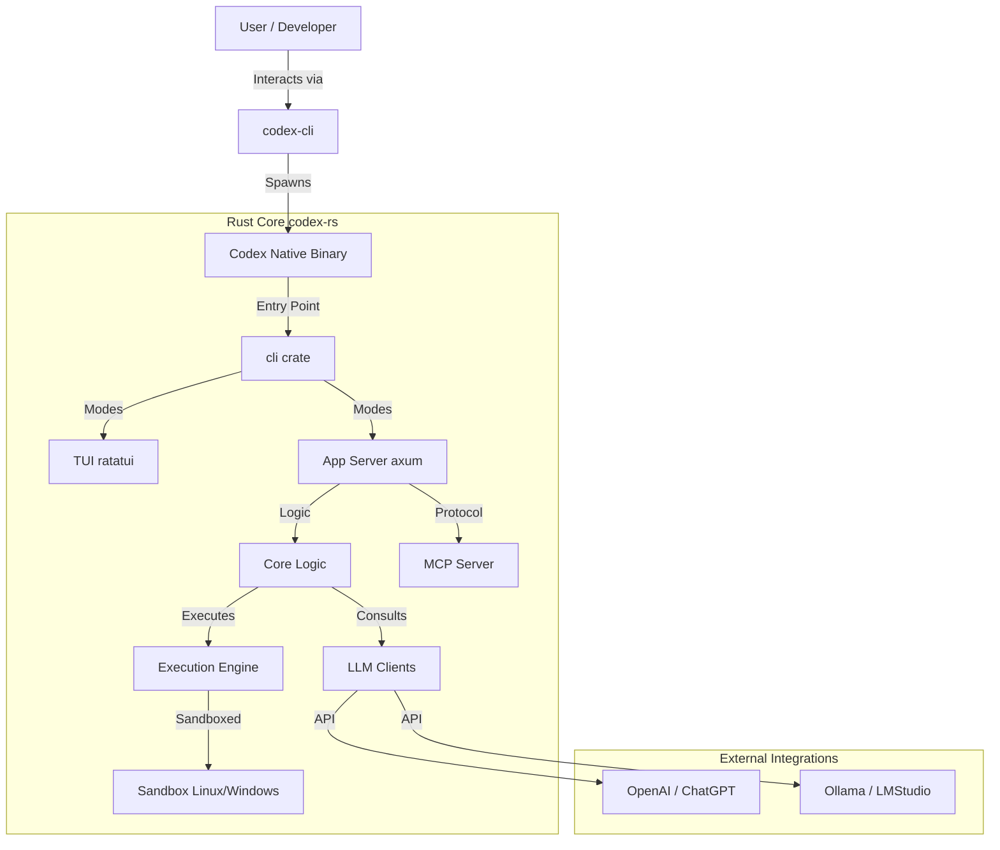

# Codex Architecture Analysis

**Date:** November 23, 2025
**Author:** Gemini (AI Assistant)
**Scope:** `./venders/codex`

## 1. Executive Summary

The `codex` repository is a sophisticated monorepo implementing an AI-powered coding assistant. It employs a **hybrid architecture** where the core logic, performance-critical components, and terminal UI are implemented in **Rust** (`codex-rs`), while distribution and specific integrations leverage **TypeScript/Node.js** ecosystems (`codex-cli`, `sdk`, `shell-tool-mcp`).

Key architectural highlights:

* **Rust Core:** A massive Cargo workspace containing the application server, TUI, execution engine, and LLM clients.
* **Sandboxed Execution:** robust support for secure command execution via `linux-sandbox` and `windows-sandbox-rs`.
* **MCP Integration:** Deep integration with the Model Context Protocol (MCP), both as a server (`mcp-server`) and a client for specific tools (`shell-tool-mcp`).
* **Universal Distribution:** Distributed as an NPM package (`codex-cli`) that wraps platform-specific native binaries.

---

## 2. High-Level Architecture

The system can be conceptualized as a tiered architecture:

---

## 3. Component Deep Dive

### 3.1. The Rust Core (`codex-rs`)

This is the heart of the application. It is organized as a Cargo workspace with numerous crates, indicating a modular monolith design.

#### Key Modules

* **Interface Layer:**
  * `cli`: The main entry point parsing arguments and initializing the application.
  * `tui`: A rich Terminal User Interface built with `ratatui` and `crossterm`.
  * `mcp-server`: Implements the Model Context Protocol, allowing Codex to serve as an intelligent backend for other tools (like IDEs).

* **Application Logic:**
  * `app-server`: The central brain, likely running an `axum` web server/RPC handler to manage state and requests.
  * `core`: Shared business logic and domain models.
  * `protocol` / `app-server-protocol`: Defines the communication schemas, likely using Protobuf/Tonic (gRPC) or JSON-RPC.

* **Execution & Security:**
  * `exec`: General command execution logic.
  * `execpolicy` / `process-hardening`: Security policies to restrict what the AI can execute.
  * `linux-sandbox` / `windows-sandbox-rs`: Platform-specific implementations for isolating executed commands. This is a critical safety feature.

* **AI Backend:**
  * `backend-client`: Generic client interface.
  * `chatgpt`, `ollama`, `lmstudio`: Specific adapters for different LLM providers.

* **Infrastructure & Utils:**
  * `keyring-store`: Secure storage for API keys.
  * `file-search`: Efficient code search capabilities.
  * `otel`: OpenTelemetry integration for observability.

### 3.2. Distribution (`codex-cli`)

This package resolves the "binary distribution problem" for CLI tools.

* **Role:** It acts as a lightweight launcher.
* **Mechanism:**
    1. User installs via `npm install -g @openai/codex`.
    2. `bin/codex.js` runs on the user's machine.
    3. It detects the OS and Architecture (e.g., `darwin-arm64`).
    4. It locates the bundled native binary (vendor directory) and executes it, passing through all arguments and stdio.
* **Build Process:** A Python script (`scripts/build_npm_package.py`) orchestrates the compilation of Rust binaries for multiple targets and bundles them into the NPM package.

### 3.3. Extensions & SDK

* **`shell-tool-mcp`**: A TypeScript-based MCP server. It seems to provide specialized shell capabilities, possibly "patching" Bash to allow for deeper integration or control by the AI agent.
* **`sdk/typescript`**: Likely a client library for programmatically interacting with the Codex engine or `app-server`.

---

## 4. Technology Stack

| Component         | Technology                                           | Usage                                       |
|:------------------|:-----------------------------------------------------|:--------------------------------------------|
| **Languages**     | **Rust** (90%), **TypeScript** (10%), Python (Build) | Core logic vs. Glue/Scripting               |
| **Web Server**    | **Axum**                                             | `app-server` HTTP/WebSocket handling        |
| **TUI**           | **Ratatui**, **Crossterm**                           | Terminal UI rendering                       |
| **Serialization** | **Serde**, **Tonic** (Prost)                         | JSON and gRPC handling                      |
| **Build**         | **Cargo**, **PNPM**, **Nix**                         | Dependency management & Reproducible builds |
| **Observability** | **OpenTelemetry**                                    | Tracing and Metrics                         |
| **Sandbox**       | **Landlock** (Linux), **Windows API**                | Secure execution                            |

---

## 5. Build & Development Flow

The project emphasizes reproducibility using **Nix**.

1. **Environment:** `flake.nix` defines the exact versions of Rust, Node.js, and system libraries required.
2. **Rust Build:** Standard `cargo build` within the workspace.
3. **Integration Build:** `pnpm` manages the JS dependencies.
4. **Release:** The Python script cross-compiles Rust binaries and packages them into the NPM artifact.

## 6. Data Flow Example: "Execute Command"

1. **User** types a request in the TUI (e.g., "List files").
2. **TUI** sends the request to the `app-server` (internal logic).
3. `app-server` constructs a prompt and sends it to `backend-client` (e.g., **OpenAI**).
4. **LLM** responds with a tool call: `execute_shell("ls -la")`.
5. `app-server` receives the tool call.
6. `execpolicy` checks if `ls -la` is safe/allowed.
7. `exec-server` spawns the process inside the **Sandbox**.
8. Output is captured and returned to the `app-server`.
9. `app-server` feeds output back to **LLM** (optional) or displays it in the **TUI**.

---
