# Codex 事件循环与任务迭代机制深度解析

> 作者: Claude
> 日期: 2025-11-23
> 版本: 1.0
> 代码库: OpenAI Codex CLI - Rust Implementation

---

## 目录

- [1. 概述](#1-概述)
- [2. 整体架构](#2-整体架构)
- [3. 事件循环层级](#3-事件循环层级)
- [4. 任务执行流程](#4-任务执行流程)
- [5. 迭代决策机制](#5-迭代决策机制)
- [6. 完整示例分析](#6-完整示例分析)
- [7. 错误处理与重试](#7-错误处理与重试)
- [8. 总结](#8-总结)

---

## 1. 概述

### 1.1 核心问题

当用户向 Codex 发起一个任务时，例如 "帮我修复这个 bug 并运行测试"，Codex 如何：

1. **分解任务**：理解需要做什么
2. **迭代执行**：读文件 → 理解代码 → 修改 → 运行测试 → 查看结果 → 再修改...
3. **判断完成**：何时认为任务已经完成
4. **自我修正**：如果测试失败，如何继续尝试

本文将深入剖析 Codex 的事件循环机制，揭示这个"AI 编程助手"如何在代码库中自主工作。

### 1.2 关键概念

- **Submission**: 用户的操作请求（Op）
- **Event**: 系统的响应事件
- **Session**: 会话上下文，管理整个对话
- **Task**: 一个完整的用户任务
- **Turn**: 一次模型交互（一问一答）
- **Tool Call**: 模型调用工具（如 shell、read_file）

---

## 2. 整体架构

### 2.1 事件驱动架构

Codex 采用 Actor 模式的事件驱动架构：

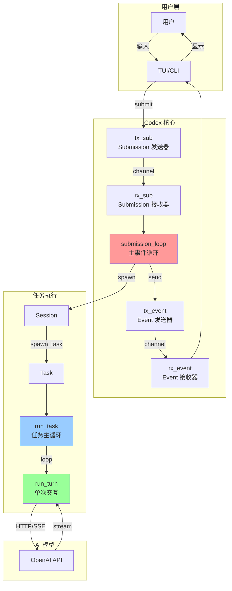

### 2.2 通道通信

```rust
// 核心通道结构
pub struct Codex {
    next_id: AtomicU64,
    tx_sub: Sender<Submission>,   // 用户 → Codex
    rx_event: Receiver<Event>,     // Codex → 用户
}

// 会话内部通道
struct Session {
    tx_event: Sender<Event>,       // 任务 → 用户
    // ... 其他字段
}
```

**双向通信**：
- **输入流**: `User → tx_sub → rx_sub → submission_loop`
- **输出流**: `task → tx_event → rx_event → User`

---

## 3. 事件循环层级

Codex 的事件循环是**三层嵌套**的循环结构：

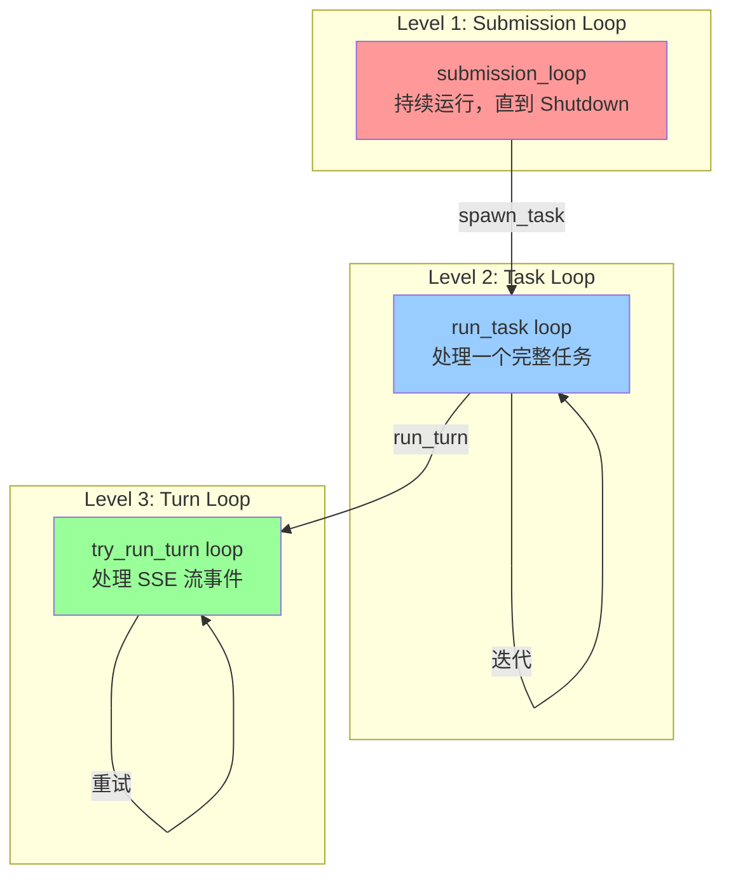

### 3.1 Level 1: Submission Loop

**位置**: `codex.rs:1381`

```rust
async fn submission_loop(
    sess: Arc<Session>,
    config: Arc<Config>,
    rx_sub: Receiver<Submission>
) {
    let mut previous_context: Option<Arc<TurnContext>> =
        Some(sess.new_turn(SessionSettingsUpdate::default()).await);

    // 主循环：接收 Submission
    while let Ok(sub) = rx_sub.recv().await {
        debug!(?sub, "Submission");
        match sub.op.clone() {
            Op::Interrupt => {
                handlers::interrupt(&sess).await;
            }
            Op::UserInput { .. } | Op::UserTurn { .. } => {
                // 处理用户输入或新 Turn
                handlers::user_input_or_turn(
                    &sess,
                    sub.id.clone(),
                    sub.op,
                    &mut previous_context
                ).await;
            }
            Op::ExecApproval { id, decision } => {
                // 处理工具执行审批
                handlers::exec_approval(&sess, id, decision).await;
            }
            Op::Shutdown => {
                if handlers::shutdown(&sess, sub.id.clone()).await {
                    break; // 退出循环
                }
            }
            // ... 其他操作
            _ => {}
        }
    }
    debug!("Agent loop exited");
}
```

**职责**：
- 永久运行，直到收到 `Op::Shutdown`
- 分发不同类型的操作到对应的 handler
- 管理 Session 的生命周期

**关键操作类型**：

| Op 类型        | 说明     | 行为                       |
|----------------|--------|--------------------------|
| `UserInput`    | 用户输入 | 注入到当前任务或启动新任务 |
| `UserTurn`     | 新对话轮 | 启动新任务                 |
| `ExecApproval` | 审批决策 | 通知等待中的工具调用       |
| `Interrupt`    | 中断     | 取消当前任务               |
| `Shutdown`     | 关闭     | 退出循环                   |

### 3.2 Level 2: Task Loop (run_task)

**位置**: `codex.rs:1905`

这是任务的**主迭代循环**，负责不断与模型交互直到任务完成。

```rust
pub(crate) async fn run_task(
    sess: Arc<Session>,
    turn_context: Arc<TurnContext>,
    input: Vec<UserInput>,
    cancellation_token: CancellationToken,
) -> Option<String> {
    // 1. 发送任务开始事件
    sess.send_event(&turn_context, EventMsg::TaskStarted(..)).await;

    // 2. 记录初始用户输入
    let initial_input_for_turn: ResponseInputItem = ResponseInputItem::from(input);
    sess.record_input_and_rollout_usermsg(&turn_context, &initial_input_for_turn).await;

    let mut last_agent_message: Option<String> = None;
    let turn_diff_tracker = Arc::new(Mutex::new(TurnDiffTracker::new()));

    // 3. 主循环：不断执行 turn 直到完成
    loop {
        // 3.1 获取待处理的输入（可能是用户中途注入的）
        let pending_input = sess.get_pending_input().await
            .into_iter()
            .map(ResponseItem::from)
            .collect::<Vec<ResponseItem>>();

        // 3.2 构建发送给模型的完整输入
        let turn_input: Vec<ResponseItem> = {
            sess.record_conversation_items(&turn_context, &pending_input).await;
            sess.clone_history().await.get_history_for_prompt()
        };

        // 3.3 执行一次 turn
        match run_turn(
            Arc::clone(&sess),
            Arc::clone(&turn_context),
            Arc::clone(&turn_diff_tracker),
            turn_input,
            cancellation_token.child_token(),
        ).await {
            Ok(turn_output) => {
                let processed_items = turn_output;

                // 3.4 检查 token 限制
                let limit = turn_context.client.get_auto_compact_token_limit().unwrap_or(i64::MAX);
                let total_usage_tokens = sess.get_total_token_usage().await;
                let token_limit_reached = total_usage_tokens >= limit;

                // 3.5 处理响应项
                let (responses, items_to_record) =
                    process_items(processed_items, &sess, &turn_context).await;

                // 3.6 如果超过 token 限制，压缩历史并继续
                if token_limit_reached {
                    run_inline_auto_compact_task(sess.clone(), turn_context.clone()).await;
                    continue; // ⚠️ 关键：继续下一轮迭代
                }

                // 3.7 判断是否完成
                if responses.is_empty() {
                    // ✅ 没有待处理的响应 = 任务完成
                    last_agent_message = get_last_assistant_message_from_turn(&items_to_record);
                    sess.notifier().notify(..);
                    break; // 退出循环
                }
                // ⚠️ 否则继续循环
                continue;
            }
            Err(CodexErr::TurnAborted { .. }) => {
                // 任务被中止
                break;
            }
            Err(e) => {
                // 错误发生，发送错误事件并退出
                sess.send_event(&turn_context, EventMsg::Error(e.to_error_event(None))).await;
                break;
            }
        }
    }

    last_agent_message
}
```

**核心逻辑**：

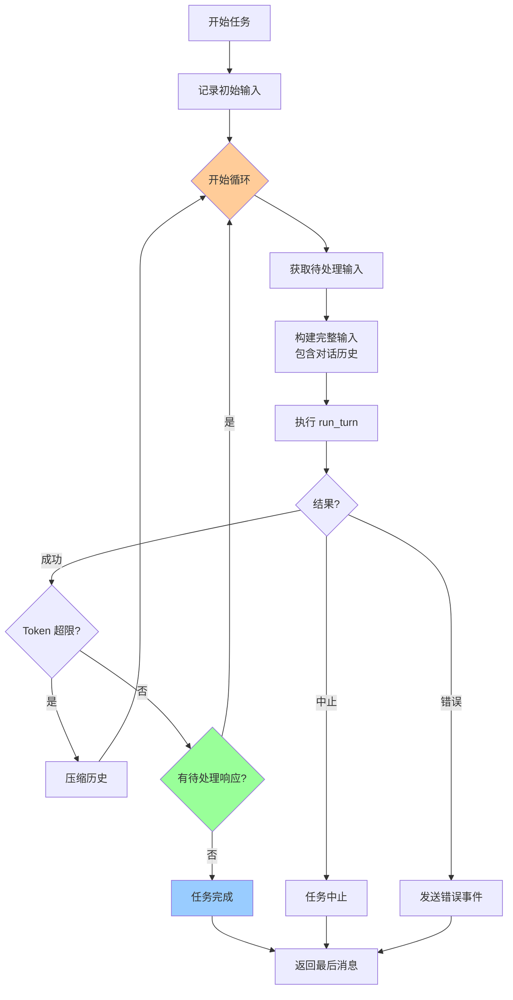

**关键决策点**：

1. **Token 超限** (`line 1977`): 自动压缩历史，继续迭代
2. **responses 为空** (`line 1987`): 认为任务完成，退出循环
3. **responses 不为空**: 说明模型需要更多信息（工具结果），继续下一轮

### 3.3 Level 3: Turn Loop (try_run_turn)

**位置**: `codex.rs:2161`

处理单次模型交互，包括 SSE 流式响应和工具调用。

```rust
async fn try_run_turn(
    router: Arc<ToolRouter>,
    sess: Arc<Session>,
    turn_context: Arc<TurnContext>,
    turn_diff_tracker: SharedTurnDiffTracker,
    prompt: &Prompt,
    cancellation_token: CancellationToken,
) -> CodexResult<Vec<ProcessedResponseItem>> {
    // 1. 记录 turn 上下文
    sess.persist_rollout_items(&[RolloutItem::TurnContext(..)]).await;

    // 2. 向模型发送请求，获取流式响应
    let mut stream = turn_context.client.clone()
        .stream(prompt)
        .or_cancel(&cancellation_token)
        .await??;

    // 3. 创建工具调用运行时
    let tool_runtime = ToolCallRuntime::new(
        Arc::clone(&router),
        Arc::clone(&sess),
        Arc::clone(&turn_context),
        Arc::clone(&turn_diff_tracker),
    );

    let mut output: FuturesOrdered<BoxFuture<CodexResult<ProcessedResponseItem>>> =
        FuturesOrdered::new();
    let mut active_item: Option<TurnItem> = None;

    // 4. 处理 SSE 流
    loop {
        // 4.1 获取下一个事件
        let event = match stream.next().or_cancel(&cancellation_token).await {
            Ok(event) => event,
            Err(CancelErr::Cancelled) => {
                let processed_items = output.try_collect().await?;
                return Err(CodexErr::TurnAborted {
                    dangling_artifacts: processed_items
                });
            }
        };

        let event = match event {
            Some(res) => res?,
            None => return Err(CodexErr::Stream("stream closed before response.completed".into(), None)),
        };

        match event {
            ResponseEvent::Created => {}

            ResponseEvent::OutputItemAdded(item) => {
                // 新输出项开始
                if let Some(turn_item) = handle_non_tool_response_item(&item).await {
                    sess.emit_turn_item_started(&turn_context, &turn_item).await;
                    active_item = Some(turn_item);
                }
            }

            ResponseEvent::OutputTextDelta(delta) => {
                // 文本增量
                if let Some(active) = active_item.as_ref() {
                    sess.send_event(&turn_context,
                        EventMsg::AgentMessageContentDelta(..)).await;
                }
            }

            ResponseEvent::OutputItemDone(item) => {
                // 输出项完成
                active_item.take();

                // 判断是否是工具调用
                match ToolRouter::build_tool_call(sess.as_ref(), item.clone()).await {
                    Ok(Some(call)) => {
                        // 🔧 工具调用：异步执行
                        let response = tool_runtime.handle_tool_call(
                            call,
                            cancellation_token.child_token()
                        );

                        output.push_back(async move {
                            Ok(ProcessedResponseItem {
                                item,
                                response: Some(response.await?),
                            })
                        }.boxed());
                    }
                    Ok(None) => {
                        // 普通响应项
                        output.push_back(future::ready(Ok(ProcessedResponseItem {
                            item,
                            response: None,
                        })).boxed());
                    }
                    Err(err) => {
                        // 工具调用错误
                        // ... 错误处理
                    }
                }
            }

            ResponseEvent::Completed { response_id: _, token_usage } => {
                // 🎉 Turn 完成
                sess.update_token_usage_info(&turn_context, token_usage.as_ref()).await;

                // 等待所有工具调用完成
                let processed_items = output.try_collect().await?;

                // 发送 Diff 事件
                let unified_diff = {
                    let mut tracker = turn_diff_tracker.lock().await;
                    tracker.get_unified_diff()
                };
                if let Ok(Some(unified_diff)) = unified_diff {
                    sess.send_event(&turn_context, EventMsg::TurnDiff(..)).await;
                }

                return Ok(processed_items); // 返回结果
            }

            // ... 其他事件类型
            _ => {}
        }
    }
}
```

**SSE 事件流程**：

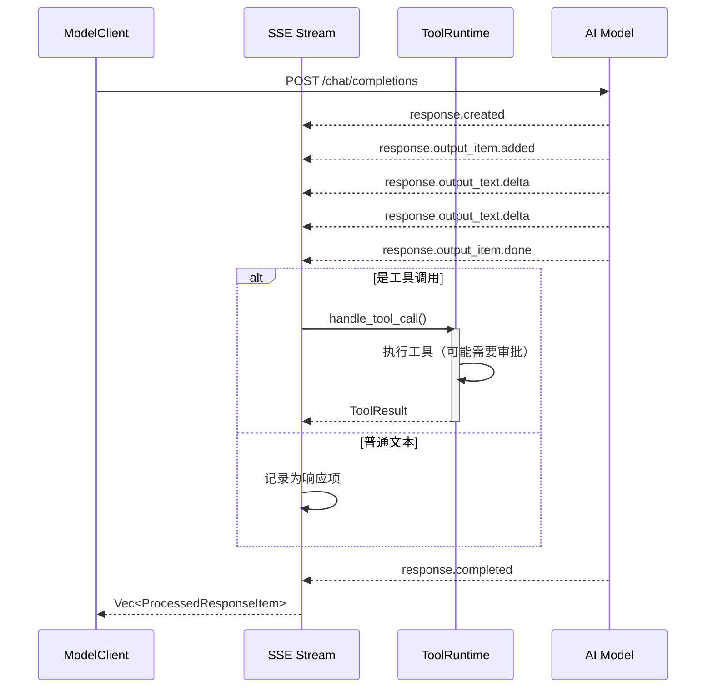

---

## 4. 任务执行流程

### 4.1 完整生命周期

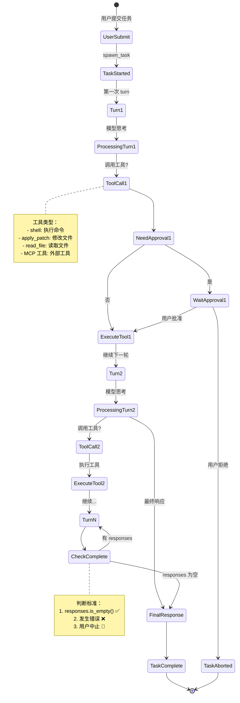

### 4.2 用户输入处理

**场景 1: 新任务**

```rust
// handlers::user_input_or_turn (line 1514)
pub async fn user_input_or_turn(
    sess: &Arc<Session>,
    sub_id: String,
    op: Op,
    previous_context: &mut Option<Arc<TurnContext>>,
) {
    let (items, updates) = match op {
        Op::UserTurn { items, .. } => (items, updates),
        Op::UserInput { items } => (items, SessionSettingsUpdate::default()),
        _ => unreachable!(),
    };

    let current_context = sess.new_turn_with_sub_id(sub_id, updates).await;

    // 尝试注入到当前任务
    if let Err(items) = sess.inject_input(items).await {
        // 没有正在运行的任务，启动新任务
        sess.spawn_task(
            Arc::clone(&current_context),
            items,
            RegularTask
        ).await;
        *previous_context = Some(current_context);
    }
}
```

**注入流程**：

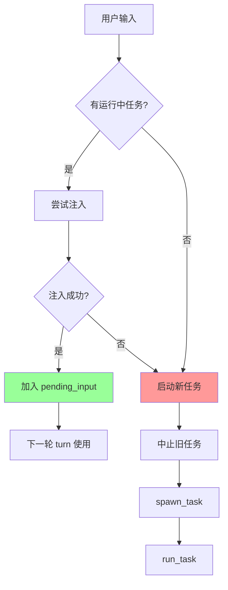

### 4.3 工具调用流程

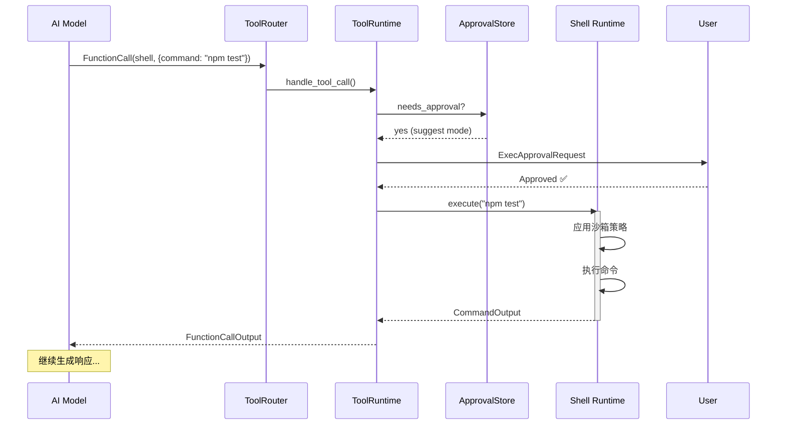

**审批策略**：

| 模式        | 说明     | 需要审批              |
|-------------|--------|-------------------|
| `suggest`   | 建议模式 | 所有命令和文件修改    |
| `auto-edit` | 自动编辑 | 只有命令，文件修改自动 |
| `full-auto` | 全自动   | 无需审批（沙箱限制）    |

---

## 5. 迭代决策机制

### 5.1 完成条件判断

**位置**: `codex.rs:1987`

```rust
let (responses, items_to_record_in_conversation_history) =
    process_items(processed_items, &sess, &turn_context).await;

// ⚠️ 核心判断：responses 是否为空
if responses.is_empty() {
    // ✅ 任务完成
    last_agent_message = get_last_assistant_message_from_turn(
        &items_to_record_in_conversation_history,
    );
    sess.notifier().notify(&UserNotification::AgentTurnComplete { .. });
    break; // 退出主循环
}
// 否则继续迭代
continue;
```

**responses 包含什么**？

```rust
// response_processing.rs:11
pub(crate) async fn process_items(
    processed_items: Vec<ProcessedResponseItem>,
    sess: &Session,
    turn_context: &TurnContext,
) -> (Vec<ResponseInputItem>, Vec<ResponseItem>) {
    let mut responses = Vec::<ResponseInputItem>::new();

    for processed_response_item in processed_items {
        let ProcessedResponseItem { item, response } = processed_response_item;

        if let Some(response) = &response {
            responses.push(response.clone()); // ⚠️ 添加到 responses
        }

        match response {
            Some(ResponseInputItem::FunctionCallOutput { .. }) => {
                // 工具调用结果
            }
            Some(ResponseInputItem::CustomToolCallOutput { .. }) => {
                // 自定义工具结果
            }
            None => {
                // 普通响应（如文本消息）
            }
            _ => {}
        }
    }

    (responses, all_items_to_record)
}
```

**响应类型**：

| ResponseInputItem 类型 | 说明           | 是否继续迭代          |
|------------------------|--------------|----------------------|
| `FunctionCallOutput`   | 工具调用结果   | ✅ 是 - 需要发送回模型 |
| `CustomToolCallOutput` | 自定义工具结果 | ✅ 是                  |
| `McpToolCallOutput`    | MCP 工具结果   | ✅ 是                  |
| 无（None）               | 纯文本响应     | ❌ 否 - 任务完成       |

### 5.2 决策树

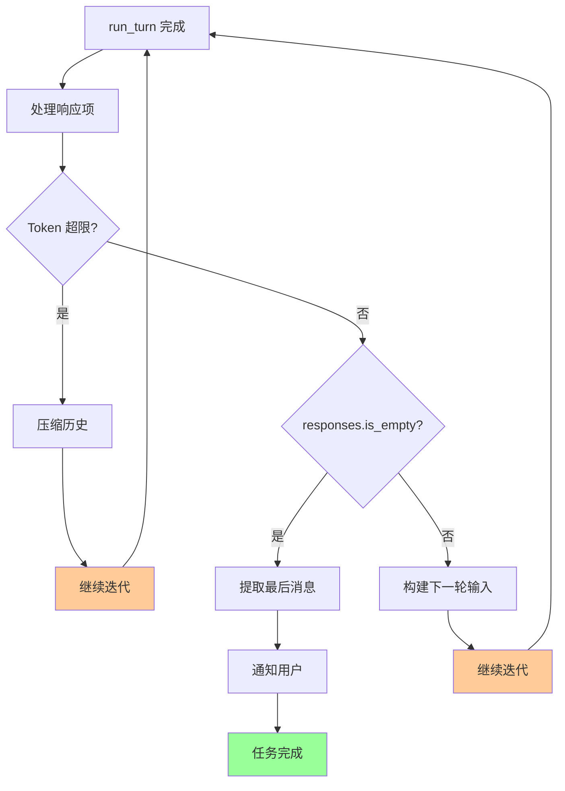

### 5.3 实际示例

**示例任务**: "修复 bug 并运行测试"

```
Turn 1:
  User: "修复 bug 并运行测试"
  Model: 让我先看看代码
  Tool Call: read_file("src/app.ts")
  Response: FunctionCallOutput (文件内容)
  → responses 不为空 → 继续

Turn 2:
  Input: [之前历史] + [文件内容]
  Model: 我发现了问题，让我修复
  Tool Call: apply_patch(...)
  Response: FunctionCallOutput (补丁应用成功)
  → responses 不为空 → 继续

Turn 3:
  Input: [之前历史] + [补丁结果]
  Model: 现在运行测试
  Tool Call: shell("npm test")
  Response: FunctionCallOutput (测试输出)
  → responses 不为空 → 继续

Turn 4:
  Input: [之前历史] + [测试结果]
  Model: "测试通过了！bug 已修复。"
  No Tool Call
  Response: 无
  → responses 为空 → 任务完成 ✅
```

**流程图**：

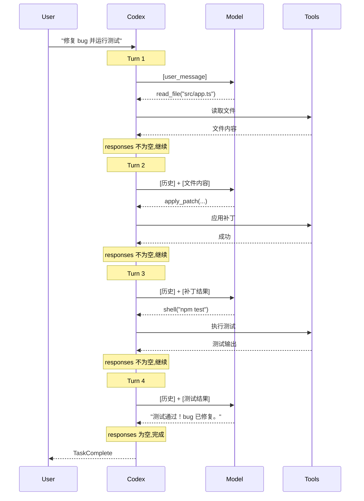

---

## 6. 完整示例分析

### 6.1 示例代码走查

假设用户输入：**"帮我添加一个新功能并测试"**

#### Step 1: 提交任务

```rust
// 用户在 TUI 中输入
codex.submit(Op::UserTurn {
    cwd: PathBuf::from("/workspace"),
    approval_policy: AskForApproval::Suggest,
    sandbox_policy: SandboxPolicy::WorkspaceWrite,
    model: "gpt-4".to_string(),
    items: vec![UserInput::Text {
        text: "帮我添加一个新功能并测试".to_string()
    }],
    ..Default::default()
}).await?;
```

#### Step 2: Submission Loop 处理

```rust
// submission_loop (line 1381)
while let Ok(sub) = rx_sub.recv().await {
    match sub.op {
        Op::UserTurn { items, .. } => {
            handlers::user_input_or_turn(&sess, sub.id, sub.op, &mut previous_context).await;
            // ↓
        }
        _ => {}
    }
}
```

#### Step 3: Spawn Task

```rust
// handlers::user_input_or_turn (line 1514)
sess.spawn_task(
    Arc::clone(&current_context),
    items, // ["帮我添加一个新功能并测试"]
    RegularTask
).await;

// ↓ Session::spawn_task (line 101 in tasks/mod.rs)
let task: Arc<dyn SessionTask> = Arc::new(task);
let cancellation_token = CancellationToken::new();

tokio::spawn(async move {
    let last_agent_message = task_for_run.run(
        session_ctx,
        ctx,
        input, // ["帮我添加一个新功能并测试"]
        task_cancellation_token.child_token(),
    ).await;
    // ...
});
```

#### Step 4: Run Task Loop

```rust
// run_task (line 1905)
pub(crate) async fn run_task(...) -> Option<String> {
    // 记录初始输入
    sess.record_input_and_rollout_usermsg(&turn_context, &initial_input_for_turn).await;

    loop {
        // 获取历史
        let turn_input = sess.clone_history().await.get_history_for_prompt();
        // turn_input = [
        //   UserInstructions,
        //   EnvironmentContext,
        //   UserMessage("帮我添加一个新功能并测试")
        // ]

        // 执行 turn
        match run_turn(...).await {
            Ok(turn_output) => {
                let (responses, items) = process_items(turn_output, &sess, &turn_context).await;

                if responses.is_empty() {
                    // 任务完成
                    break;
                }
                // 否则继续
                continue;
            }
            Err(e) => { break; }
        }
    }
}
```

#### Step 5: Run Turn - First Iteration

```rust
// run_turn (line 2023)
async fn run_turn(...) -> CodexResult<Vec<ProcessedResponseItem>> {
    // 构建 prompt
    let prompt = Prompt {
        input: turn_input, // 包含用户消息和历史
        tools: router.specs(), // 可用工具列表
        parallel_tool_calls: false,
        base_instructions_override: None,
        output_schema: None,
    };

    // 发送到模型
    match try_run_turn(..., &prompt, ...).await {
        Ok(output) => return Ok(output),
        Err(e) => { /* 重试逻辑 */ }
    }
}
```

#### Step 6: Try Run Turn - SSE Stream

```rust
// try_run_turn (line 2161)
async fn try_run_turn(...) -> CodexResult<Vec<ProcessedResponseItem>> {
    // 向模型发送请求
    let mut stream = turn_context.client.stream(prompt).await??;

    loop {
        let event = stream.next().await?;

        match event {
            ResponseEvent::OutputItemAdded(item) => {
                // 模型开始回复
                sess.emit_turn_item_started(&turn_context, &turn_item).await;
            }

            ResponseEvent::OutputTextDelta(delta) => {
                // 模型: "让我先看看现有代码..."
                sess.send_event(&turn_context,
                    EventMsg::AgentMessageContentDelta(delta)).await;
            }

            ResponseEvent::OutputItemDone(item) => {
                // 模型完成一个输出项
                match ToolRouter::build_tool_call(sess.as_ref(), item.clone()).await {
                    Ok(Some(call)) => {
                        // 🔧 工具调用: read_file("src/app.ts")
                        let response = tool_runtime.handle_tool_call(call, ...).await?;

                        output.push_back(ProcessedResponseItem {
                            item,
                            response: Some(response), // ⚠️ 有 response
                        });
                    }
                    Ok(None) => {
                        // 普通文本
                        output.push_back(ProcessedResponseItem {
                            item,
                            response: None,
                        });
                    }
                }
            }

            ResponseEvent::Completed { .. } => {
                // Turn 完成
                let processed_items = output.try_collect().await?;
                return Ok(processed_items);
                // processed_items = [
                //   ProcessedResponseItem {
                //     item: Message("让我先看看现有代码..."),
                //     response: None
                //   },
                //   ProcessedResponseItem {
                //     item: FunctionCall(read_file, ...),
                //     response: Some(FunctionCallOutput { content: "..." })
                //   }
                // ]
            }
        }
    }
}
```

#### Step 7: Process Items

```rust
// response_processing.rs:11
let (responses, items_to_record) = process_items(processed_items, &sess, &turn_context).await;

// responses = [
//   FunctionCallOutput { call_id: "call_1", content: "<文件内容>" }
// ]
// → responses 不为空 → 继续下一轮
```

#### Step 8: Next Turn

```rust
// 回到 run_task loop
loop {
    let turn_input = sess.clone_history().await.get_history_for_prompt();
    // turn_input 现在包含:
    // [
    //   UserInstructions,
    //   EnvironmentContext,
    //   UserMessage("帮我添加一个新功能并测试"),
    //   Message("让我先看看现有代码..."),
    //   FunctionCall(read_file, "src/app.ts"),
    //   FunctionCallOutput("<文件内容>")
    // ]

    match run_turn(...).await {
        Ok(turn_output) => {
            // 第二次 turn: 模型分析代码，编写新功能...
        }
    }
}
```

**后续迭代**：

- **Turn 2**: 分析代码 → 调用 `apply_patch` 添加功能
- **Turn 3**: 调用 `shell("npm test")` 运行测试
- **Turn 4**: 分析测试结果
- **Turn 5**: 如果测试失败，修复并重新测试
- **Turn N**: 最终响应 "功能已添加并通过测试" → 完成

### 6.2 时序图总览

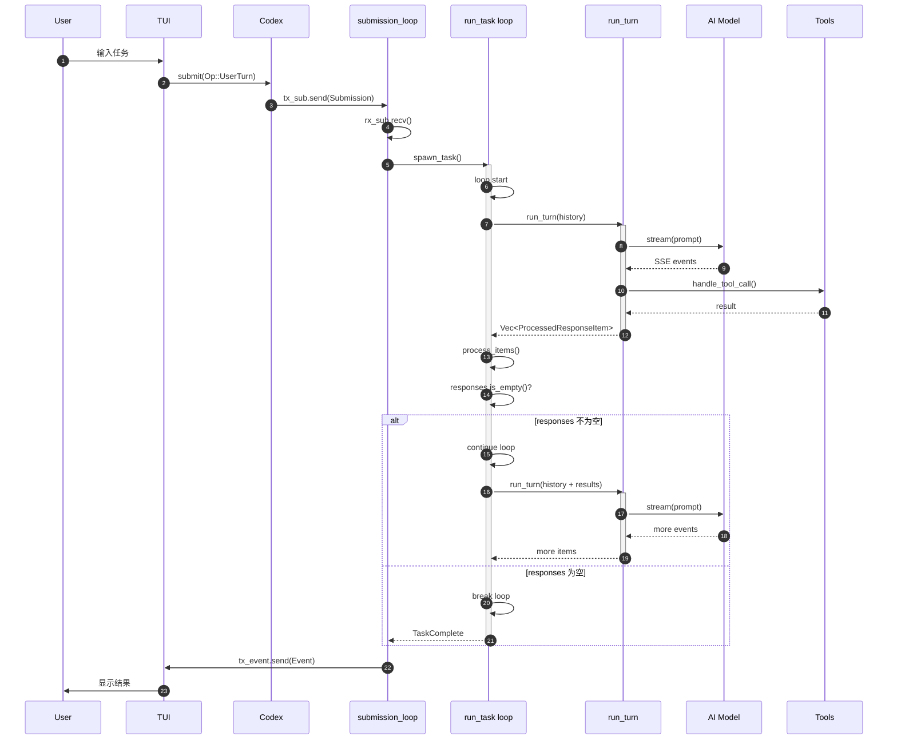

---

## 7. 错误处理与重试

### 7.1 重试机制

**位置**: `codex.rs:2081`

```rust
let mut retries = 0;
loop {
    match try_run_turn(...).await {
        Ok(output) => return Ok(output),

        Err(CodexErr::TurnAborted { .. }) => {
            return Err(...); // 不重试
        }

        Err(e) => {
            let max_retries = turn_context.client.get_provider().stream_max_retries();
            if retries < max_retries {
                retries += 1;
                let delay = backoff(retries);
                warn!("stream disconnected - retrying ({retries}/{max_retries} in {delay:?})...");

                // 通知用户
                sess.notify_stream_error(&turn_context,
                    format!("Reconnecting... {retries}/{max_retries}"), e).await;

                tokio::time::sleep(delay).await;
            } else {
                return Err(e); // 超过重试次数
            }
        }
    }
}
```

**退避策略**：

```rust
pub(crate) fn backoff(retries: usize) -> Duration {
    match retries {
        1 => Duration::from_secs(1),
        2 => Duration::from_secs(2),
        3 => Duration::from_secs(4),
        4 => Duration::from_secs(8),
        _ => Duration::from_secs(16),
    }
}
```

### 7.2 错误类型处理

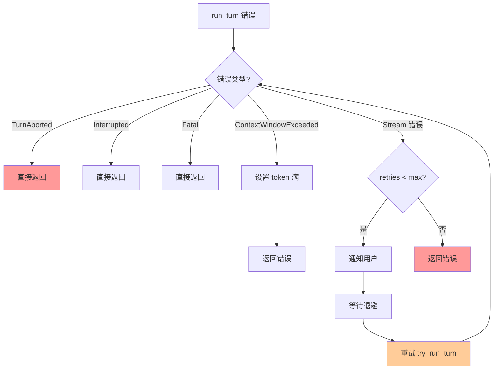

### 7.3 中断处理

**用户中断**：

```rust
// submission_loop 接收 Op::Interrupt
Op::Interrupt => {
    handlers::interrupt(&sess).await;
}

// handlers::interrupt
pub async fn interrupt(sess: &Arc<Session>) {
    sess.interrupt_task().await;
}

// Session::interrupt_task
pub async fn interrupt_task(&self) {
    self.abort_all_tasks(TurnAbortReason::Interrupted).await;
}

// Session::abort_all_tasks
pub async fn abort_all_tasks(&self, reason: TurnAbortReason) {
    for task in self.take_all_running_tasks().await {
        self.handle_task_abort(task, reason.clone()).await;
    }
}

// Session::handle_task_abort
async fn handle_task_abort(&self, task: RunningTask, reason: TurnAbortReason) {
    // 1. 取消 cancellation_token
    task.cancellation_token.cancel();

    // 2. 调用任务的 abort 方法
    task.task.abort(...).await;

    // 3. 等待任务完成
    select! {
        _ = task.done.notified() => {}
        _ = tokio::time::sleep(Duration::from_millis(GRACEFUL_INTERRUPTION_TIMEOUT_MS)) => {
            // 超时，强制中止
        }
    }

    // 4. 发送中止事件
    self.send_event(&task.turn_context,
        EventMsg::TurnAborted(TurnAbortedEvent { reason })).await;
}
```

**中断传播**：

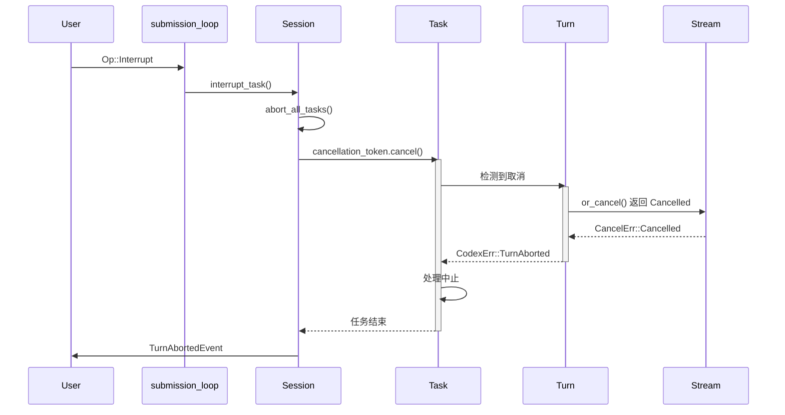

---

## 8. 总结

### 8.1 核心机制总结

**三层循环结构**：

1. **Submission Loop**: 处理用户操作，管理 Session 生命周期
2. **Task Loop (run_task)**: 迭代执行 turn 直到任务完成
3. **Turn Loop (try_run_turn)**: 处理单次模型交互和 SSE 流

**迭代决策**：

- **继续迭代**: `responses` 不为空（有工具调用结果需要发送回模型）
- **任务完成**: `responses` 为空（模型只返回文本响应）
- **中止任务**: 错误发生、用户中断、Token 超限且无法压缩

**自我修正能力**：

- 模型可以查看工具执行结果（如测试失败）
- 基于结果调整策略（修改代码、重新测试）
- 不断迭代直到成功或决定放弃

### 8.2 设计亮点

1. **Event-Driven Architecture**: 通过 channel 解耦，易于测试和扩展
2. **Graceful Cancellation**: 使用 `CancellationToken` 优雅中断
3. **Streaming Response**: SSE 流式响应，实时反馈
4. **Tool Parallelism**: 支持并行工具调用（如果模型支持）
5. **Automatic Compaction**: Token 超限时自动压缩历史
6. **Retry Logic**: 网络错误自动重试，提高鲁棒性

### 8.3 关键代码位置

| 功能             | 文件                     | 行号 |
|------------------|--------------------------|------|
| Submission Loop  | `codex.rs`               | 1381 |
| Spawn Task       | `tasks/mod.rs`           | 101  |
| Run Task Loop    | `codex.rs`               | 1905 |
| Run Turn         | `codex.rs`               | 2023 |
| Try Run Turn     | `codex.rs`               | 2161 |
| Process Items    | `response_processing.rs` | 11   |
| Tool Router      | `tools/router.rs`        | -    |
| Handle Tool Call | `tools/parallel.rs`      | -    |

### 8.4 学习要点

**对于开发者**：

- 理解事件驱动架构的优势
- 学习如何设计迭代式 AI Agent
- 掌握 Rust 异步编程模式
- 了解如何处理流式响应

**对于 AI Agent 设计者**：

- 任务分解的重要性（通过工具调用实现）
- 迭代终止条件的设计（responses 为空）
- 错误恢复和重试策略
- 用户体验优化（流式输出、进度通知）

---

**参考资料**：

- [Codex GitHub Repository](https://github.com/openai/codex)
- [Ratatui Documentation](https://ratatui.rs/)
- [Tokio Async Runtime](https://tokio.rs/)
- [OpenAI Responses API](https://platform.openai.com/docs/api-reference/responses)

---

**文档结束**

本文档详细剖析了 Codex CLI 的事件循环和任务迭代机制，从用户输入到任务完成的全过程。通过理解这些机制，开发者可以更好地设计和实现类似的 AI Agent 系统，或者为 Codex 贡献代码。
