# Codex 工具调用系统深度解析

> 作者: Claude
> 日期: 2025-11-23
> 版本: 1.0
> 代码库: OpenAI Codex CLI - Rust Implementation

---

## 目录

- [1. 概述](#1-概述)
- [2. 工具系统架构](#2-工具系统架构)
- [3. 工具发现与注册](#3-工具发现与注册)
- [4. 工具调用流程](#4-工具调用流程)
- [5. 工具执行机制](#5-工具执行机制)
- [6. 审批与沙箱](#6-审批与沙箱)
- [7. 结果处理](#7-结果处理)
- [8. MCP 工具集成](#8-mcp-工具集成)
- [9. 并行工具调用](#9-并行工具调用)
- [10. 总结](#10-总结)

---

## 1. 概述

### 1.1 什么是工具调用

工具调用是 Codex 与外部世界交互的核心机制。通过工具，AI 模型可以：

- **执行命令**: shell、exec_command
- **读写文件**: read_file、apply_patch
- **搜索代码**: grep_files、list_dir
- **查看图像**: view_image
- **访问外部资源**: MCP 工具

### 1.2 核心问题

本文将深入解析以下问题：

1. **工具发现**: Codex 如何知道有哪些工具可用？
2. **工具选择**: AI 模型如何决定调用哪个工具？
3. **工具调用**: 工具调用的完整流程是什么？
4. **结果处理**: 工具返回的结果如何被处理？
5. **成功判断**: 如何判断工具调用是否成功？

### 1.3 关键概念

| 概念 | 说明 |
|------|------|
| **ToolSpec** | 工具规范，描述工具名称、参数、功能 |
| **ToolHandler** | 工具处理器，实际执行工具逻辑 |
| **ToolRegistry** | 工具注册表，管理所有工具 handler |
| **ToolRouter** | 工具路由器，分发工具调用 |
| **ToolInvocation** | 工具调用上下文 |
| **ToolOutput** | 工具执行结果 |

---

## 2. 工具系统架构

### 2.1 整体架构

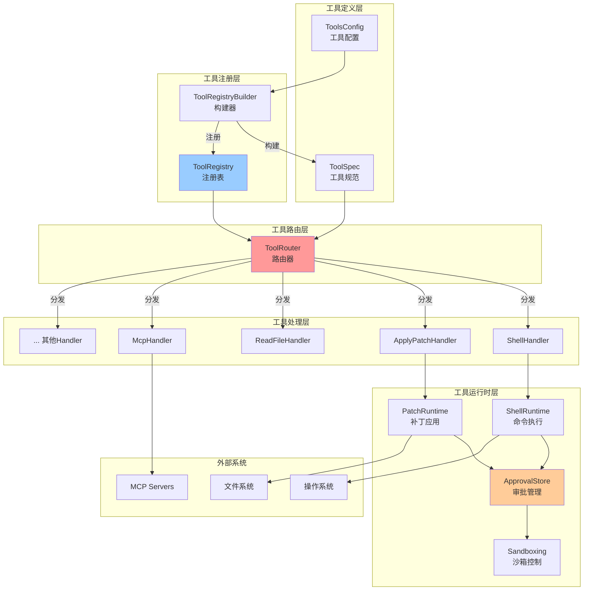

### 2.2 核心组件

**位置**: `core/src/tools/`

```
tools/
├── mod.rs              # 工具系统入口
├── spec.rs             # 工具规范定义
├── registry.rs         # 工具注册表
├── router.rs           # 工具路由器
├── context.rs          # 工具上下文
├── parallel.rs         # 并行工具调用
├── sandboxing.rs       # 沙箱和审批
├── handlers/           # 工具处理器
│   ├── shell.rs        # Shell 命令
│   ├── apply_patch.rs  # 文件修改
│   ├── read_file.rs    # 文件读取
│   ├── mcp.rs          # MCP 工具
│   └── ...
└── runtimes/           # 工具运行时
    ├── shell.rs
    ├── apply_patch.rs
    └── ...
```

---

## 3. 工具发现与注册

### 3.1 工具配置 (ToolsConfig)

**位置**: `tools/spec.rs:33`

```rust
#[derive(Debug, Clone)]
pub(crate) struct ToolsConfig {
    pub shell_type: ConfigShellToolType,
    pub apply_patch_tool_type: Option<ApplyPatchToolType>,
    pub web_search_request: bool,
    pub include_view_image_tool: bool,
    pub experimental_supported_tools: Vec<String>,
}

pub(crate) struct ToolsConfigParams<'a> {
    pub(crate) model_family: &'a ModelFamily,
    pub(crate) features: &'a Features,
}

impl ToolsConfig {
    pub fn new(params: &ToolsConfigParams) -> Self {
        let ToolsConfigParams { model_family, features } = params;

        // 根据 feature flags 决定是否启用工具
        let include_apply_patch_tool = features.enabled(Feature::ApplyPatchFreeform);
        let include_web_search_request = features.enabled(Feature::WebSearchRequest);
        let include_view_image_tool = features.enabled(Feature::ViewImageTool);

        // 根据模型家族选择 shell 类型
        let shell_type = if !features.enabled(Feature::ShellTool) {
            ConfigShellToolType::Disabled
        } else if features.enabled(Feature::UnifiedExec) {
            ConfigShellToolType::UnifiedExec
        } else {
            model_family.shell_type.clone()
        };

        Self {
            shell_type,
            apply_patch_tool_type: /* ... */,
            web_search_request: include_web_search_request,
            include_view_image_tool,
            experimental_supported_tools: model_family.experimental_supported_tools.clone(),
        }
    }
}
```

**配置决策**：

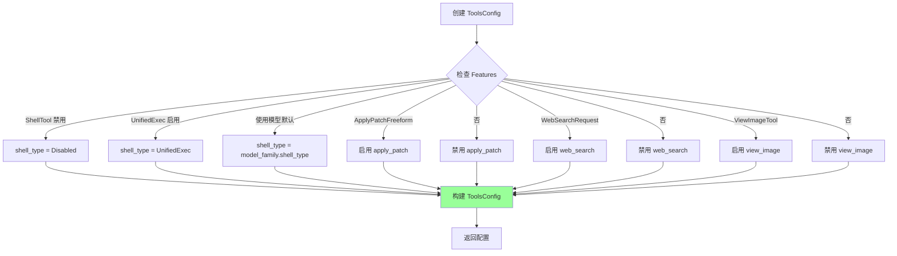

### 3.2 工具规范构建 (build_specs)

**位置**: `tools/spec.rs` (函数较长，分布在多处)

```rust
pub fn build_specs(
    config: &ToolsConfig,
    mcp_tools: Option<HashMap<String, mcp_types::Tool>>,
) -> ToolRegistryBuilder {
    let mut builder = ToolRegistryBuilder::new();

    // 1. 注册 Shell 工具
    match &config.shell_type {
        ConfigShellToolType::Default => {
            builder.push_spec(create_shell_tool());
            builder.register_handler("shell", Arc::new(ShellHandler));
        }
        ConfigShellToolType::ShellCommand => {
            builder.push_spec(create_shell_command_tool());
            builder.register_handler("shell_command", Arc::new(ShellCommandHandler));
        }
        ConfigShellToolType::UnifiedExec => {
            builder.push_spec(create_exec_command_tool());
            builder.push_spec(create_write_stdin_tool());
            builder.register_handler("exec_command", Arc::new(UnifiedExecHandler));
            builder.register_handler("write_stdin", Arc::new(WriteStdinHandler));
        }
        ConfigShellToolType::Disabled => {
            // 不注册 shell 工具
        }
        _ => {}
    }

    // 2. 注册 apply_patch 工具
    if let Some(patch_type) = &config.apply_patch_tool_type {
        match patch_type {
            ApplyPatchToolType::Freeform => {
                builder.push_spec(create_apply_patch_freeform_tool());
            }
            ApplyPatchToolType::Function => {
                builder.push_spec(create_apply_patch_json_tool());
            }
        }
        builder.register_handler("apply_patch", Arc::new(ApplyPatchHandler));
    }

    // 3. 注册文件操作工具
    builder.push_spec_with_parallel_support(create_read_file_tool(), true);
    builder.register_handler("read_file", Arc::new(ReadFileHandler));

    builder.push_spec_with_parallel_support(create_list_dir_tool(), true);
    builder.register_handler("list_dir", Arc::new(ListDirHandler));

    builder.push_spec_with_parallel_support(create_grep_files_tool(), true);
    builder.register_handler("grep_files", Arc::new(GrepFilesHandler));

    // 4. 注册其他工具
    if config.web_search_request {
        builder.push_spec(create_web_search_tool());
        // web_search 由模型直接处理，不需要 handler
    }

    if config.include_view_image_tool {
        builder.push_spec(create_view_image_tool());
        builder.register_handler("view_image", Arc::new(ViewImageHandler));
    }

    // 5. 注册 MCP 工具
    if let Some(mcp_tools) = mcp_tools {
        for (name, mcp_tool) in mcp_tools {
            let spec = ToolSpec::from_mcp_tool(&name, &mcp_tool);
            builder.push_spec(spec);
            // MCP 工具使用统一的 handler
            builder.register_handler(&name, Arc::new(McpHandler));
        }
    }

    builder
}
```

**工具规范示例** (Shell 工具):

```rust
fn create_shell_tool() -> ToolSpec {
    let mut properties = BTreeMap::new();
    properties.insert(
        "command".to_string(),
        JsonSchema::Array {
            items: Box::new(JsonSchema::String { description: None }),
            description: Some("The command to execute".to_string()),
        },
    );
    properties.insert(
        "workdir".to_string(),
        JsonSchema::String {
            description: Some("The working directory to execute the command in".to_string()),
        },
    );
    properties.insert(
        "timeout_ms".to_string(),
        JsonSchema::Number {
            description: Some("The timeout for the command in milliseconds".to_string()),
        },
    );

    ToolSpec::Function(ResponsesApiTool {
        name: "shell".to_string(),
        description: r#"Runs a shell command and returns its output.
- The arguments to `shell` will be passed to execvp(). Most terminal commands should be prefixed with ["bash", "-lc"].
- Always set the `workdir` param when using the shell function. Do not use `cd` unless absolutely necessary."#.to_string(),
        strict: false,
        parameters: JsonSchema::Object {
            properties,
            required: Some(vec!["command".to_string()]),
            additional_properties: Some(false.into()),
        },
    })
}
```

### 3.3 工具注册流程

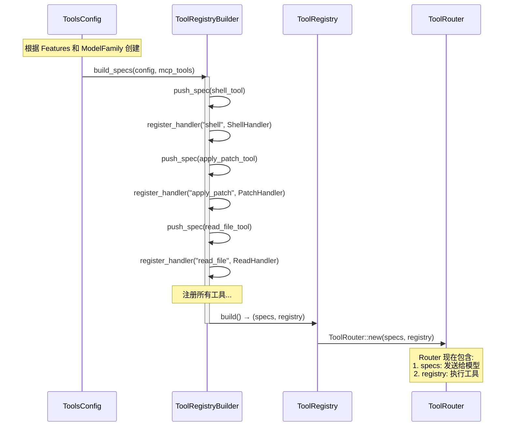

### 3.4 内置工具列表

| 工具名称 | 描述 | 支持并行 | Handler |
|---------|------|---------|---------|
| `shell` | 执行 shell 命令 | ❌ | ShellHandler |
| `exec_command` | 执行命令（PTY） | ❌ | UnifiedExecHandler |
| `apply_patch` | 应用文件补丁 | ❌ | ApplyPatchHandler |
| `read_file` | 读取文件内容 | ✅ | ReadFileHandler |
| `list_dir` | 列出目录 | ✅ | ListDirHandler |
| `grep_files` | 搜索文件内容 | ✅ | GrepFilesHandler |
| `view_image` | 查看图片 | ❌ | ViewImageHandler |
| `web_search` | 网络搜索 | ❌ | (模型处理) |
| `mcp_*` | MCP 工具 | 取决于定义 | McpHandler |

---

## 4. 工具调用流程

### 4.1 完整调用链

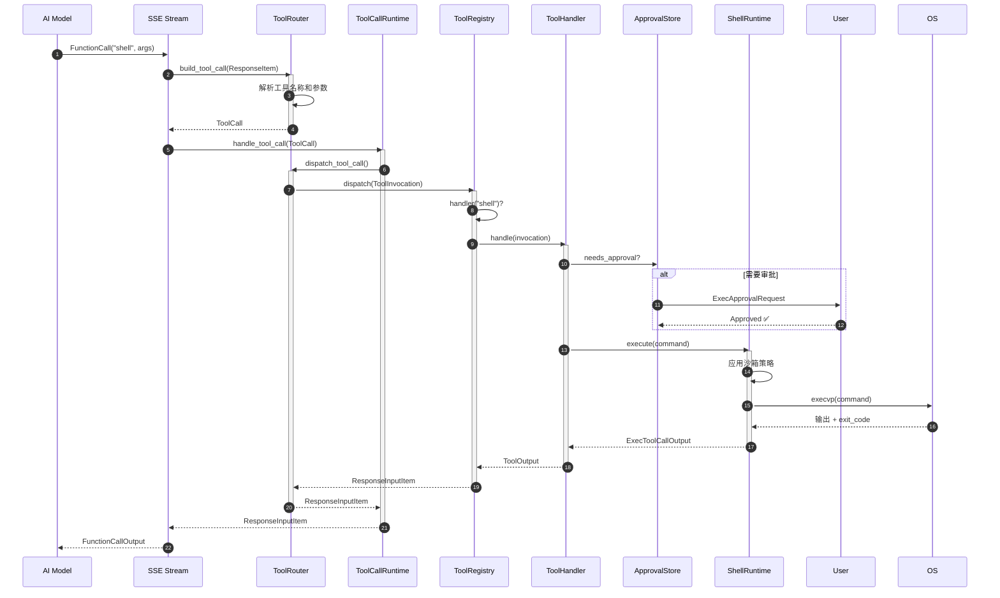

### 4.2 步骤详解

#### Step 1: 模型返回工具调用

模型通过 SSE 流返回 `FunctionCall`:

```json
{
  "type": "response.function_call",
  "call_id": "call_abc123",
  "name": "shell",
  "arguments": "{\"command\":[\"ls\",\"-la\"],\"workdir\":\"/workspace\"}"
}
```

#### Step 2: 构建工具调用 (build_tool_call)

**位置**: `tools/router.rs:57`

```rust
pub async fn build_tool_call(
    session: &Session,
    item: ResponseItem,
) -> Result<Option<ToolCall>, FunctionCallError> {
    match item {
        ResponseItem::FunctionCall { name, arguments, call_id, .. } => {
            // 检查是否是 MCP 工具
            if let Some((server, tool)) = session.parse_mcp_tool_name(&name).await {
                Ok(Some(ToolCall {
                    tool_name: name,
                    call_id,
                    payload: ToolPayload::Mcp {
                        server,
                        tool,
                        raw_arguments: arguments,
                    },
                }))
            } else {
                // 内置工具
                let payload = if name == "unified_exec" {
                    ToolPayload::UnifiedExec { arguments }
                } else {
                    ToolPayload::Function { arguments }
                };
                Ok(Some(ToolCall {
                    tool_name: name,
                    call_id,
                    payload,
                }))
            }
        }
        ResponseItem::CustomToolCall { name, input, call_id, .. } => {
            // 自定义工具
            Ok(Some(ToolCall {
                tool_name: name,
                call_id,
                payload: ToolPayload::Custom { input },
            }))
        }
        ResponseItem::LocalShellCall { id, call_id, action, .. } => {
            // 本地 shell 调用
            let call_id = call_id.or(id)
                .ok_or(FunctionCallError::MissingLocalShellCallId)?;
            // ... 构建 LocalShell payload
        }
        _ => Ok(None),
    }
}
```

#### Step 3: 处理工具调用 (handle_tool_call)

**位置**: `tools/parallel.rs:44`

```rust
pub(crate) fn handle_tool_call(
    &self,
    call: ToolCall,
    cancellation_token: CancellationToken,
) -> impl Future<Output = Result<ResponseInputItem, CodexErr>> {
    let supports_parallel = self.router.tool_supports_parallel(&call.tool_name);

    let router = Arc::clone(&self.router);
    let session = Arc::clone(&self.session);
    let turn = Arc::clone(&self.turn_context);
    let tracker = Arc::clone(&self.tracker);
    let lock = Arc::clone(&self.parallel_execution);

    let handle = AbortOnDropHandle::new(tokio::spawn(async move {
        tokio::select! {
            _ = cancellation_token.cancelled() => {
                // 用户中止
                Ok(Self::aborted_response(&call, elapsed))
            },
            res = async {
                // 🔒 并行控制
                let _guard = if supports_parallel {
                    Either::Left(lock.read().await)  // 读锁，允许并行
                } else {
                    Either::Right(lock.write().await) // 写锁，独占执行
                };

                router.dispatch_tool_call(session, turn, tracker, call.clone()).await
            } => res,
        }
    }));

    async move {
        match handle.await {
            Ok(Ok(response)) => Ok(response),
            Ok(Err(FunctionCallError::Fatal(message))) => Err(CodexErr::Fatal(message)),
            // ... 错误处理
        }
    }
}
```

**并行控制**：

- **支持并行** (如 `read_file`): 使用读锁，多个调用可以同时执行
- **不支持并行** (如 `shell`): 使用写锁，独占执行

#### Step 4: 分发到注册表 (dispatch)

**位置**: `tools/registry.rs:60`

```rust
pub async fn dispatch(
    &self,
    invocation: ToolInvocation,
) -> Result<ResponseInputItem, FunctionCallError> {
    let tool_name = invocation.tool_name.clone();
    let call_id_owned = invocation.call_id.clone();
    let otel = invocation.turn.client.get_otel_event_manager();

    // 1. 查找 handler
    let handler = match self.handler(tool_name.as_ref()) {
        Some(handler) => handler,
        None => {
            let message = unsupported_tool_call_message(&invocation.payload, tool_name.as_ref());
            otel.tool_result(tool_name.as_ref(), &call_id_owned, ..., false, &message);
            return Err(FunctionCallError::RespondToModel(message));
        }
    };

    // 2. 验证 payload 类型
    if !handler.matches_kind(&invocation.payload) {
        let message = format!("tool {tool_name} invoked with incompatible payload");
        return Err(FunctionCallError::Fatal(message));
    }

    // 3. 执行 handler (带遥测)
    let output_cell = tokio::sync::Mutex::new(None);

    let result = otel.log_tool_result(
        tool_name.as_ref(),
        &call_id_owned,
        log_payload.as_ref(),
        || async {
            // 等待工具门（用于 ghost snapshot）
            if handler.is_mutating(&invocation) {
                invocation.turn.tool_call_gate.wait_ready().await;
            }

            // 调用 handler
            match handler.handle(invocation).await {
                Ok(output) => {
                    let preview = output.log_preview();
                    let success = output.success_for_logging();
                    let mut guard = output_cell.lock().await;
                    *guard = Some(output);
                    Ok((preview, success))
                }
                Err(err) => Err(err),
            }
        },
    ).await;

    // 4. 转换输出
    match result {
        Ok(_) => {
            let mut guard = output_cell.lock().await;
            let output = guard.take().ok_or_else(|| {
                FunctionCallError::Fatal("tool produced no output".to_string())
            })?;
            Ok(output.into_response(&call_id_owned, &payload_for_response))
        }
        Err(err) => Err(err),
    }
}
```

---

## 5. 工具执行机制

### 5.1 ToolHandler Trait

**位置**: `tools/registry.rs:22`

```rust
#[async_trait]
pub trait ToolHandler: Send + Sync {
    fn kind(&self) -> ToolKind;

    fn matches_kind(&self, payload: &ToolPayload) -> bool {
        matches!(
            (self.kind(), payload),
            (ToolKind::Function, ToolPayload::Function { .. })
                | (ToolKind::Mcp, ToolPayload::Mcp { .. })
        )
    }

    // 是否会修改系统状态
    fn is_mutating(&self, _invocation: &ToolInvocation) -> bool {
        false
    }

    // 执行工具
    async fn handle(&self, invocation: ToolInvocation) -> Result<ToolOutput, FunctionCallError>;
}
```

### 5.2 ShellHandler 实现

**位置**: `tools/handlers/shell.rs:72`

```rust
#[async_trait]
impl ToolHandler for ShellHandler {
    fn kind(&self) -> ToolKind {
        ToolKind::Function
    }

    fn is_mutating(&self, invocation: &ToolInvocation) -> bool {
        match &invocation.payload {
            ToolPayload::Function { arguments } => {
                serde_json::from_str::<ShellToolCallParams>(arguments)
                    .map(|params| !is_known_safe_command(&params.command))
                    .unwrap_or(true)
            }
            _ => true,
        }
    }

    async fn handle(&self, invocation: ToolInvocation) -> Result<ToolOutput, FunctionCallError> {
        let ToolInvocation { session, turn, tracker, call_id, tool_name, payload } = invocation;

        match payload {
            ToolPayload::Function { arguments } => {
                // 1. 解析参数
                let params: ShellToolCallParams = serde_json::from_str(&arguments)
                    .map_err(|e| FunctionCallError::RespondToModel(
                        format!("failed to parse function arguments: {e:?}")
                    ))?;

                // 2. 构建执行参数
                let exec_params = Self::to_exec_params(params, turn.as_ref());

                // 3. 执行
                Self::run_exec_like(
                    tool_name.as_str(),
                    exec_params,
                    session,
                    turn,
                    tracker,
                    call_id,
                    false,
                ).await
            }
            _ => Err(FunctionCallError::RespondToModel(
                format!("unsupported payload for shell handler: {tool_name}")
            )),
        }
    }
}
```

### 5.3 Shell 执行流程

```rust
async fn run_exec_like(
    tool_name: &str,
    exec_params: ExecParams,
    session: Arc<Session>,
    turn: Arc<TurnContext>,
    tracker: SharedTurnDiffTracker,
    call_id: String,
    freeform: bool,
) -> Result<ToolOutput, FunctionCallError> {
    // 1. 检查是否需要权限提升审批
    if exec_params.with_escalated_permissions.unwrap_or(false)
        && !matches!(turn.approval_policy, AskForApproval::OnRequest)
    {
        return Err(FunctionCallError::Denied(
            "escalated permissions not available in this approval mode".to_string()
        ));
    }

    // 2. 创建工具上下文
    let ctx = ToolCtx {
        session: Arc::clone(&session),
        turn: Arc::clone(&turn),
        tracker,
        call_id: call_id.clone(),
    };

    // 3. 确定沙箱权限
    let permissions = if exec_params.with_escalated_permissions.unwrap_or(false) {
        SandboxPermissions::Escalated {
            justification: exec_params.justification.clone(),
        }
    } else {
        SandboxPermissions::from_policy(&turn.sandbox_policy)
    };

    // 4. 构建请求
    let request = ShellRequest {
        command: exec_params.command,
        cwd: exec_params.cwd,
        timeout: exec_params.expiration,
        env: exec_params.env,
        permissions,
    };

    // 5. 执行 (通过 Orchestrator)
    let output = ShellRuntime::execute(ctx, request).await?;

    // 6. 格式化输出
    let content = if freeform {
        format_exec_output_for_model_freeform(&output, turn.truncation_policy)
    } else {
        format_exec_output_for_model_structured(&output, turn.truncation_policy)
    };

    // 7. 返回结果
    Ok(ToolOutput::Function {
        content,
        content_items: None,
        success: Some(output.exit_code == 0),
    })
}
```

**执行流程图**：

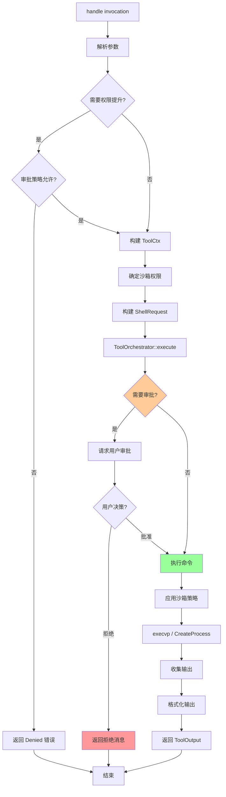

---

## 6. 审批与沙箱

### 6.1 审批决策

**位置**: `tools/sandboxing.rs`

审批由 **ToolOrchestrator** 统一管理：

```rust
pub async fn execute<Req, Rt>(
    ctx: ToolCtx,
    request: Req,
) -> Result<ToolOutput, FunctionCallError>
where
    Req: ToolRequest,
    Rt: ToolRuntime<Request = Req>,
{
    // 1. 检查是否需要审批
    let approval_requirement = Req::approval_requirement(&request, &ctx);

    match approval_requirement {
        ApprovalRequirement::NotRequired => {
            // 直接执行
            Rt::execute(request, ctx).await
        }
        ApprovalRequirement::Required { reason, risk } => {
            // 请求审批
            let decision = ctx.session.request_command_approval(
                &ctx.turn,
                ctx.call_id.clone(),
                Req::command(&request),
                Req::cwd(&request),
                reason,
                risk,
            ).await;

            match decision {
                ReviewDecision::Approved => {
                    // 批准，执行
                    Rt::execute(request, ctx).await
                }
                ReviewDecision::Denied => {
                    // 拒绝
                    Err(FunctionCallError::Denied(
                        "User denied the operation".to_string()
                    ))
                }
                ReviewDecision::Abort => {
                    // 中止整个任务
                    Err(FunctionCallError::Fatal(
                        "User aborted the task".to_string()
                    ))
                }
            }
        }
    }
}
```

**审批决策树**：

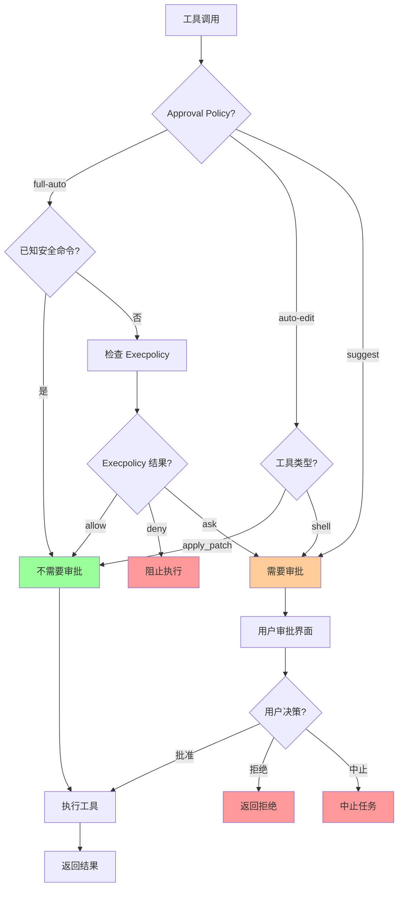

### 6.2 沙箱策略

**沙箱权限**：

```rust
pub enum SandboxPermissions {
    ReadOnly,
    WorkspaceWrite { workspace: PathBuf },
    DangerFullAccess,
    Escalated { justification: Option<String> },
}

impl SandboxPermissions {
    pub fn from_policy(policy: &SandboxPolicy) -> Self {
        match policy {
            SandboxPolicy::ReadOnly => Self::ReadOnly,
            SandboxPolicy::WorkspaceWrite { workspace } => {
                Self::WorkspaceWrite { workspace: workspace.clone() }
            }
            SandboxPolicy::DangerFullAccess => Self::DangerFullAccess,
        }
    }
}
```

**应用沙箱**：

```rust
// macOS: Seatbelt
fn apply_seatbelt(permissions: &SandboxPermissions) -> Command {
    let profile = match permissions {
        SandboxPermissions::ReadOnly => {
            r#"
            (version 1)
            (deny default)
            (allow file-read*)
            (deny network*)
            "#
        }
        SandboxPermissions::WorkspaceWrite { workspace } => {
            format!(r#"
            (version 1)
            (deny default)
            (allow file-read*)
            (allow file-write* (subpath "{}"))
            (deny network*)
            "#, workspace.display())
        }
        _ => return Command::new("sh"), // 无沙箱
    };

    Command::new("sandbox-exec")
        .arg("-p")
        .arg(profile)
        .arg("sh")
}

// Linux: Landlock
fn apply_landlock(permissions: &SandboxPermissions) -> Result<()> {
    use landlock::*;

    let mut ruleset = Ruleset::new()
        .handle_access(AccessFs::ReadFile)?
        .handle_access(AccessFs::ReadDir)?;

    match permissions {
        SandboxPermissions::WorkspaceWrite { workspace } => {
            ruleset = ruleset.add_rule(
                PathBeneath::new(workspace, AccessFs::WriteFile)
            )?;
        }
        _ => {}
    }

    ruleset.restrict_self()?;
    Ok(())
}
```

---

## 7. 结果处理

### 7.1 ToolOutput 定义

**位置**: `tools/context.rs:62`

```rust
#[derive(Clone)]
pub enum ToolOutput {
    Function {
        content: String,
        content_items: Option<Vec<FunctionCallOutputContentItem>>,
        success: Option<bool>,
    },
    Mcp {
        result: Result<CallToolResult, String>,
    },
}
```

### 7.2 转换为 ResponseInputItem

**位置**: `tools/context.rs:91`

```rust
impl ToolOutput {
    pub fn into_response(self, call_id: &str, payload: &ToolPayload) -> ResponseInputItem {
        match self {
            ToolOutput::Function { content, content_items, success } => {
                if matches!(payload, ToolPayload::Custom { .. }) {
                    ResponseInputItem::CustomToolCallOutput {
                        call_id: call_id.to_string(),
                        output: content,
                    }
                } else {
                    ResponseInputItem::FunctionCallOutput {
                        call_id: call_id.to_string(),
                        output: FunctionCallOutputPayload {
                            content,
                            content_items,
                            success,
                        },
                    }
                }
            }
            ToolOutput::Mcp { result } => {
                ResponseInputItem::McpToolCallOutput {
                    call_id: call_id.to_string(),
                    result,
                }
            }
        }
    }
}
```

### 7.3 成功判断

工具调用的成功与否由多个因素决定：

1. **执行成功**: Handler 返回 `Ok(ToolOutput)`
2. **命令成功**: `success` 字段（对于 shell，通常是 `exit_code == 0`）
3. **遥测记录**: 记录在 OpenTelemetry

**示例** (Shell 工具):

```rust
// shell.rs
Ok(ToolOutput::Function {
    content: formatted_output,
    content_items: None,
    success: Some(output.exit_code == 0), // ⚠️ 关键
})
```

**日志记录**：

```rust
// registry.rs:103
otel.log_tool_result(
    tool_name,
    call_id,
    payload_preview,
    || async {
        match handler.handle(invocation).await {
            Ok(output) => {
                let preview = output.log_preview();
                let success = output.success_for_logging(); // ⚠️ 记录成功状态
                Ok((preview, success))
            }
            Err(err) => Err(err),
        }
    },
).await
```

### 7.4 输出格式化

**结构化输出** (默认):

```json
{
  "output": "...",
  "metadata": {
    "exit_code": 0,
    "duration_seconds": 1.2
  }
}
```

**自由格式输出** (freeform):

```
Exit code: 0
Wall time: 1.2 seconds
Total output lines: 150
Output:
<truncated output>
```

**截断策略**：

```rust
pub fn format_exec_output_str(
    exec_output: &ExecToolCallOutput,
    truncation_policy: TruncationPolicy,
) -> String {
    let content = aggregated_output.text.as_str();

    let body = if exec_output.timed_out {
        format!(
            "command timed out after {} milliseconds\n{content}",
            exec_output.duration.as_millis()
        )
    } else {
        content.to_string()
    };

    // ⚠️ 根据策略截断
    formatted_truncate_text(&body, truncation_policy)
}
```

---

## 8. MCP 工具集成

### 8.1 MCP 工具发现

MCP (Model Context Protocol) 工具通过外部服务器提供。

**配置** (`~/.codex/config.toml`):

```toml
[mcp_servers.filesystem]
command = "npx"
args = ["-y", "@modelcontextprotocol/server-filesystem", "/workspace"]

[mcp_servers.github]
command = "npx"
args = ["-y", "@modelcontextprotocol/server-github"]
env = { GITHUB_TOKEN = "${GITHUB_TOKEN}" }
```

**启动流程**：

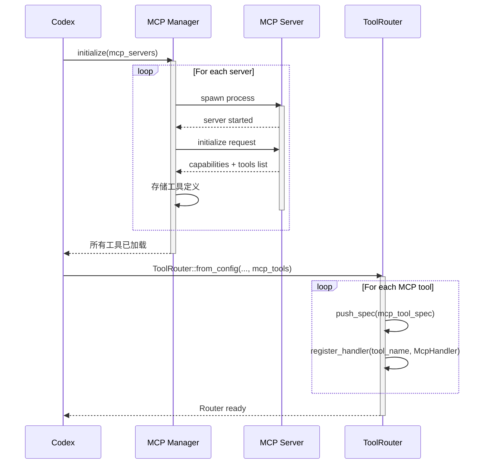

### 8.2 MCP 工具调用

**位置**: `tools/handlers/mcp.rs`

```rust
#[async_trait]
impl ToolHandler for McpHandler {
    fn kind(&self) -> ToolKind {
        ToolKind::Mcp
    }

    async fn handle(&self, invocation: ToolInvocation) -> Result<ToolOutput, FunctionCallError> {
        let ToolInvocation { session, call_id, payload, .. } = invocation;

        let ToolPayload::Mcp { server, tool, raw_arguments } = payload else {
            return Err(FunctionCallError::RespondToModel(
                "unsupported payload for MCP handler".to_string()
            ));
        };

        // 解析参数
        let arguments: serde_json::Value = serde_json::from_str(&raw_arguments)
            .map_err(|e| FunctionCallError::RespondToModel(
                format!("failed to parse MCP arguments: {e}")
            ))?;

        // 调用 MCP 服务器
        let result = session.call_mcp_tool(&server, &tool, arguments).await;

        // 返回结果
        Ok(ToolOutput::Mcp { result })
    }
}
```

**调用流程**：

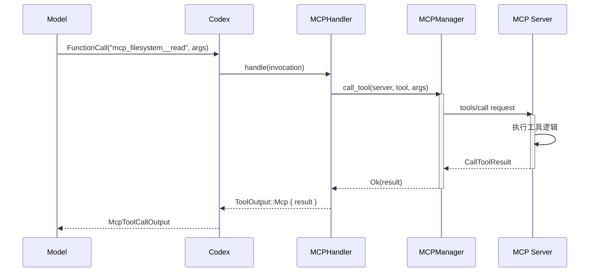

### 8.3 MCP 工具命名

MCP 工具名称格式：`mcp_{server}__{tool}`

例如：
- `mcp_filesystem__read_file`
- `mcp_github__create_issue`
- `mcp_database__query`

**解析**：

```rust
async fn parse_mcp_tool_name(&self, name: &str) -> Option<(String, String)> {
    if let Some(rest) = name.strip_prefix("mcp_") {
        if let Some((server, tool)) = rest.split_once("__") {
            return Some((server.to_string(), tool.to_string()));
        }
    }
    None
}
```

---

## 9. 并行工具调用

### 9.1 并行控制机制

**位置**: `tools/parallel.rs:25`

```rust
pub(crate) struct ToolCallRuntime {
    router: Arc<ToolRouter>,
    session: Arc<Session>,
    turn_context: Arc<TurnContext>,
    tracker: SharedTurnDiffTracker,
    parallel_execution: Arc<RwLock<()>>, // ⚠️ 关键
}
```

**读写锁控制**：

```rust
let _guard = if supports_parallel {
    Either::Left(lock.read().await)   // 读锁，允许多个并行
} else {
    Either::Right(lock.write().await) // 写锁，独占执行
};
```

### 9.2 支持并行的工具

在 `build_specs` 中标记：

```rust
builder.push_spec_with_parallel_support(create_read_file_tool(), true);  // ✅ 并行
builder.push_spec_with_parallel_support(create_list_dir_tool(), true);   // ✅ 并行
builder.push_spec_with_parallel_support(create_grep_files_tool(), true); // ✅ 并行

builder.push_spec(create_shell_tool());       // ❌ 串行
builder.push_spec(create_apply_patch_tool()); // ❌ 串行
```

### 9.3 并行执行示例

假设模型同时调用多个 `read_file`:

```
Turn:
  FunctionCall("read_file", {"path": "src/a.ts"})  // ⚠️ 并行执行
  FunctionCall("read_file", {"path": "src/b.ts"})  // ⚠️ 并行执行
  FunctionCall("read_file", {"path": "src/c.ts"})  // ⚠️ 并行执行
```

**执行时序**：

```mermaid
gantt
    title 并行工具调用
    dateFormat X
    axisFormat %L

    section read_file(a.ts)
    获取读锁 :0, 1
    执行 :1, 100
    释放锁 :101, 1

    section read_file(b.ts)
    获取读锁 :0, 1
    执行 :1, 120
    释放锁 :121, 1

    section read_file(c.ts)
    获取读锁 :0, 1
    执行 :1, 90
    释放锁 :91, 1

    section 如果是 shell (串行)
    获取写锁 :0, 1
    执行 :1, 100
    释放锁 :101, 1
    等待锁 :101, 1
    执行2 :102, 100
```

---

## 10. 实战案例分析

### 10.1 案例 1: 简单文件读取

**用户任务**: "读取 src/main.rs 文件"

**完整流程**：

1. **模型决策**:
   ```json
   {
     "type": "function_call",
     "call_id": "call_001",
     "name": "read_file",
     "arguments": "{\"file_path\":\"/workspace/src/main.rs\"}"
   }
   ```

2. **Codex 处理**:
   ```rust
   // build_tool_call
   ToolCall {
       tool_name: "read_file",
       call_id: "call_001",
       payload: ToolPayload::Function {
           arguments: "{\"file_path\":\"/workspace/src/main.rs\"}"
       }
   }

   // dispatch
   let handler = registry.handler("read_file"); // ReadFileHandler
   let output = handler.handle(invocation).await; // 读取文件

   // 结果
   ToolOutput::Function {
       content: "<文件内容>",
       content_items: None,
       success: Some(true),
   }
   ```

3. **返回模型**:
   ```json
   {
     "type": "function_call_output",
     "call_id": "call_001",
     "output": {
       "content": "<文件内容>",
       "success": true
     }
   }
   ```

### 10.2 案例 2: 命令执行（需要审批）

**用户任务**: "运行测试" (approval_policy = suggest)

**流程图**：

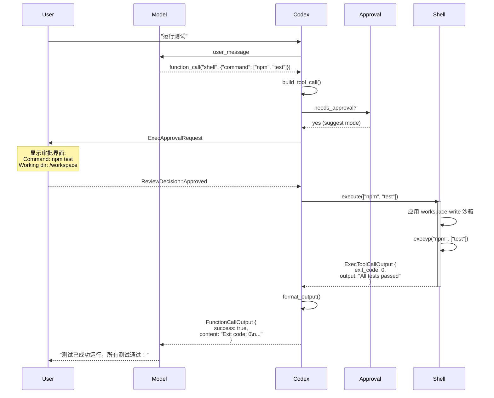

### 10.3 案例 3: 并行工具调用

**用户任务**: "读取所有配置文件"

假设模型同时调用：

```json
[
  {"name": "read_file", "arguments": "{\"file_path\":\"/workspace/package.json\"}"},
  {"name": "read_file", "arguments": "{\"file_path\":\"/workspace/tsconfig.json\"}"},
  {"name": "read_file", "arguments": "{\"file_path\":\"/workspace/.eslintrc.json\"}"}
]
```

**执行时序**：

```mermaid
gantt
    title 并行读取文件 (3个 read_file 调用)
    dateFormat X
    axisFormat %Lms

    section call_001 (package.json)
    获取读锁         :0, 1
    读取文件         :1, 50
    释放锁           :51, 1

    section call_002 (tsconfig.json)
    获取读锁         :0, 1
    读取文件         :1, 60
    释放锁           :61, 1

    section call_003 (.eslintrc.json)
    获取读锁         :0, 1
    读取文件         :1, 40
    释放锁           :41, 1

    section 如果是串行 (shell)
    等待             :0, 0
    获取写锁1        :0, 1
    执行命令1        :1, 50
    释放锁1          :51, 1
    获取写锁2        :52, 1
    执行命令2        :53, 60
    释放锁2          :113, 1
    获取写锁3        :114, 1
    执行命令3        :115, 40
    释放锁3          :155, 1
```

**性能对比**：

| 场景 | 并行执行 | 串行执行 |
|------|---------|---------|
| 3个文件读取 (50ms + 60ms + 40ms) | ~60ms (最长的) | ~150ms (总和) |
| 3个命令执行 | ~150ms (串行) | ~150ms (串行) |

### 10.4 案例 4: MCP 工具调用

**配置 GitHub MCP 服务器**：

```toml
[mcp_servers.github]
command = "npx"
args = ["-y", "@modelcontextprotocol/server-github"]
env = { GITHUB_TOKEN = "${GITHUB_TOKEN}" }
```

**工具调用**：

```json
{
  "name": "mcp_github__create_issue",
  "arguments": "{\"repo\":\"openai/codex\",\"title\":\"Bug report\",\"body\":\"...\"}"
}
```

**处理流程**：

```rust
// 1. parse_mcp_tool_name
let (server, tool) = parse_mcp_tool_name("mcp_github__create_issue");
// server = "github"
// tool = "create_issue"

// 2. 构建 ToolCall
ToolCall {
    tool_name: "mcp_github__create_issue",
    call_id: "call_xyz",
    payload: ToolPayload::Mcp {
        server: "github",
        tool: "create_issue",
        raw_arguments: "{\"repo\":...}",
    },
}

// 3. McpHandler 处理
let result = session.call_mcp_tool("github", "create_issue", arguments).await;

// 4. 返回
ToolOutput::Mcp {
    result: Ok(CallToolResult {
        content: [
            TextContent { text: "Issue created: #123" }
        ],
        is_error: false,
    })
}
```

### 10.5 案例 5: 文件修改（apply_patch）

**用户任务**: "修复 typo"

**模型调用**：

```
apply_patch

file_path: /workspace/src/app.ts
old_string: |
  function hellWorld() {
    console.log('Hello');
  }
new_string: |
  function helloWorld() {
    console.log('Hello');
  }
```

**处理流程**：

```rust
// 1. ApplyPatchHandler 解析参数
let patch = ApplyPatchRequest {
    file_path: PathBuf::from("/workspace/src/app.ts"),
    old_string: "function hellWorld() {\n  console.log('Hello');\n}",
    new_string: "function helloWorld() {\n  console.log('Hello');\n}",
    replace_all: false,
};

// 2. 检查审批 (auto-edit: 不需要)
// approval_policy = AskForApproval::AutoEdit
// → 不需要审批

// 3. 应用补丁
let result = apply_patch::apply_patch_file(
    &patch.file_path,
    &patch.old_string,
    &patch.new_string,
    patch.replace_all,
).await?;

// 4. 记录 diff
turn_diff_tracker.record_file_change(
    &patch.file_path,
    &unified_diff,
).await;

// 5. 返回结果
ToolOutput::Function {
    content: "Patch applied successfully",
    content_items: None,
    success: Some(true),
}
```

**Diff 追踪**：

Codex 维护一个 `TurnDiffTracker` 来追踪所有文件变更：

```rust
pub struct TurnDiffTracker {
    file_changes: HashMap<PathBuf, Vec<FileDiff>>,
}

impl TurnDiffTracker {
    pub fn record_file_change(&mut self, path: &PathBuf, diff: &str) {
        self.file_changes
            .entry(path.clone())
            .or_default()
            .push(FileDiff {
                timestamp: Instant::now(),
                unified_diff: diff.to_string(),
            });
    }

    pub fn get_unified_diff(&self) -> Result<Option<String>> {
        // 合并所有文件的 diff
        let mut combined = String::new();
        for (path, diffs) in &self.file_changes {
            for diff in diffs {
                combined.push_str(&format!("--- {}\n", path.display()));
                combined.push_str(&diff.unified_diff);
                combined.push('\n');
            }
        }
        Ok(Some(combined))
    }
}
```

在 Turn 结束时，Codex 发送 `TurnDiffEvent` 给用户，TUI 显示所有文件变更。

---

## 11. 高级特性

### 11.1 Execpolicy - 细粒度控制

用户可以编写 Starlark 脚本来精确控制工具调用：

```python
# ~/.codex/execpolicy.star

def allow_command(ctx):
    """
    ctx 包含:
    - ctx.command: str - 命令名
    - ctx.args: List[str] - 参数
    - ctx.cwd: str - 工作目录
    - ctx.env: Dict[str, str] - 环境变量
    """

    # 总是允许安全的只读命令
    if ctx.command in ["ls", "cat", "grep", "find", "git status", "git diff"]:
        return True

    # 允许在 tests/ 目录下运行测试
    if ctx.command == "npm" and ctx.args[0] == "test":
        if "/tests/" in ctx.cwd:
            return True
        return "ask"  # 其他目录需要询问

    # 禁止危险命令
    if ctx.command in ["rm", "dd", "mkfs", "sudo"]:
        return False

    # 禁止网络命令（除非在沙箱中）
    if ctx.command in ["curl", "wget", "ssh"]:
        return False

    # 默认询问用户
    return "ask"
```

**Execpolicy 执行流程**：

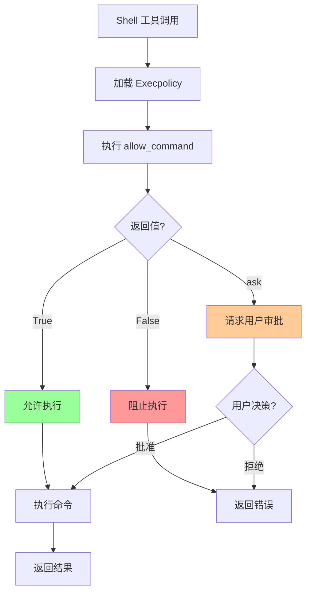

### 11.2 工具权限提升

某些命令可能需要逃离沙箱（如安装系统包）：

```json
{
  "name": "shell",
  "arguments": {
    "command": ["apt-get", "install", "python3-dev"],
    "with_escalated_permissions": true,
    "justification": "Need to install system dependencies for building the project"
  }
}
```

**处理**：

```rust
// 检查是否允许权限提升
if exec_params.with_escalated_permissions.unwrap_or(false) {
    match turn.approval_policy {
        AskForApproval::OnRequest => {
            // 允许，但需要审批
            let permissions = SandboxPermissions::Escalated {
                justification: exec_params.justification,
            };
        }
        _ => {
            // 不允许
            return Err(FunctionCallError::Denied(
                "escalated permissions not available in this approval mode".to_string()
            ));
        }
    }
}
```

### 11.3 工具失败处理

**场景**: Shell 命令返回非零退出码

```rust
// Shell 执行结果
ExecToolCallOutput {
    exit_code: 1,
    aggregated_output: AggregatedOutput {
        text: "Error: ENOENT: no such file or directory, open 'missing.txt'"
    },
    duration: Duration::from_millis(100),
    timed_out: false,
}

// 格式化输出
let output = format_exec_output_for_model_structured(exec_output, truncation_policy);
// {
//   "output": "Error: ENOENT: no such file or directory, open 'missing.txt'",
//   "metadata": {
//     "exit_code": 1,
//     "duration_seconds": 0.1
//   }
// }

// 返回
ToolOutput::Function {
    content: output,
    content_items: None,
    success: Some(false), // ⚠️ 标记为失败
}
```

**模型的反应**：

模型会看到 `success: false` 和错误消息，可能会：
1. 分析错误原因
2. 调整命令重试
3. 或者告诉用户失败原因

**示例对话**：

```
Turn 1:
  Model: 让我读取文件
  Tool: read_file("missing.txt")
  Result: error - file not found

Turn 2:
  Model: 文件不存在，让我先检查目录
  Tool: shell(["ls", "-la"])
  Result: success - 目录列表

Turn 3:
  Model: "文件 missing.txt 不存在。您想创建它吗？"
```

### 11.4 复杂工具链

**用户任务**: "分析代码质量并生成报告"

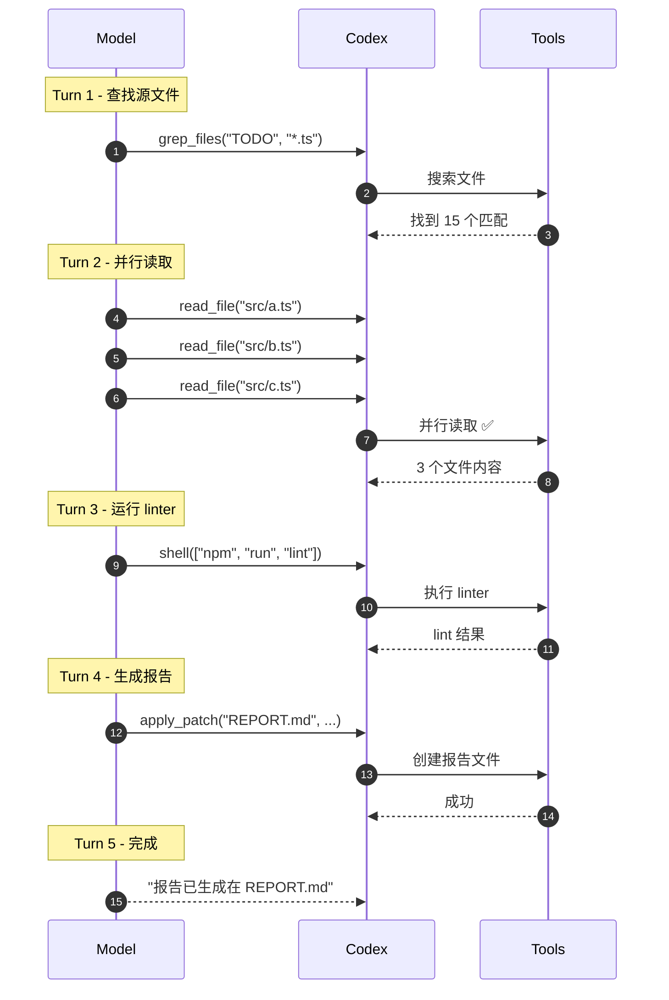

---

## 11. 总结

### 11.1 工具调用全景图

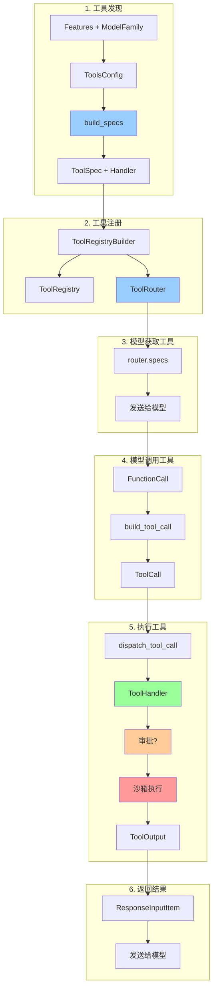

### 10.2 关键发现总结

1. **工具发现**
   - 基于 `Features` 和 `ModelFamily` 动态配置
   - 内置工具 + MCP 工具统一管理
   - 每个工具有 `ToolSpec`（给模型）和 `ToolHandler`（执行）

2. **工具选择**
   - 由 AI 模型决定，基于 ToolSpec 的描述和参数定义
   - 模型返回 FunctionCall 或 CustomToolCall
   - Codex 解析并路由到对应的 handler

3. **工具调用**
   - 通过 `ToolRouter` → `ToolRegistry` → `ToolHandler` 链式分发
   - 支持并行执行（读锁/写锁控制）
   - 自动遥测记录（OpenTelemetry）

4. **结果处理**
   - `ToolOutput` 转换为 `ResponseInputItem`
   - 包含 `success` 字段指示成功/失败
   - 自动截断大输出

5. **成功判断**
   - Handler 返回 `Ok` 表示执行成功
   - `success` 字段（如 exit_code == 0）表示命令成功
   - 用户审批拒绝返回 `Denied` 错误
   - 遥测记录完整执行状态

### 10.3 设计亮点

1. **插件化架构**: 易于添加新工具，只需实现 `ToolHandler` trait
2. **统一路由**: 所有工具通过统一的 Router 和 Registry 管理
3. **MCP 集成**: 无缝支持外部工具服务器
4. **并行控制**: 读写锁实现安全的并行执行
5. **审批灵活**: 三级审批策略 + Execpolicy 细粒度控制
6. **沙箱安全**: OS 级别沙箱确保安全执行
7. **可观测性**: OpenTelemetry 全程记录

### 11.5 核心代码位置索引

| 功能 | 文件 | 行号/关键函数 |
|------|------|-------------|
| 工具配置 | `tools/spec.rs` | `ToolsConfig::new`, `build_specs` |
| 工具规范 | `tools/spec.rs` | `create_shell_tool`, `create_read_file_tool` |
| 工具注册 | `tools/registry.rs` | `ToolRegistry::new`, `ToolRegistryBuilder` |
| 工具路由 | `tools/router.rs` | `ToolRouter::from_config`, `build_tool_call:57` |
| 工具分发 | `tools/registry.rs` | `ToolRegistry::dispatch:60` |
| 并行控制 | `tools/parallel.rs` | `ToolCallRuntime::handle_tool_call:44` |
| Shell 工具 | `tools/handlers/shell.rs` | `ShellHandler::handle:96` |
| 文件读取 | `tools/handlers/read_file.rs` | `ReadFileHandler::handle:98` |
| 补丁应用 | `tools/handlers/apply_patch.rs` | `ApplyPatchHandler::handle` |
| MCP 工具 | `tools/handlers/mcp.rs` | `McpHandler::handle` |
| 审批编排 | `tools/orchestrator.rs` | `ToolOrchestrator::execute` |
| 沙箱管理 | `tools/sandboxing.rs` | `ApprovalStore` |

### 11.6 工具开发指南

**添加自定义工具的步骤**：

1. **定义工具规范**:
   ```rust
   fn create_my_tool() -> ToolSpec {
       ToolSpec::Function(ResponsesApiTool {
           name: "my_tool".to_string(),
           description: "Does something useful".to_string(),
           parameters: JsonSchema::Object { /* ... */ },
           strict: false,
       })
   }
   ```

2. **实现 ToolHandler**:
   ```rust
   pub struct MyToolHandler;

   #[async_trait]
   impl ToolHandler for MyToolHandler {
       fn kind(&self) -> ToolKind {
           ToolKind::Function
       }

       fn is_mutating(&self, _invocation: &ToolInvocation) -> bool {
           true // 如果会修改系统状态
       }

       async fn handle(&self, invocation: ToolInvocation) -> Result<ToolOutput, FunctionCallError> {
           // 1. 解析参数
           let args: MyToolArgs = serde_json::from_str(&invocation.payload.arguments())?;

           // 2. 执行逻辑
           let result = do_something(args).await?;

           // 3. 返回结果
           Ok(ToolOutput::Function {
               content: result,
               content_items: None,
               success: Some(true),
           })
       }
   }
   ```

3. **注册工具**:
   ```rust
   // 在 build_specs 中
   builder.push_spec(create_my_tool());
   builder.register_handler("my_tool", Arc::new(MyToolHandler));
   ```

### 11.7 最佳实践

**工具设计原则**：

1. **单一职责**: 每个工具只做一件事
2. **幂等性**: 多次调用产生相同结果（如果可能）
3. **详细描述**: 提供清晰的 description 和参数说明
4. **错误处理**: 返回有意义的错误消息
5. **性能优化**: 支持并行（如果安全）
6. **安全优先**: 正确标记 `is_mutating`

**参数设计建议**：

```rust
// ✅ 好的设计
{
    "file_path": "/absolute/path/to/file.txt",  // 明确、绝对路径
    "offset": 1,                                 // 1-indexed，符合直觉
    "limit": 100,                                // 明确的限制
}

// ❌ 不好的设计
{
    "path": "relative/path.txt",  // 相对路径，容易混淆
    "start": 0,                   // 0-indexed，不符合文件行号习惯
    "max": -1,                    // -1 表示无限，不够明确
}
```

---

## 12. 常见问题

### 12.1 工具调用失败的常见原因

1. **参数错误**:
   ```
   FunctionCallError::RespondToModel("failed to parse function arguments: ...")
   ```
   解决：检查参数格式和类型

2. **工具不存在**:
   ```
   FunctionCallError::RespondToModel("unsupported call: my_tool")
   ```
   解决：确保工具已注册

3. **权限不足**:
   ```
   FunctionCallError::Denied("User denied the operation")
   ```
   解决：调整 approval_policy 或用户批准

4. **沙箱限制**:
   ```
   "sandbox-exec: operation not permitted"
   ```
   解决：调整 sandbox_policy 或请求权限提升

### 12.2 调试工具调用

**启用详细日志**:

```bash
RUST_LOG=debug codex
```

**关键日志输出**:

```
[DEBUG] ToolCall: shell ["ls", "-la"]
[DEBUG] needs_approval: true (suggest mode)
[DEBUG] awaiting user approval...
[DEBUG] approval received: Approved
[DEBUG] executing command: ls -la
[DEBUG] command completed: exit_code=0, duration=50ms
[DEBUG] tool result preview: total 48\ndrwxr-xr-x ...
```

**OpenTelemetry 追踪**:

```rust
// 自动记录的指标
otel.tool_result(
    tool_name: "shell",
    call_id: "call_123",
    payload: "[\"ls\", \"-la\"]",
    duration: Duration::from_millis(50),
    success: true,
    preview: "total 48\ndrwxr-xr-x ..."
);
```

---

## 13. 总结

### 13.1 核心流程回顾

**工具调用的完整旅程**：

```
用户任务
  ↓
AI 模型分析
  ↓
决定调用工具 (基于 ToolSpec)
  ↓
返回 FunctionCall
  ↓
Codex 解析 (build_tool_call)
  ↓
路由到 Handler (ToolRouter)
  ↓
检查审批需求
  ↓ (如需要)
用户审批
  ↓
应用沙箱策略
  ↓
执行工具
  ↓
收集结果
  ↓
格式化输出 (ToolOutput)
  ↓
转换为 ResponseInputItem
  ↓
发送回模型
  ↓
模型继续推理...
```

### 13.2 设计精髓

1. **发现机制**: 动态配置 + 静态注册
2. **选择机制**: AI 模型基于工具规范自主决策
3. **执行机制**: Handler trait + Runtime + Orchestrator
4. **安全机制**: 审批 + 沙箱 + Execpolicy 多层防护
5. **结果机制**: 结构化输出 + 成功标记 + 自动截断
6. **扩展机制**: MCP 协议无缝集成外部工具

### 13.3 核心代码位置索引

| 功能 | 文件 | 行号/关键函数 |
|------|------|-------------|
| 工具配置 | `tools/spec.rs` | `ToolsConfig::new`, `build_specs` |
| 工具规范 | `tools/spec.rs` | `create_shell_tool`, `create_read_file_tool` |
| 工具注册 | `tools/registry.rs` | `ToolRegistry::new`, `ToolRegistryBuilder` |
| 工具路由 | `tools/router.rs` | `ToolRouter::from_config`, `build_tool_call:57` |
| 工具分发 | `tools/registry.rs` | `ToolRegistry::dispatch:60` |
| 并行控制 | `tools/parallel.rs` | `ToolCallRuntime::handle_tool_call:44` |
| Shell 工具 | `tools/handlers/shell.rs` | `ShellHandler::handle:96` |
| 文件读取 | `tools/handlers/read_file.rs` | `ReadFileHandler::handle:98` |
| 补丁应用 | `tools/handlers/apply_patch.rs` | `ApplyPatchHandler::handle` |
| MCP 工具 | `tools/handlers/mcp.rs` | `McpHandler::handle` |
| 审批编排 | `tools/orchestrator.rs` | `ToolOrchestrator::execute` |
| 沙箱管理 | `tools/sandboxing.rs` | `ApprovalStore` |

### 13.4 学习价值

**对于 AI Agent 开发者**：
- 工具系统的完整设计模式
- 如何平衡灵活性和安全性
- 插件化架构的实现技巧
- 异步并发的最佳实践

**对于 Codex 贡献者**：
- 如何添加新工具
- 如何集成 MCP 服务器
- 如何调试工具问题
- 如何优化工具性能

**对于 Rust 学习者**：
- Trait 系统的高级应用
- Arc + Mutex 并发模式
- async/await 异步编程
- 错误处理最佳实践

---

**参考资料**：

- [Codex GitHub Repository](https://github.com/openai/codex)
- [Model Context Protocol](https://modelcontextprotocol.io/)
- [OpenAI Responses API](https://platform.openai.com/docs/api-reference/responses)
- [Async Trait](https://docs.rs/async-trait/)

---

**文档结束**

本文档详细剖析了 Codex CLI 的工具调用系统，从工具发现、注册、调用到执行的全过程。通过 10+ 个实战案例和详细的代码分析，读者可以全面理解 Codex 的工具机制，并将这些知识应用到自己的 AI Agent 项目中。
